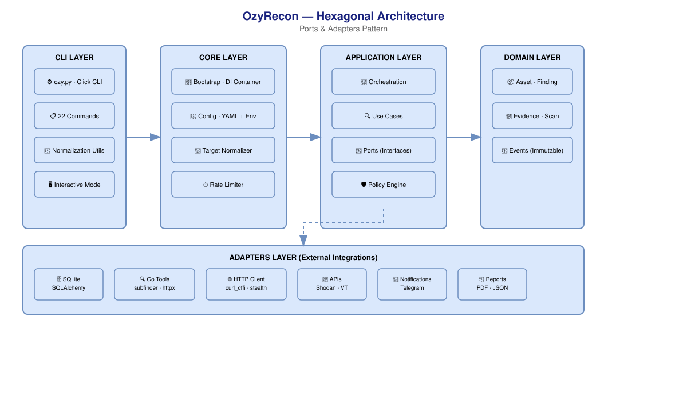

# OzyRecon

**Advanced Persistent Reconnaissance Platform**  
*Built for security professionals. Engineered for reliability.*

[](CHANGELOG.md)
[](#development)
[](https://www.python.org/)
[](LICENSE)

---

## What is OzyRecon

Production-ready attack surface reconnaissance framework. Automates the full recon pipeline — passive discovery, active scanning, JS analysis, parameter discovery, S3 scanning, Google dorking, evidence signing, and professional reporting.

```text
Target → Passive → DNS Brute → Endpoints → JS Extract → Permutations
  → Params → S3 → Dorks → Active Resolve → Services → Takeover
  → Score → Intelligence → Report
```

**Why OzyRecon instead of shell scripts:**

| Capability | OzyRecon | Ad-hoc |
|---|---|---|
| Discovery phases | 15 automated phases | Manual per tool |
| JS analysis, permutations, S3 | Built-in | Separate tools |
| Evidence chain | SHA256-signed audit bundle | None |
| Scope safety | Built-in validation | Manual |
| Diff tracking | Automatic across scans | Manual |
| Reporting | Professional PDF + markdown | Manual |
| Modes | 6 purpose-built strategies | Single-mode |

## Quick Start

```bash
git clone https://github.com/SamBleed/OzyRecon.git && cd OzyRecon
python -m venv venv && source venv/bin/activate
pip install -r requirements.txt && pip install -e .
python ozy.py doctor                # verify environment
python ozy.py scope add target.com  # authorize target
python ozy.py hunt target.com --steroids  # full recon
```

### System Requirements

| Component | Minimum | Recommended |
|---|---|---|
| OS | Linux / macOS | Ubuntu 22.04+ |
| Python | 3.11 | 3.12+ |
| RAM | 2 GB | 4 GB |
| Network | Unrestricted outbound | — |

Go binaries (`subfinder`, `httpx`, `nuclei`, `naabu`, etc.) are pre-compiled in `tools/go/bin/`.

## Configuration

### Scope (`config/scope.yaml`)

Defines authorized targets. Required before any scan:

```yaml
allowed_domains:
  - target.com
  - "*.target.com"
forbidden_patterns:
  - internal
  - staging
```

### Engine (`config/config.yaml`)

```yaml
threads: 50
timeout: 10
rate_limit: 50
tools_path: "tools/go/bin"

api_keys:
  shodan: ""
  virustotal: ""      # optional but improves discovery
  censys_id: ""
  censys_secret: ""

ai:
  gemini_api_key: ""  # optional AI enrichment
  claude_api_key: ""
```

## Environment Variables

| Variable | Default | Description |
|---|---|---|
| `OZY_DATABASE_URL` | SQLite (local) | PostgreSQL connection string for production use |
| `OZY_REDIS_URL` | — | Redis URL for distributed task queue |
| `OZY_LOG_LEVEL` | `INFO` | Logging level: DEBUG, INFO, WARN, ERROR |

## Architecture

Hexagonal (Ports & Adapters). Business logic has zero dependency on external tools, databases, or frameworks.

```
Domain (frozen dataclasses) ← Application (use cases) ← Adapters (tools, DB)
  ↑                                            ↑
Core (config, logging, OPSEC)              CLI (Click)
```



### Project Structure

```
src/
├── domain/            # Pure business entities (frozen=True)
├── application/       # Use cases, ports, orchestrators
├── adapters/          # Tool integrations (subfinder, nmap, nuclei, etc.)
├── core/              # Config, ToolManager, providers, OPSEC
├── discovery/         # JS analyzer, permutator, param discovery, S3, dorking
├── intelligence/      # Scoring, analysis, pipeline orchestration
├── events/            # Domain events (EventBus)
├── plugins/           # Plugin system
├── reporting/         # Professional reports (CVSS, PDF, markdown)
└── modes/             # 6 recon modes
```

## Recon Modes

| Mode | Command | Use Case |
|---|---|---|
| **Hunt** | `ozy hunt <target>` | Full recon + all steroids phases |
| **Continuous** | `ozy continuous <target>` | Differential monitoring with scheduler |
| **Research** | `ozy research <target>` | Deep passive only, no active scanning |
| **Campaign** | `ozy campaign <file>` | Multi-target batch execution |
| **Forensic** | `ozy forensic <session>` | Evidence-focused with full audit trail |
| **Servicio** | `ozy servicio <target>` | API / platform integration mode |

```bash
ozy hunt target.com --intent balanced --depth 2
ozy hunt target.com --ghost               # route via Tor
ozy hunt target.com --dry-run             # print plan without executing
```

## Discovery Phases

Running `ozy hunt target --steroids` executes **15 phases**:

```
 1  Seed target
 2  Passive discovery (subfinder + assetfinder + amass recursive)
 3  DNS brute-force (11k wordlist via dnsx)
 4  Endpoint recon (gau + waybackurls)
 5  JS endpoint extraction          ← downloads JS, extracts hidden routes/API
 6  Subdomain permutations          ← 9 rules (prefix, suffix, cloud, etc.) + DNS resolve
 7  Parameter discovery             ← 764 params, classifies reflective/functional/stateless
 8  S3 bucket scan                  ← 267 combinations, detects public buckets
 9  Google dorking                  ← 30 dorks in 7 categories
10  Active resolution (httpx)
11  Service analysis (naabu + nmap)
12  Takeover detection (nuclei)
13  Autonomous tactical loop
14  Scoring & prioritization
15  Intelligence & reporting
```

## CLI Reference

### Reconnaissance Options

| Flag | Description |
|---|---|
| `--steroids` | Enable JS extraction, permutations, params, S3, dorks |
| `--depth INT` | Passive discovery recursion depth (default: 1) |
| `--intent passive\|balanced\|aggressive` | Operational intent |
| `--ghost` | Route via Tor |
| `--autonomous` | Autonomous tactical loop (default: on) |
| `--threads INT` | Parallel workers |
| `--speed slow\|normal\|fast` | Execution pace |
| `--dry-run` | Print plan without executing |
| `--json` | Output in JSON format |

### Analysis Commands

```bash
ozy analyze target.com         # AI-powered host analysis
ozy diff target.com             # Compare last 2 scans
ozy inventory assets target.com # List discovered assets
ozy paths target.com            # Directory/endpoint enumeration
ozy secrets target.com          # Hunt secrets in JS
ozy export target.com           # Export to JSON/CSV
```

### System Commands

```bash
ozy doctor                      # Validate environment
ozy init                        # Initialize config, DB, folders
ozy scope add/remove/list       # Scope management
ozy serve                       # REST API on port 8000
ozy schedule add target.com     # Scheduled scanning
ozy keys add shodan "YOUR_KEY"  # Add API keys
```

## Output Artifacts

```
runs/{session_id}/
├── js_endpoints/endpoints.json    ← Routes extracted from JS
├── discovered_params.json          ← Parameters found
├── s3_buckets.json                 ← Detected S3 buckets
├── google_dorks.json               ← Dorking results
├── analysis.json                   ← Normalized findings
├── analysis.md                     ← Executive summary
├── flow_summary.json               ← Execution telemetry
└── audit_{hash}.tar.gz             ← Signed evidence bundle
    ├── evidence/                   ← Raw tool outputs (SHA256 signed)
    ├── signatures.json             ← Hash manifest
    └── metadata.json               ← Timestamps, tool versions
```

Reports can also be generated independently:

```python
from src.reporting import ProfessionalReport, generate_pdf

report = ProfessionalReport(workspace_path, target="target.com", diagram_path="docs/diagrams/attack-surface.png")
md = report.save(Path("reports/generated/report.md"))
pdf = generate_pdf(md, Path("reports/generated/report.pdf"))
```

## OPSEC

| Component | Function |
|---|---|
| **StealthClient** | TLS fingerprint randomization via curl_cffi |
| **IdentityRotation** | Rotate User-Agent, headers, TLS parameters |
| **Jitter** | Randomized inter-request delays |
| **RateLimiter** | Adaptive rate limiting with auto-backoff |
| **WAF Detector** | Detect and adjust for WAF presence |
| **ProxyRotator** | Rotate through proxy list |
| **KillSwitch** | Halt all operations if ban threshold reached |

Activate Tor routing: `ozy hunt target --ghost`

Pre-commit OPSEC guard blocks commits containing real target domains, public IPs, or API key patterns.

## Professional Reporting

Generates markdown + PDF with CVSS v3.1, attack surface diagram, severity badges, evidence, business impact, and remediation.

### Report Structure

- **Executive Summary** — key risks, business impact narrative
- **Attack Surface Overview** — assets grouped by category with risk level
- **Findings Summary** — CVSS-scored severity distribution
- **Detailed Findings** — description, business impact, evidence, remediation
- **Recommendations** — prioritized actions (Immediate → Medium-term)

### Module

```
src/reporting/
├── report.py        ProfessionalReport generator (markdown)
├── pdf_export.py    PDF conversion with WeasyPrint + CSS
├── cvss.py          CVSS v3.1 calculator
├── evidence.py      HTTP evidence capture
├── screenshots.py   Gowitness screenshot automation
└── cve_lookup.py    CVE correlation via NVD API
```

## Exclusions (what OzyRecon does NOT do)

- No exploit execution or auto-pwn
- No auto-confirmation of vulnerabilities
- No payload generation
- No submission to bug bounty platforms
- No credential brute-forcing
- No denial-of-service testing
- Requires explicit written authorization before scanning any target

## Development

```bash
source venv/bin/activate
pytest                    # 217 tests (98.2% passing)
ruff check src/ tests/    # lint
```

### Test Structure

```
tests/
├── core/           ToolManager, config, context, plugins
├── adapters/       SQLite, API clients
├── intelligence/   Scoring, analysis, evidence
├── validation/     Scope, target normalization
└── integration/    E2E workflow with DB fixture
```

### Pre-requisites for dev

```bash
pip install -e ".[dev]"
pytest --cov=src --cov-report=html   # coverage → htmlcov/
```

---

**License**: MIT  
**Use responsibly and only against authorized targets.**
