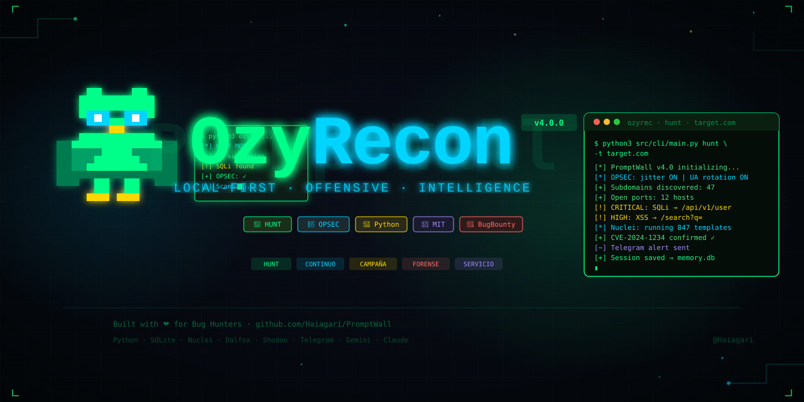

<div align="center">



<br/>


<br/>

**Plataforma profesional de reconocimiento ofensivo e inteligencia de objetivos.**  
Local-first · Sigilo militar · Aprendizaje estadístico · Multi-modo operativo.

[🚀 Inicio rápido](#-inicio-rápido) · [📖 Documentación](#-documentación) · [🎯 Modos](#-modos-operativos) · [⚙️ Configuración](#️-configuración)

</div>

---

## 🧠 ¿Qué es OzyRecon?

OzyRecon es una plataforma de reconocimiento y enumeración diseñada para **Bug Hunters y auditores de seguridad**. No es un simple wrapper de herramientas — es un sistema que **aprende de cada sesión**, mantiene memoria táctica entre ejecuciones y opera con OPSEC de grado militar.

- 🧠 **Orquestador agéntico** con razonamiento contextual y fallback determinista
- 💾 **Memoria persistente** — cada hallazgo se consolida y se compara con sesiones previas
- 🥷 **OPSEC integrado** — jitter, rotación de User-Agents, Kill-Switch automático
- 📊 **Scoring dinámico** — prioriza hallazgos basándose en contexto e historial

---

## 🎯 Modos Operativos

| Modo | Descripción | Caso de uso |
|------|-------------|-------------|
| 🏹 `HUNT` | Caza agresiva en targets nuevos | Primera incursión en un programa |
| 🔄 `CONTINUO` | Monitoreo 24/7 con detección de cambios | Programas en producción activa |
| 📢 `CAMPAÑA` | Escalado de patrones específicos | Pivot tras hallazgo inicial |
| 🔍 `INVESTIGACIÓN` | CVEs sobre superficie conocida | Targets con tech stack definido |
| 🔬 `FORENSE` | Análisis post-mortem | Validación y reporte |
| 📋 `SERVICIO` | Reportes ejecutivos para clientes | Auditorías comerciales |

---

## 🚀 Inicio Rápido

```bash
# Clonar repositorio
git clone https://github.com/SamBleed/OzyRecon.git
cd OzyRecon

# Instalar dependencias
make install

# Configurar API keys
cp config/config.example.yaml config/config.yaml
# → Editar config.yaml con tus keys

# Modo Hunt - caza agresiva
python3 src/cli/main.py hunt -t target.com

# Modo Continuo - monitoreo persistente
python3 src/cli/main.py continuous -t target.com

# CLI Interactiva
python3 agent.py
```

---

## ✨ Características Principales

### 🧠 Capa Agéntica
Orquestador inteligente con razonamiento contextual. Toma decisiones sobre qué herramienta usar, cuándo escalar y cómo priorizar hallazgos. Fallback determinista cuando las APIs de IA no están disponibles.

### 💾 Memoria Táctica
Persistencia de sesiones y hallazgos entre ejecuciones mediante SQLite. Detección de cambios, correlación de patrones y scoring acumulativo por objetivo.

### 🥷 OPSEC de Grado Militar
Jitter configurable, rotación de User-Agents, Kill-Switch automático ante detección, rate limiting inteligente por objetivo.

### 📊 Scoring Dinámico
Puntuación adaptativa que evoluciona con el historial del target. Los hallazgos se clasifican por severidad real en contexto, no solo CVSS teórico.

---

## 📂 Estructura del Proyecto

```
OzyRecon/
├── src/
│   ├── core/           # Config, logging, errores, contexto
│   ├── opsec/          # Rate limiting, rotación de identidad, jitter, kill_switch
│   ├── discovery/      # Subdominios, puertos, fingerprinting
│   ├── scanners/       # Nuclei, Dalfox, wrappers
│   ├── storage/        # SQLite, modelos, queries, diff
│   ├── intelligence/   # Severidad, deduplicación, correlación
│   ├── notifications/  # Alertas Telegram
│   ├── export/         # JSON normalizado, exportadores por plataforma
│   └── modes/          # hunt, continuous, campaign, research, forensic, servicio
├── config/             # Configuración, targets, scoring
├── docs/               # Documentación técnica
├── assets/             # Banner, diagramas, demos
├── resources/          # Wordlists, templates
├── scripts/            # Utilidades
└── tests/              # Suite de pruebas
```

---

## ⚙️ Configuración

```yaml
# config/config.yaml

threads: 50
timeout: 10
rate_limit: 50

api_keys:
  shodan: ""          # Reconocimiento de red
  virustotal: ""      # Inteligencia de IPs

notifications:
  telegram_token: "TU_TOKEN"
  telegram_chat_id: "TU_CHAT_ID"
  alert_level: "medium"   # critical | high | medium | low | all

ai:
  gemini_api_key: ""  # Análisis inteligente (opcional)
  claude_api_key: ""  # Orquestación avanzada (opcional)

opsec:
  jitter_min: 1.5
  jitter_max: 4.0
  rotate_ua: true
  kill_switch: true
```

---

## 📦 Stack Técnico

| Capa | Tecnología |
|------|-----------|
| Core | Python 3.10+ |
| Almacenamiento | SQLite + modelos relacionales |
| Escaneo | Nuclei · Dalfox · Subfinder · Httpx |
| Inteligencia de red | Shodan · VirusTotal |
| Notificaciones | Telegram Bot API |
| IA (opcional) | Gemini · Claude Sonnet |
| OPSEC | Jitter nativo · UA rotation · Kill-switch |

---

## 📊 Demo

```
$ python3 src/cli/main.py hunt -t target.com

[*] OzyRecon v4.0 — HUNT MODE
[*] OPSEC: jitter=ON | UA-rotation=ON | kill_switch=ON
──────────────────────────────────────────────────────
[+] Subdominios descubiertos : 47
[+] Hosts con puertos abiertos: 12
[+] Tecnologías fingerprinted : 8 stacks únicos
──────────────────────────────────────────────────────
[!] CRITICAL → SQLi en /api/v1/user?id=
[!] HIGH     → XSS reflejado en /search?q=
[!] HIGH     → CVE-2024-1234 confirmado (Apache 2.4.49)
[+] Nuclei: 847 templates ejecutados — 3 positivos
──────────────────────────────────────────────────────
[~] Alertas Telegram enviadas ✓
[+] Sesión guardada → memory.db
[*] Duración: 4m 32s
```

---

## 🛡️ Uso Ético

> **IMPORTANTE:** Esta herramienta fue creada para Bug Hunting legal y auditorías autorizadas únicamente.

- ✅ Usar solo en programas donde tengas permiso explícito
- ✅ Respetar rate limits — no saturar objetivos
- ✅ Verificar hallazgos manualmente antes de reportar
- ✅ Seguir los disclosure guidelines de cada programa
- ❌ No usar en targets sin autorización escrita

---

## 📖 Documentación

- [🏗️ Arquitectura](./docs/architecture.md) — Visión general del sistema
- [🎯 Modos Operativos](./docs/modes.md) — Guía detallada de cada modo
- [🥷 OPSEC](./docs/opsec.md) — Guía de seguridad operativa
- [📋 Metodología](./docs/methodology.md) — Estándar de trabajo

---

## 🤝 Contribuir

```bash
# Fork → rama → commit → PR
git checkout -b feature/mi-feature
git commit -m 'feat: descripción del cambio'
git push origin feature/mi-feature
# → Abrir Pull Request
```

---

## 🙏 Agradecimientos

- [ProjectDiscovery](https://projectdiscovery.io) — Herramientas ofensivas open source
- [SecLists](https://github.com/danielmiessler/SecLists) — Wordlists
- Comunidad global de Bug Hunters

---

<div align="center">

**Construido con ❤️ para la comunidad de Bug Hunters**

[github.com/SamBleed/OzyRecon](https://github.com/SamBleed/OzyRecon)


</div>
