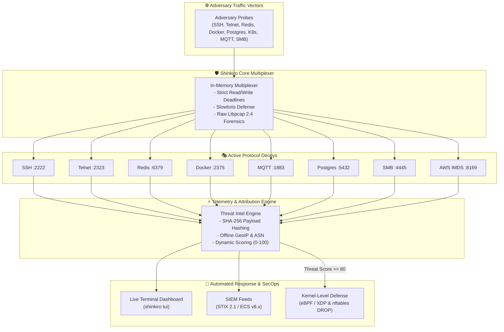

# 蜃気楼 Shinkiro

**Ephemeral Cyber Deception & Attacker Intelligence Mesh**  
*Zero-footprint in-memory honeynet, high-interaction virtual shells, automated IoC extraction, STIX 2.1 feeds, distributed cluster mesh, red team attack simulator, and kernel-level eBPF/XDP defense.*

[](CHANGELOG.md)
[](#testing)
[](https://golang.org/)
[](LICENSE)
[](#deployment)

---

## What is Shinkiro

**Shinkiro (蜃気楼 — *mirage*)** is a high-performance, single-binary cyber deception engine and distributed honeypot mesh written in Go. Instead of running fragile, heavy virtual machines (like Cowrie or Dionaea), Shinkiro multiplexes lightweight, memory-jailed protocol emulators across the most exploited internet, cloud, and IoT attack surfaces.

Adversaries scanning your perimeter or attempting lateral movement encounter realistic, responsive services that safely entrap their scanners, credential brute-forcers, and manual exploit attempts without granting access to the host.

<p align="center">
  
</p>

<details>
<summary><b>View Mermaid Source Diagram</b></summary>


</details>

---

## 14 High-Interaction Decoy Services

See the complete [Decoy Protocols & Emulation Matrix](docs/decoys/decoy-matrix.md) for full protocol specifications and MITRE ATT&CK taxonomy.

| Decoy Service | Default Port | Emulated Protocol & Deception Capabilities |
| :--- | :--- | :--- |
| **SSH** | `2222` | OpenSSH 9.2p1 handshake, captures passwords/keys, provides a sandbox in-memory virtual terminal (`bash`), logs commands & exfiltration attempts (`curl`, `wget`). |
| **Telnet** | `2323` | BusyBox v1.31.1 router login prompt, IAC negotiation, Mirai botnet credential harvesting, interactive fake shell. |
| **MQTT** | `1883` | MQTT v3.1.1 broker, CONNECT client authentication traps, unauthorized PUBLISH topic exploits, SUBSCRIBE reconnaissance. |
| **SMB / CIFS** | `4445` | NetBIOS session & SMBv2 negotiation parser, EternalBlue (MS17-010) & ransomware recon trap. |
| **Redis** | `6379` | RESP protocol engine. Emulates unauthenticated Redis 7.2.4 cluster specs (`INFO`), traps unauthorized `CONFIG` dumps, and intercepts rogue Lua `EVAL` injection payloads. |
| **Docker Engine** | `2375` | Docker REST API (`/_ping`, `/version`, `/v1.24/containers/create`). Intercepts crypto-mining containers (`xmrig`, etc.) and records attacker images. |
| **HTTP Traps** | `8080` | Catches directory-traversal and scanner probes looking for `/.env`, `/.git/config`, `/aws/credentials`. Serves canary-seeded synthetic keys. |
| **PostgreSQL** | `5432` | Postgres wire protocol 3.0. Emulates SSL negotiation, cleartext authentication challenge, captures database usernames & passwords. |
| **Kubernetes API** | `6443` | Emulates K8s v1.29 control-plane endpoints (`/version`, `/api`, `/apis`). Traps anonymous credential theft attempts on pods and secrets. |
| **AWS IMDS** | `8169` / `169.254.169.254` | Emulates AWS EC2 Instance Metadata Service (IMDSv1 & IMDSv2). Traps SSRF attempts to steal IAM role credentials (`/latest/meta-data/iam/security-credentials/`). |
| **MongoDB** | `27017` | BSON wire protocol `OP_MSG` emulator, intercepts `isMaster` probes and unauthenticated database reconnaissance. |
| **Elasticsearch** | `9200` | Elasticsearch REST API (`/`, `/_cat/indices`, `/_cluster/health`), cluster indexing trap. |
| **SMTP / ESMTP** | `2525` | Postfix ESMTP banner (`HELO`, `EHLO`, `MAIL FROM`, `RCPT TO`, `DATA`), phishing/spam collector. |
| **DNS Server** | `1053` | RFC 1035 UDP parser, traps subdomain enumeration and C2 covert channel lookups. |

---

## Quick Start

### 1. Build from Source

```bash
git clone https://github.com/Haiagari/shinkiro.git && cd shinkiro
make build
```

### 2. Launch Live Terminal Dashboard (TUI)

```bash
./bin/shinkiro tui
```

### 3. Run Headless Daemon

```bash
./bin/shinkiro up
```

### 4. Red Team Attack Simulation

Run synthetic automated adversarial probes against all active decoys to verify detection and telemetry pipeline:

```bash
./bin/shinkiro simulate --host 127.0.0.1
```

### 5. Export STIX 2.1 Threat Intelligence Bundle

```bash
./bin/shinkiro stix > /tmp/shinkiro-threats.json
```

### 6. Generate Kernel-Level eBPF / XDP & nftables Blocklists

```bash
./bin/shinkiro kernel
./bin/shinkiro export --format nftables --threshold 80
---

## Testing & Quality

Shinkiro enforces 100% test coverage with Go's race detector enabled:

```bash
# Run all unit tests with race condition detector
make test

# Run concurrent connection spike / chaos flood tests
go test -v -race ./tests/chaos

# Run end-to-end multi-decoy honeynet simulation
go test -v -race ./tests/e2e
---

## License

AGPL-3.0-only © 2026 Haiagari Security.
