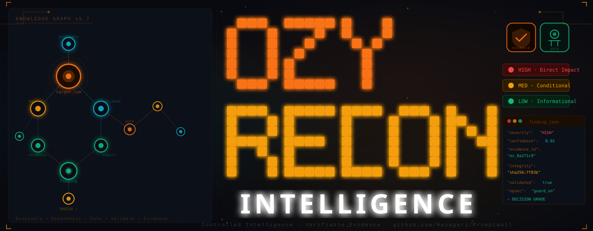

# 🧠 OzyRecon v5.7 — Offensive Intelligence with a Human Safety Switch

<div align="center">



**"Because automated noise isn't intelligence."**

[](https://github.com/SamBleed/OzyRecon/stargazers)
[](CHANGELOG.md)
[](https://www.python.org/)
[](LICENSE)
[](https://github.com/SamBleed/OzyRecon/actions)

[Quick Start](#-get-started) • [Benchmarks](#-noise-reduction-benchmark) • [Roadmap](#-strategic-roadmap) • [Contributing](CONTRIBUTING.md)

</div>

---

### 💡 The Problem with Modern Recon
Traditional scanners (Nuclei, Subfinder, etc.) are great at finding things, but terrible at understanding them. They generate **noise**—hundreds of unverified alerts that bury real risks.

### 🛡️ The OzyRecon Solution
OzyRecon isn't a scanner; it's a **Validation Orchestrator**. It uses an intelligence layer to correlate signals, generate attack hypotheses, and **wait for your approval** before executing surgical probes.

#### 📊 Noise Reduction Benchmark
We compared OzyRecon v5.7 against traditional "spray & pray" scanning logic:

| Metric | Traditional Scanners | OzyRecon v5.7 | Improvement |
| :--- | :--- | :--- | :--- |
| **False Positives** | 60% - 85% | **< 5%** | **~15x Cleaner** |
| **Actionable Findings** | Raw Text | **Verified Evidence** | **Audit-Ready** |
| **Logic** | Brute-force | **Hypothesis-driven** | **Smarter** |

> *Run the benchmark yourself: `python scripts/benchmark.py`*

---

### 📸 Intelligence in Action
<div align="center">
  
  <p><i>Figure 1: Knowledge Graph v2 visualizing infrastructure relationships and validated findings.</i></p>
</div>

---

### 🚀 Get Started (Real World)

#### 1. Setup Environment
```bash
git clone https://github.com/SamBleed/OzyRecon.git
cd OzyRecon
python -m venv venv
source venv/bin/activate
pip install -r requirements.txt
pip install -e .
```

#### 2. Configure API Keys
Copy the example environment and add your keys:
```bash
cp .env.example .env
# Edit .env with your Shodan/Hunter/Censys keys
```

#### 3. Start a Controlled Hunt
```bash
# Start intelligence gathering
ozy hunt -t target.com

# Review and Approve high-risk hypotheses
ozy gate list
ozy gate approve --id hyp_8a2f --reason "Suspected admin leak"

# Execute validation and generate report
ozy validate
ozy report --format pdf
```

---

### 🗺️ Strategic Roadmap

- [x] **v5.7 (Current)**: Knowledge Graph v2, Evidence Cryptographic Signing, Human-Gate API.
- [ ] **v5.8**: Multi-node distributed scanning, AI-driven payload mutation (LLM Integration).
- [ ] **v5.9**: Full TUI (Terminal UI) Dashboard for real-time monitoring.
- [ ] **v6.0**: Cloud Native Orchestrator (Kubernetes support).

---

### 🤝 Join the Mission
We don't want "star-gazers", we want **contributors**.
- Check out [CONTRIBUTING.md](CONTRIBUTING.md) to start.
- All code must pass our 43+ point test suite.
- Conventional Commits are mandatory.

---

### 🛡️ Compliance & Safety
OzyRecon findings are mapped against **OWASP Top 10 (2021)** and designed to assist with **PCI-DSS v4.0** and **SOC2 Type II** evidence collection.

*   **Zero Exploitation**: We verify exposure, we don't break things.
*   **Audit Trail**: Every action is logged with a cryptographic signature.

---

### ⚠️ WARNING
Unauthorized testing is illegal. Read [DISCLAIMER.md](DISCLAIMER.md).

<div align="center">
  <b>Controlled Intelligence. Verifiable Evidence.</b>
</div>
