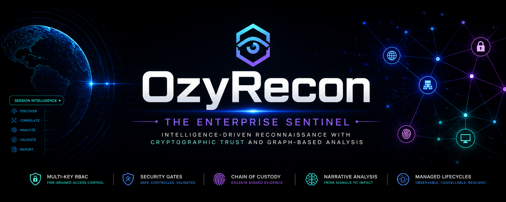

# 🧠 OzyRecon v9.0 — *Ghost Intelligence Edition*

> **Professional offensive intelligence platform for high-scale reconnaissance, AI-powered triage, extreme stealth, and cloud infrastructure leak detection.**

## Start Here

- [Current status](docs/STATUS.md)
- [Roadmap](docs/ROADMAP.md)
- [Archive index](docs/archive/README.md)

 

---

## 🎭 What v9.0 Gives You (The Elite Arsenal)

OzyRecon v9.0 is an advanced persistent reconnaissance platform designed for modern attack surfaces.

### 1. 👻 StealthClient & JA3 Evasion
Complete network-level deception using `curl_cffi` to impersonate real browsers (Chrome, Safari, Firefox). Bypasses JA3/JA4 TLS fingerprinting used by Cloudflare, Akamai, and AWS Shield.

### 2. 📸 Visual Recon (Headless Discovery)
Automated screenshotting of discovered assets using a smart-detected headless Chromium engine. View what the target looks like before ever opening a browser.

### 3. ☁️ Cloud Leak Detection
Predictive scanning for exposed S3 buckets, Azure Blobs, and Google Cloud Storage related to the target domain. Detects public infrastructure before attackers do.

### 4. 🧠 AI-Powered Triage (Gemini 1.5)
The intelligence layer uses real-world AI to verify hardcoded secrets, reduce false positives (Entropy Analysis > 3.8), and suggest exploits for the detected tech stack.

### 5. 🕒 Differential Intelligence
The `watch` command now performs real-time HTTP content diffing. Get notified exactly WHAT changed in a file (e.g., a new developer token added to `app.js`).

### 6. 📊 Elite Reporting
Generates professional Jinja2-based HTML reports including executive summaries, risk charts, cloud exposure maps, and actionable remediation plans.

---

## 🏗️ CLI Surface

OzyRecon is a CLI-first platform. Direct, fast, and powerful:

- `python ozy.py hunt <target>`: Start an intelligent adaptive hunt.
- `python ozy.py secrets <target> --verify`: Scan for JS secrets with AI verification.
- `python ozy.py screenshot <target>`: Capture visual evidence of assets.
- `python ozy.py exploits <target>`: AI-based exploit advisor for the tech stack.
- `python ozy.py inventory assets <target>`: Manage the discovered attack surface.
- `python ozy.py report <target>`: Generate the professional intelligence report.
- `python ozy.py watch <target>`: Real-time certificate and content monitoring.

---

## 🛠️ System Requirements

- **Python 3.11+**
- **Chromium/Chrome** (For Visual Recon)
- **Go binaries** in `tools/go/bin/`:
  - `subfinder`, `assetfinder`, `amass`, `httpx`, `dnsx`, `nuclei`, `katana`, `gowitness`, `wafw00f`.

---

**Built for operators who prefer signal, gates, and traceable output.**

