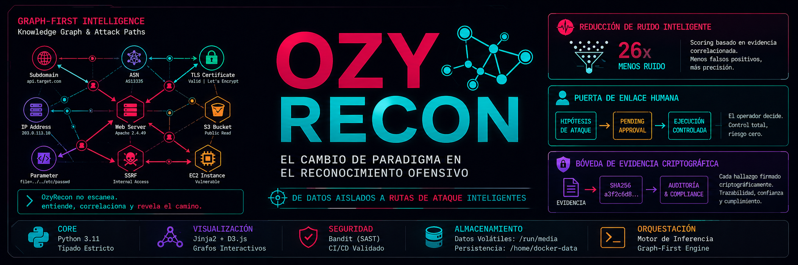
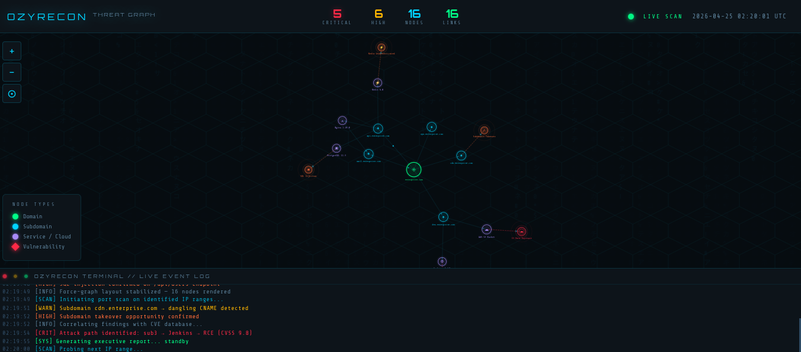

# 🧠 OzyRecon v6.0 — *Safe Autonomy*

> **Headless reconnaissance with normalized output, explicit gates, and platform-friendly contracts.**

<div align="center">



<br/>

[](CHANGELOG.md)
[](LICENSE)
[]()

</div>

---

## 🎭 v6.0 Core Pillars: "Safe Autonomy"

OzyRecon v6.0 is a headless reconnaissance engine with a local runtime contract in this tree. It focuses on safe autonomy, contract-driven output, and explicit validation gates. The platform bridge is defined separately in [`docs/BRIDGE_CONTRACT.md`](docs/BRIDGE_CONTRACT.md).

### 1. 🧤 Stealth-Aware Transport
Powered by `curl_cffi`, OzyRecon keeps transport handling consistent while preserving the ability to adapt to defensive controls without assuming a fixed network fingerprint.

### 2. 🎯 Gated Validation
OzyRecon uses evidence-based probing with explicit approval policy. Results are normalized and streamed to the platform for review and correlation.

### 3. 🔍 Correlation-First Analysis
The Knowledge Graph correlates data across assets to highlight relationships, exposure patterns, and review priorities.

---

## 🏗️ Runtime Surface

OzyRecon exposes a local engine surface that can be consumed directly or through the platform bridge:

- **Local entrypoint**: [`ozy.py`](ozy.py)
- **API runtime**: [`src/core/api.py`](src/core/api.py)
- **Normalized export**: [`src/export/normalizer.py`](src/export/normalizer.py)
- **Runtime trace**: `GET /sessions/{session_id}/trace`
- **Bridge contract**: [`docs/BRIDGE_CONTRACT.md`](docs/BRIDGE_CONTRACT.md)

---

## 🧠 The Shift: Graph-First Intelligence

OzyRecon doesn’t scan targets — it builds **relationships**.

* Assets become **nodes**
* Connections become **edges**
* Weak signals become **review priorities**

<div align="center">
  
  <br>
<sub><i>Knowledge Graph correlating infrastructure into reviewable relationships.</i></sub>
</div>

---

## 🔥 Why OzyRecon is Different

### 🧩 Correlation Engine (Not Just Detection)

Findings are **validated through relationships**, not isolated signals.

→ Open port ≠ vulnerability
→ Correlated evidence = **review candidate**

---

### 📉 26x Noise Reduction

Evidence-based scoring eliminates irrelevant data.

* No correlation → ignored
* Multi-signal validation → escalated

---

### 🧑‍💻 Human-in-the-Loop Security

No blind execution.

```text
Review Candidate → PENDING_APPROVAL → Controlled Execution
```

You decide **when** and **what** runs.

---

### 🔐 Cryptographic Evidence Layer

Every finding is:

* Hashed (SHA256)
* Timestamped
* Audit-ready

Built for **compliance, trust, and reproducibility**.

---

## ⚙️ Architecture Snapshot

| Layer         | Stack                            |
| ------------- | -------------------------------- |
| Core          | Python 3.11 (strict typing)      |
| Visualization | Jinja2 + D3.js                   |
| Security      | Bandit (SAST)                    |
| Storage       | Volatile + Persistent separation |
| Engine        | Graph-Based Inference            |

---

## ⚡ Quick Start

### 1. Unified Execution (Recommended)
Start the local engine runtime from this repository:

```bash
python ozy.py --help
python ozy.py
```

### 2. CLI Automation
Use the CLI wrapper for scripted runs:

```bash
python -m cli --help
python -m cli hunt target.com
```

### 3. Report Generation
Generate dynamic HTML and PDF reports:

```bash
# Basic HTML report
python ozy.py report target.com

# PDF report (requires system dependencies)
python ozy.py report target.com --format pdf

# Both formats in a specific directory
python ozy.py report target.com --format both --output my_reports/
```

> **Note**: PDF generation requires `WeasyPrint`. See [System Dependencies](#system-dependencies) for installation details.

### 4. Platform Bridge
If you are using the Ozy Platform, the adapter should consume the same contract described in [`docs/BRIDGE_CONTRACT.md`](docs/BRIDGE_CONTRACT.md).

---

## 🛠️ System Dependencies

### WeasyPrint (PDF Generation)
To generate PDF reports, OzyRecon requires `WeasyPrint`, which depends on several system libraries for graphics and text layout:

- **Debian/Ubuntu**:
  ```bash
  sudo apt-get install libpango-1.0-0 libharfbuzz0b libpangoft2-1.0-0 libpangocairo-1.0-0
  ```
- **macOS (Homebrew)**:
  ```bash
  brew install pango
  ```
- **Windows**:
  Follow the instructions on the [WeasyPrint documentation](https://doc.courtbouillon.org/weasyprint/stable/first_steps.html#windows).

---

## 📚 Documentation

### Primary docs

* 🧾 [Phase 0 Audit](OZYRECON_PHASE0_AUDIT.md)
* 🧰 [Hardening Plan](OZYRECON_HARDENING_PLAN.md)
* 📜 [Runtime Contract](docs/RUNTIME_CONTRACT.md)

### Supporting docs

* 🧭 [Improvement Plan](OZYRECON_IMPROVEMENT_PLAN.md)
* 🪧 [Operational Plan](OZYRECON_OPERATIONAL_PLAN.md)
* 🤝 [Bridge Contract](docs/BRIDGE_CONTRACT.md)

### General docs

* 📦 [Installation](docs/INSTALL.md)
* 🧪 [Use Cases](docs/USE_CASES.md)
* 📊 [Benchmarks](docs/BENCHMARKS.md)
* 🛣️ [Roadmap](docs/ROADMAP.md)
* 🤝 [Contributing](CONTRIBUTING.md)

---

<div align="center">

**Built for operators who prefer signal, gates, and traceable output.**

</div>
