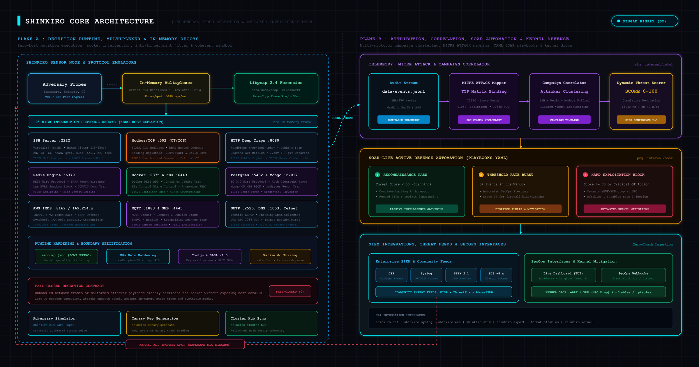
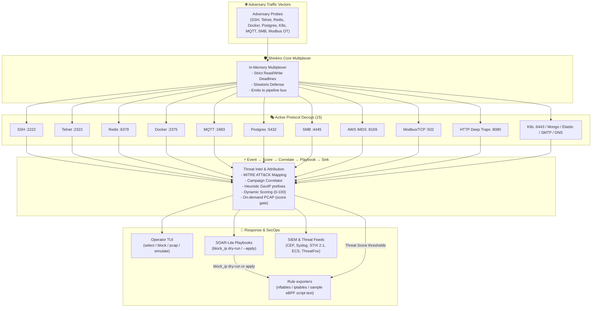

# 蜃気楼 Shinkiro

**Ephemeral Cyber Deception & Attacker Intelligence Mesh**  
*In-memory honeynet, protocol decoys, IoC extraction, STIX/CEF/Syslog/ECS exporters, SOAR-lite playbooks, and text exporters for nftables / iptables / sample eBPF rules — not a live kernel XDP loader.*

[](https://github.com/Haiagari/shinkiro/actions/workflows/ci.yml)
[](CHANGELOG.md)
[](https://golang.org/)
[](LICENSE)
[%20%7C%20macOS%20(source)-blue?style=flat-square)](#quick-start)


> **Deploy modes / e2e / GHCR:** `make compose-lab` · `make compose-edge` · `make e2e` · optional `PUSH_GHCR=true` → `ghcr.io/haiagari/shinkiro`. See [`docs/deploy-modes-e2e-ghcr.md`](docs/deploy-modes-e2e-ghcr.md) and [`deploy/README.md`](deploy/README.md).

---

## What is Shinkiro

**Shinkiro (蜃気楼 — *mirage*)** is a single-binary cyber deception engine written in Go. It multiplexes lightweight, memory-jailed protocol emulators across common internet, cloud, and IoT attack surfaces.

Adversaries scanning your perimeter encounter responsive decoy services that capture credentials, probes, and exploit attempts without granting host access. Telemetry flows through an in-process **Event → Score → Correlate → Playbook → Sink** pipeline, drives SOAR-lite actions (`block_ip` / `alert`), and can emit firewall rule text — **live firewall apply is opt-in** (`--apply` / `SHINKIRO_SOAR_APPLY=1`); default is dry-run.

### What is implemented today

| Area | Reality in this tree |
| :--- | :--- |
| **15 decoys** | SSH, Telnet, MQTT, SMB, Redis, Docker, HTTP, Postgres, K8s, AWS IMDS, Mongo, Elastic, SMTP, DNS, Modbus — see matrix below |
| **CLI** | `up [--apply]`, `tui [--apply]` (operator actions: block/pcap/simulate/canary), `simulate`, `export` (nftables/iptables text), `kernel`/`ebpf` (rule script text), `cef`/`syslog`/`stix`/`ecs`, `canary`, `cluster hub` |
| **Event pipeline** | `internal/pipeline` bus wired in `up`/`tui` — Score (MITRE+GeoIP) → Correlate → Playbook → Sink |
| **Defense exporters** | `internal/defense` + `internal/ebpf.FilterManager.RenderScript()` emit rule text; sample XDP C lives under `internal/ebpf/c/` — **no live BPF map loader / `BPF_MAP_UPDATE`** |
| **SOAR block_ip** | Dry-run default (prints nftables/iptables commands); live exec + optional webhook only with `--apply` or `SHINKIRO_SOAR_APPLY=1` |
| **GeoIP** | Heuristic / demo prefix table in `internal/intel/geoip` — **not** a MaxMind offline database |
| **Cluster** | HTTP ingest hub (`POST /api/v1/cluster/ingest`) — **not** encrypted UDP gossip |
| **PCAP** | On-demand libpcap capture when score ≥ threshold (default 80) via `internal/pcap.OnDemandCapture` → `data/pcap/` — **not** continuous socket mirroring |
| **Supply chain** | Release CI: Linux amd64/arm64 binaries, `checksums.txt`, Cosign **`sign-blob`** on checksums, Syft SPDX + CycloneDX SBOMs — **not** SLSA Level 3 provenance |
| **Deploy** | Dockerfile + Compose + Helm with **lab/edge** modes (`make compose-lab` / `compose-edge`); local image by default; **optional** GHCR when `PUSH_GHCR=true` — see `deploy/README.md` |

<p align="center">
  
</p>

<details>
<summary><b>View Mermaid Source Diagram</b></summary>


</details>

---

## 15 High-Interaction Decoy Services

See the complete [Decoy Protocols & Emulation Matrix](docs/decoys/decoy-matrix.md) for protocol notes and MITRE ATT&CK taxonomy.

| Decoy Service | Default Port | Emulated Protocol & Deception Capabilities |
| :--- | :--- | :--- |
| **SSH** | `2222` | OpenSSH-style handshake, captures passwords/keys, in-memory virtual terminal (`bash`), human latency jitter, logs commands & exfiltration attempts. |
| **Telnet** | `2323` | BusyBox-style router login prompt, IAC negotiation, Mirai-style credential harvesting, interactive fake shell. |
| **MQTT** | `1883` | MQTT v3.1.1 broker, CONNECT client authentication traps, unauthorized PUBLISH/SUBSCRIBE reconnaissance. |
| **SMB / CIFS** | `4445` | NetBIOS session & SMBv2 negotiation parser, EternalBlue-style recon trap. |
| **Redis** | `6379` | RESP protocol engine. Emulates unauthenticated Redis cluster `INFO`, traps `CONFIG` dumps and Lua `EVAL` payloads. |
| **Docker Engine** | `2375` | Docker REST API (`/_ping`, `/version`, `/containers/create`). Intercepts miner-style container create attempts. |
| **HTTP Deep Traps**| `8080` | Directory-traversal / canary paths (`/.env`, `/.git`), admin panels (`wp-login.php`, Jenkins, Grafana). |
| **PostgreSQL** | `5432` | Postgres wire protocol 3.0. SSL negotiation, cleartext auth challenge, captures DB usernames & passwords. |
| **Kubernetes API** | `6443` | K8s control-plane-style endpoints (`/version`, `/api`, `/apis`). Traps anonymous recon on pods/secrets paths. |
| **AWS IMDS** | `8169` | EC2 Instance Metadata Service-style (IMDSv1 & IMDSv2) SSRF trap for IAM credential paths. |
| **MongoDB** | `27017` | BSON wire protocol `OP_MSG` emulator, `isMaster` probes and unauthenticated recon. |
| **Elasticsearch** | `9200` | Elasticsearch REST API (`/`, `/_cat/indices`, `/_cluster/health`). |
| **SMTP / ESMTP** | `2525` | Postfix-style ESMTP banner (`HELO`, `EHLO`, `MAIL FROM`, `RCPT TO`, `DATA`). |
| **DNS Server** | `1053` | RFC 1035 UDP parser, subdomain enumeration / C2-style lookup capture. |
| **Modbus / TCP** | `502` | ICS/SCADA PLC-style emulator, MBAP frame decoder, holding registers/coils, unauthorized command traps (`T0855`). |

Runtime config uses the top-level key **`services:`** (not `decoys:`) — see [`config.yaml`](config.yaml).

---

## Quick Start

### 0. Install pre-built binary (Linux amd64 / arm64)

Release CI publishes raw binaries (not GoReleaser tarballs):

| Asset | Example |
| :--- | :--- |
| Binary | `shinkiro-linux-amd64`, `shinkiro-linux-arm64` |
| Checksums | `checksums.txt` (SHA-256) |
| Signature | `checksums.bundle` (Cosign `sign-blob`) |
| SBOM | `shinkiro-sbom.spdx.json`, `shinkiro-sbom.cdx.json` (Syft) |

```bash
# Latest release (resolves tag via GitHub Releases API — no hardcoded fallback)
curl -sSL https://raw.githubusercontent.com/Haiagari/shinkiro/main/scripts/install.sh | sh

# Pin a version
SHINKIRO_VERSION=v1.0.0 curl -sSL https://raw.githubusercontent.com/Haiagari/shinkiro/main/scripts/install.sh | sh
```

**Pre-built binaries are Linux-only** (`linux-amd64`, `linux-arm64`). macOS / Darwin has no release assets — use **Build from Source** below (`make build`). The installer exits with a clear message on Darwin.

After install (or build), confirm the embedded version string:

```bash
shinkiro version
# or: ./bin/shinkiro version
```

### 1. Build from Source

```bash
git clone https://github.com/Haiagari/shinkiro.git && cd shinkiro
make build
```

### 2. Launch Live Terminal Dashboard (TUI)

```bash
# Dry-run SOAR block_ip (default) — same guards as `up`
./bin/shinkiro tui

# Live firewall apply for playbook + TUI `b` key
./bin/shinkiro tui --apply
```

Operator keybindings (press `?` in the TUI for the full overlay):

| Key | Action |
| :--- | :--- |
| `↑`/`k` `↓`/`j` | Select event or campaign |
| `Tab` | Toggle Events ↔ Campaigns |
| `b` | SOAR `block_ip` (dry-run unless `--apply` / `SHINKIRO_SOAR_APPLY=1`) |
| `p` | On-demand PCAP for selection |
| `s` | Adversary simulate vs local mesh |
| `c` | Generate AWS canary honeytoken |
| `r` | Refresh high-score events / campaigns from intel store |
| `x` / `esc` | Clear status / close help |
| `q` | Quit |

Details: [`docs/architecture/tui-operator.md`](docs/architecture/tui-operator.md).

### 3. Run Headless Daemon

```bash
# Dry-run SOAR block_ip (default) — prints nftables/iptables commands only
./bin/shinkiro up

# Live firewall apply (explicit)
./bin/shinkiro up --apply
# or: SHINKIRO_SOAR_APPLY=1 ./bin/shinkiro up
```

### 4. Red Team Attack Simulation

With the mesh running (`shinkiro up` or `shinkiro tui` in another terminal), run the real adversary simulator:

```bash
./bin/shinkiro simulate --host 127.0.0.1
```

### 5. Generate Canary Tokens

HMAC-signed synthetic AWS honeytokens for canary placement:

```bash
./bin/shinkiro canary generate --label canary-prod-seed
```

### 6. Export SIEM (CEF / Syslog / STIX 2.1 / ECS)

```bash
# ArcSight Common Event Format
./bin/shinkiro cef

# RFC5424 Syslog stream
./bin/shinkiro syslog

# STIX 2.1 JSON Bundle
./bin/shinkiro stix > /tmp/shinkiro-threats.json

# Elastic Common Schema (ECS v8.x)
./bin/shinkiro ecs
```

### 7. Automated Defense, SOAR Playbooks & On-Demand PCAP

Events flow: **Event → Score → Correlate → Playbook → Sink** (`internal/pipeline`). Full operator notes: [`docs/architecture/event-pipeline.md`](docs/architecture/event-pipeline.md).

Shinkiro loads declarative rules from `playbooks.yaml`. The **real** schema is `rules` / `if` / `then` with actions such as `block_ip` and `alert` (see `internal/soar`):

```yaml
# Matches playbooks.yaml + internal/soar.PlaybookConfig
rules:
  - name: ssh-credential-stuffing-autoblock
    enabled: true
    if:
      decoy: ssh
      min_score: 75
      action_match: LOGIN
    then:
      - type: block_ip
      - type: alert

  - name: rapid-recon-scanning-ratelimit
    enabled: true
    if:
      decoy: "*"
      threshold: 5
      window_sec: 30
    then:
      - type: block_ip
      - type: alert
```

**`block_ip` dry-run vs apply**

| Mode | Enable | What happens |
| :--- | :--- | :--- |
| Dry-run (**default**) | (nothing) | Logs generated `nftables`/`iptables` text; does **not** exec firewall binaries |
| Live apply | `--apply` or `SHINKIRO_SOAR_APPLY=1` | Executes those commands; optional JSON POST to `SHINKIRO_SOAR_BLOCK_WEBHOOK` |

Format: `SHINKIRO_SOAR_BLOCK_FORMAT=nftables|iptables` (default `nftables`). This is **not** silent kernel XDP / BPF map auto-block.

**On-demand PCAP:** when `ThreatScore >= SHINKIRO_PCAP_THRESHOLD` (default `80`), the sink writes a libpcap file under `SHINKIRO_PCAP_DIR` (default `data/pcap/`).

Export firewall / sample kernel rule **text** (offline export; separate from live `--apply`):

```bash
# Sample eBPF / XDP-oriented script text + comments (not a live loader)
./bin/shinkiro kernel

# nftables blackhole table text
./bin/shinkiro export --format nftables --threshold 80

# iptables DROP script text
./bin/shinkiro export --format iptables --threshold 80
```

### 8. Docker Compose & Kubernetes / Helm

Full steps: [`deploy/README.md`](deploy/README.md).

**Compose** (local build — preferred):

```bash
make docker-build    # tags shinkiro:local
make compose-up      # deploy/docker/docker-compose.yml
make compose-lab    # lab mode overlay
make compose-edge   # edge mode overlay
```

**Helm** chart: `deploy/helm/shinkiro`

- Image defaults: `repository: shinkiro`, `tag: local`, `pullPolicy: IfNotPresent` — optional GHCR when `PUSH_GHCR=true` (see `docs/deploy-modes-e2e-ghcr.md`).
- Container command: `/usr/local/bin/shinkiro up` (matches Dockerfile).
- ConfigMap mounts `config.yaml` + `playbooks.yaml` into `/app` (runtime key is **`services:`**, not `decoys:`).
- Data volume at `/app/data` for `data/events.jsonl`; optional seccomp JSON mount + `RuntimeDefault` profile.
- `capabilities.drop: [ALL]` with `add: [NET_BIND_SERVICE]` for Modbus `:502`.

```bash
make docker-build
kind load docker-image shinkiro:local   # or: minikube image load shinkiro:local

helm install shinkiro ./deploy/helm/shinkiro \
  --namespace security \
  --create-namespace \
  --set image.repository=shinkiro \
  --set image.tag=local \
  --set image.pullPolicy=IfNotPresent
```

### 9. MITRE ATT&CK® & ThreatFox IoC Feeds

Every scored event can carry structured intelligence:

- **MITRE ATT&CK TTP Mapping:** Tags tactics/techniques from Initial Access, Execution, Persistence, Credential Access, Lateral Movement, and ICS (`T0855`, etc.).
- **ThreatFox-style IoC helpers:** Community-oriented IoC fields with SHA-256 payload checksums, ports, and confidence ratings (see `internal/intel`).

---

## Supply Chain & Runtime Hardening

What release CI **actually** does today (`.github/workflows/release.yml`):

1. **Cosign `sign-blob`:** Keyless Sigstore signing of `checksums.txt` → `checksums.bundle`. Individual binary attestations / image signing are not claimed here.
2. **Syft SBOM:** SPDX JSON and CycloneDX JSON attached to the GitHub Release.
3. **Optional GHCR image:** job `push-ghcr` when repository variable `PUSH_GHCR=true` → `ghcr.io/haiagari/shinkiro:<tag>` (+ `latest`); binary release always runs.
4. **Not SLSA Level 3:** There is no SLSA provenance generator / attestation workflow in this repo. Earlier docs that claimed “SLSA Level 3 build provenance” were incorrect.
5. **Seccomp profile file:** `deploy/security/seccomp.json` is shipped for operators to apply; it is not automatically enforced by the binary itself.

---

## Testing & Quality Assurance

```bash
# Unit tests with race detector (same target CI uses)
make test

# Protocol parser fuzzing (testing.F) — Makefile-driven subset
make fuzz

# Concurrent connection spike / chaos flood test (real test in tree)
go test -v -race ./tests/chaos

# End-to-end: all 15 real decoys (unprivileged high ports)
make e2e
# equivalent: go test -v -race ./tests/e2e

# Optional local microbenchmarks (not gated in CI; no bench.yml regression workflow)
make bench
# Real Benchmark* funcs today: BenchmarkMultiplexer_ConcurrentConnections,
# BenchmarkTelemetry_EventIngestionRate in internal/core/multiplexer_bench_test.go
```

Published ns/op tables that previously appeared in docs without matching checked-in results are **removed**. Prefer running `make bench` locally and trusting `tests/chaos` for concurrency smoke.

---

## Documentation Index

- [TUI Operator Actions](docs/architecture/tui-operator.md): Keybindings for block/pcap/simulate/canary; dry-run vs apply honesty.
- [Event Pipeline, SOAR dry-run/apply, On-Demand PCAP](docs/architecture/event-pipeline.md): Stage order, `--apply` / env flags, PCAP threshold.
- [High-Interaction Protocol Matrix](docs/decoys/decoy-matrix.md): Decoy specifications and MITRE mapping.
- [System Architecture & Data Flow](docs/architecture/system-architecture.md): Multiplexer, rule exporters, HTTP cluster hub, PCAP package status.
- [Threat Scoring & Campaign Correlator](docs/architecture/threat-scoring.md): Scoring, velocity notes, and real playbook schema.
- [SIEM & STIX 2.1 Integration](docs/threat-intel/stix-misp-integration.md): CEF, Syslog, ECS, STIX; honest GeoIP description.
- [Performance & Scaling Notes](docs/benchmarks/performance.md): How to run real benches/chaos; no invented SLA numbers.
- [Architecture Overview & Package Map](docs/api/architecture-overview.md): Go packages and CLI surface.
- [Deploy (Compose & Helm)](deploy/README.md): Local image, lab/edge modes, optional GHCR.
- [Deploy modes / e2e / GHCR](docs/deploy-modes-e2e-ghcr.md): How to run modes, `make e2e`, enable GHCR.

---

## License

AGPL-3.0-only © 2026 Haiagari Security.
