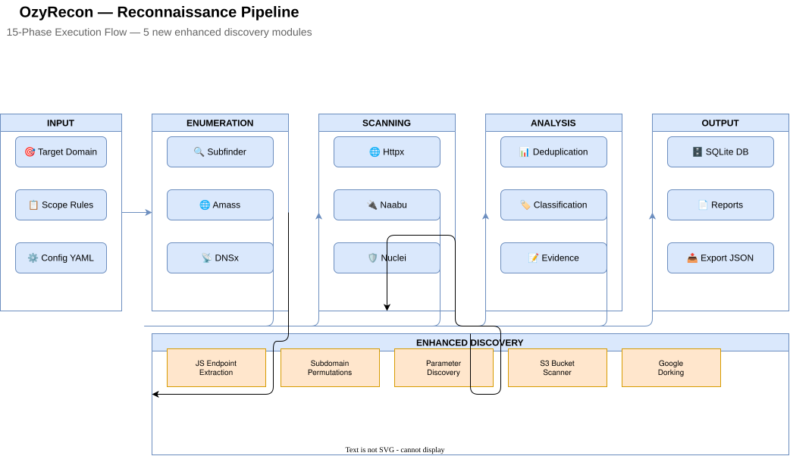

<div align="center">

```
 ██████╗ ███████╗██╗   ██╗    ██████╗ ███████╗ ██████╗ ██████╗ ███╗   ██╗
██╔═══██╗╚══███╔╝╚██╗ ██╔╝    ██╔══██╗██╔════╝██╔════╝██╔═══██╗████╗  ██║
██║   ██║  ███╔╝  ╚████╔╝     ██████╔╝█████╗  ██║     ██║   ██║██╔██╗ ██║
██║   ██║ ███╔╝    ╚██╔╝      ██╔══██╗██╔══╝  ██║     ██║   ██║██║╚██╗██║
╚██████╔╝███████╗   ██║       ██║  ██║███████╗╚██████╗╚██████╔╝██║ ╚████║
 ╚═════╝ ╚══════╝   ╚═╝       ╚═╝  ╚═╝╚══════╝ ╚═════╝ ╚═════╝ ╚═╝  ╚═══╝
```

**Advanced Persistent Reconnaissance Platform**
*Built for security professionals. Engineered for reliability.*

---

[](docs/STATUS.md)
[](#testing)
[](https://www.python.org/)
[](CHANGELOG.md)
[](LICENSE)
[](DISCLAIMER.md)

</div>

---

## Table of Contents

- [What is OzyRecon?](#what-is-ozyrecon)
- [Architecture](#architecture)
- [Reconnaissance Pipeline](#reconnaissance-pipeline)
- [Installation](#installation)
- [Quick Start](#quick-start)
- [Configuration](#configuration)
- [CLI Reference](#cli-reference)
- [Development & Testing](#development--testing)
- [Output Artifacts](#output-artifacts)
- [Security Considerations](#security-considerations)
- [Documentation](#documentation)

---

## What is OzyRecon?

OzyRecon is a **production-ready reconnaissance framework** for security professionals who need reliable, auditable, and comprehensive asset discovery. Whether you're running a bug bounty program, conducting a penetration test, or performing continuous security monitoring — OzyRecon automates the entire pipeline.

```
  Target Input                  Full Recon Pipeline               Structured Output
  ─────────────    ──────────────────────────────────────────    ──────────────────
  example.com  ──► Passive Discovery → Active Scanning → AI  ──► analysis.json
                   Subdomains, Ports, Services, CVEs              analysis.md
                                                                   audit_bundle.tar.gz
```

### Why OzyRecon?

| Feature | OzyRecon | Traditional Tools |
|---------|----------|-------------------|
| Architecture | Hexagonal (testable, extensible) | Monolithic, tightly coupled |
| Evidence | SHA256-signed audit bundles | Raw output files |
| Scope Safety | Built-in scope validation | Manual discipline required |
| Deduplication | Automatic normalization | Manual post-processing |
| Diff Detection | Change tracking across scans | None |
| AI Enrichment | Optional LLM prioritization | None |

---

## Architecture

OzyRecon implements **Hexagonal Architecture (Ports & Adapters)**, enforcing strict separation of concerns across four layers.

### High-Level Architecture


### Layer Responsibilities

| Layer | Purpose | Key Components |
|-------|---------|----------------|
| **CLI Layer** | User interface and command parsing | Click CLI, 22 subcommands, interactive mode |
| **Core Layer** | Infrastructure and cross-cutting concerns | Bootstrap, Config, Target Normalizer, Rate Limiter |
| **Application Layer** | Business logic and orchestration | Use Cases, Ports (interfaces), Policy Engine |
| **Domain Layer** | Pure business entities and rules | Asset, Finding, Evidence, Scan (immutable) |
| **Adapters Layer** | External tool integrations | SQLite, Go tools, HTTP client, APIs, Notifications |

### Dependency Flow

```
Domain          ← no dependencies
   ↑
Application     ← depends on Domain only (via port interfaces)
   ↑
Adapters        ← depends on Application ports + Domain
   ↑
Infrastructure  ← cross-cutting concerns
```

### Key Design Patterns

<details>
<summary><b>Port & Adapter Example — Asset Repository</b></summary>

```python
# Port (interface) — lives in Application Layer
# src/application/ports/asset_repository.py
class IAssetRepository(ABC):
    @abstractmethod
    def save(self, asset: Asset) -> None: ...

    @abstractmethod
    def find_by_domain(self, domain: str) -> Asset | None: ...


# Adapter (concrete) — lives in Adapter Layer
# src/adapters/storage/sqlite_repository.py
class SQLiteAssetRepository(IAssetRepository):
    def save(self, asset: Asset) -> None:
        # Maps domain model → SQLAlchemy model
        ...


# Use Case — depends on interface, not SQLite
# src/application/use_cases/orchestrator_v10.py
class OrchestratorV10:
    def __init__(self, repository: IAssetRepository):
        self._repository = repository  # Could be SQLite, Postgres, or Mock


# Test — no database needed
class MockAssetRepository(IAssetRepository):
    def __init__(self): self.assets = {}
    def save(self, asset): self.assets[asset.domain] = asset
    def find_by_domain(self, domain): return self.assets.get(domain)
```

</details>

### Concurrency Model

```
                    OzyRecon Process
                    ─────────────────────────────────────
                    │                                   │
              ThreadPoolExecutor               Subprocess Pool
              (3–5 workers)                    (Go binaries)
              ─────────────────               ──────────────────
              HTTP Probing                    subfinder (passive)
              Fuzzing                         nmap (port scan)
              DNS Resolution                  nuclei (vuln scan)
              API Calls                       katana (crawl)
                    │                                   │
                    └──────── Thread-Safe State ────────┘
                              Rate Limiters
                              Result Cache
                              Backpressure Queue
```

---

## Reconnaissance Pipeline

OzyRecon runs in **five sequential phases**, each with defined inputs, outputs, and failure handling.



### Phase Details

| Phase | Name | Duration | Purpose |
|-------|------|----------|---------|
| 1 | **Preflight** | 5–10 sec | Validate environment, tools, network |
| 2 | **Scope & Authorization** | < 1 sec | Enforce scanning boundaries |
| 3 | **Adaptive Hunt** | 5–20 min | Passive discovery → Active scanning |
| 4 | **Analysis Snapshot** | 30 sec–2 min | Normalize, score, sign evidence |
| 5 | **Diff Intelligence** | 1–5 sec | Detect changes from previous scans |

### Phase 1 · Preflight Verification

```
Checks:
  ✓ Binary presence       nmap, nuclei, subfinder, httpx, katana, gowitness, dnsx
  ✓ Python deps           sqlalchemy, requests, rich, click, pyyaml, cryptography
  ✓ Database              SQLite connection + schema migration state
  ✓ Network               DNS resolution of 8.8.8.8 + TCP to 1.1.1.1:443
  ✓ Scope                 At least one authorized domain in config/scope.yaml
```

### Phase 2 · Scope & Authorization

```
Input:  Target string (e.g. "api.example.com")
        ↓ normalize (strip protocol, trailing dots, paths)
        ↓ extract root domain
        ↓ validate against config/scope.yaml allowed_domains
        ↓ check wildcard matches (*.example.com)
        ↓ reject private IPs (10.x, 192.168.x, 127.x) unless explicitly allowed
        ↓ apply forbidden_patterns (internal, staging, dev...)
Output: ✅ AUTHORIZED  or  ❌ REJECTED: <reason>
```

### Phase 3 · Adaptive Hunt

```
┌─────────────────── PASSIVE DISCOVERY (2–5 min) ──────────────────┐
│                                                                    │
│  crt.sh ──────► Certificate Transparency Logs                     │
│  Censys ──────► Historical SSL certificates                       │
│  CommonCrawl ─► Historical URL mentions                           │
│  Wayback ─────► Archived pages and endpoints                      │
│  subfinder ───► Aggregated passive subdomain enumeration          │
│  whois/BGP ───► ASN enumeration, IP ranges                        │
│                                                                    │
└─────────────────── ACTIVE RESOLUTION (3–8 min) ───────────────────┐
│                                                                    │
│  dnsx ────────► DNS resolution with retries (A/AAAA/CNAME/MX/TXT)│
│  httpx ───────► HTTP/HTTPS probing + technology fingerprinting    │
│  gowitness ───► Automated screenshots for manual review           │
│  banner grab ─► Port 21,22,25,80,443,3306,5432 version detection  │
│                                                                    │
└─────────────────── SERVICE ANALYSIS (5–15 min) ───────────────────┘
                                                                    │
  nmap ──────────► Top 1000 ports (or custom port list)             │
  nmap -sV ──────► Service version detection                        │
  nmap --script ─► Safe NSE scripts (auth, SSL certs, etc.)         │
  OS detection ──► TCP/IP stack fingerprinting (optional, root req) │
```

### Phase 4 · Analysis Snapshot

```
Raw Tool Outputs
      │
      ▼
Finding Aggregation   ─── Merge results from all tools, prioritize by severity
      │
      ▼
Risk Scoring          ─── Apply config/scoring.yaml rules (service type, exposure)
      │
      ▼
Attack Surface Map    ─── Identify vectors: admin panels, outdated services, misconfigs
      │
      ▼
AI Enrichment         ─── (optional) LLM contextualization + prioritization
      │
      ▼
Evidence Signing      ─── SHA256 hash all raw outputs → evidence/ directory
      │
      ▼
  analysis.json  +  analysis.md  +  flow_summary.json
```

### Phase 5 · Diff Intelligence

```
Previous Scan (DB)     Current Scan
───────────────────    ──────────────────
api.example.com    ──► api.example.com       ← UNCHANGED
admin.example.com  ──► (missing)             ← ⚠️  REMOVED
                   ──► dev.example.com       ← 🆕  NEW
cdn.example.com    ──► cdn.example.com:8080  ← 🔴  CHANGED (new port)
```

---

## Installation

### System Requirements

| Requirement | Minimum | Recommended |
|-------------|---------|-------------|
| OS | Linux (Ubuntu 20.04+) / macOS 12+ | Ubuntu 22.04 LTS |
| Python | 3.11 | 3.12+ |
| RAM | 2 GB | 4 GB |
| Disk | 500 MB (binaries) | 2 GB (binaries + scan data) |
| Network | Unrestricted outbound TCP/UDP | — |

### Step-by-Step Setup

**1. Clone the repository**

```bash
git clone https://github.com/yourusername/OzyRecon.git
cd OzyRecon
```

**2. Create and activate a virtual environment**

```bash
python -m venv venv
source venv/bin/activate        # Linux/macOS
# venv\Scripts\activate         # Windows
```

**3. Install Python dependencies**

```bash
pip install --upgrade pip
pip install -r requirements.txt
pip install -e .                # editable install for development
```

**4. Install system binaries**

```bash
# Ubuntu/Debian
sudo apt install nmap

# Arch Linux
sudo pacman -S nmap

# macOS
brew install nmap
```

> Go binaries (`subfinder`, `httpx`, `nuclei`, `katana`, `gowitness`, `dnsx`) are pre-compiled and included in `tools/go/bin/`.

**5. Verify and initialize**

```bash
python ozy.py --version     # → OzyRecon v9.0.1
python ozy.py doctor        # → READY - All checks passed
python ozy.py init          # creates config/, data/
./scripts/pre-flight.sh     # validates full environment
```

### Python Dependencies

| Package | Version | Purpose |
|---------|---------|---------|
| `sqlalchemy` | >= 2.0 | Database ORM and migrations |
| `requests` | >= 2.31 | HTTP client |
| `rich` | >= 13.0 | Terminal output formatting |
| `click` | >= 8.1 | CLI framework |
| `pyyaml` | >= 6.0 | Configuration parsing |
| `curl_cffi` | >= 0.7.0 | TLS fingerprint randomization |
| `cryptography` | >= 42.0 | Evidence signing |
| `jinja2` | >= 3.1 | Template rendering |
| `weasyprint` | >= 62.0 | PDF generation (optional) |

### Troubleshooting

<details>
<summary><b>ImportError: No module named 'sqlalchemy'</b></summary>

```bash
# Activate the venv first — you may be using the system Python
source venv/bin/activate
pip install -r requirements.txt
```

</details>

<details>
<summary><b>Binary Not Found: nmap</b></summary>

```bash
sudo apt install nmap         # Ubuntu/Debian
sudo pacman -S nmap           # Arch
brew install nmap             # macOS
```

</details>

<details>
<summary><b>Permission Denied: ./scripts/pre-flight.sh</b></summary>

```bash
chmod +x scripts/pre-flight.sh
```

</details>

---

## Quick Start

### Basic Workflow

```bash
# 1. Add target to authorized scope
python ozy.py scope add example.com

# 2. Run full reconnaissance
python ozy.py flow example.com --profile safe-active

# 3. View discovered assets
python ozy.py inventory

# 4. Analyze a specific host
python ozy.py analyze api.example.com

# 5. Export results
python ozy.py export example.com
# → exports/example.com_2026-05-30.json
```

### Scan Profiles

| Profile | Description | Best For |
|---------|-------------|----------|
| `passive` | No active scanning. Passive sources only. | Initial recon, stealth |
| `safe-active` | Standard recon, non-invasive techniques. | Bug bounties (default) |
| `aggressive` | Deep scanning, all techniques. | Explicit written authorization required |

---

## Configuration

### `config/scope.yaml`

```yaml
target: example.com
allowed_domains:
  - example.com
  - "*.example.com"
  - test.example.org
forbidden_patterns:
  - internal
  - staging
  - dev
profiles_allowed:
  - passive
  - safe-active
authorization:
  type: bug-bounty
  reference: "HackerOne Program #12345"
  date: "2026-05-30"
  authorized_by: "Program Owner"
```

### `config/config.yaml`

```yaml
# Performance
threads: 50
timeout: 10       # seconds per request
rate_limit: 50    # requests/second for nuclei

# Tools path
tools_path: "tools/go/bin"

# Auto Rate Limiting
auto_rate_limit:
  enabled: true
  max_requests_per_min: 200
  check_interval: 10
  error_threshold: 10
  ban_threshold: 50
  slow_mode_threshold: 1000

# API Keys (optional)
api_keys:
  shodan: ""
  virustotal: ""
  censys_id: ""
  censys_secret: ""
  securitytrails: ""
  github: ""

# Notifications (optional)
notifications:
  telegram_token: "YOUR_BOT_TOKEN"
  telegram_chat_id: "YOUR_CHAT_ID"
  alert_level: "medium"  # critical, high, medium, low, all
  always_notify: true

# AI Enrichment (optional)
ai:
  gemini_api_key: ""
  claude_api_key: ""
```

### Rate Limiting

- Default: **200 requests/min** with 5–10% jitter
- Configurable per profile in `config/profiles.yaml`
- Automatic backoff on HTTP 429 responses
- Randomized inter-request delays (prevents pattern detection)

---

## CLI Reference

### Command Categories

| Category | Commands | Description |
|----------|----------|-------------|
| **Recon** | `flow`, `scan`, `analyze` | Core reconnaissance workflows |
| **Inventory** | `inventory`, `diff`, `paths` | Asset management and tracking |
| **Security** | `scope`, `secrets`, `audit` | Scope enforcement and security checks |
| **Output** | `export`, `screenshot`,`verify` | Report generation and evidence |
| **System** | `doctor`, `init`, `keys` | Environment and configuration |
| **Advanced** | `schedule`, `watch`, `serve` | Automation and API mode |

### Core Commands

```bash
# Full reconnaissance pipeline
python ozy.py flow <target> [--profile passive|safe-active|aggressive]

# Quick scan (discovery only)
python ozy.py scan <target> --discovery-only

# Analyze specific asset
python ozy.py analyze <host> [--detailed]

# View all discovered assets
python ozy.py inventory [--format table|json|csv]

# Compare with previous scan
python ozy.py diff <target>

# Export results
python ozy.py export <target> [--format json|csv|pdf]
```

### System Commands

```bash
# Check environment health
python ozy.py doctor

# Initialize configuration
python ozy.py init

# Manage API keys
python ozy.py keys add <provider> <key>
python ozy.py keys list

# Verify evidence integrity
python ozy.py verify <scan_id>
```

---

## Development & Testing

### Running Tests

```bash
source venv/bin/activate

pytest                                          # full suite (217 tests, ~2.5 min)
pytest -v                                       # verbose output
pytest tests/core/test_tool_manager_sync.py    # single module
pytest -k "test_scope"                          # pattern matching
pytest -x                                       # stop on first failure
pytest --cov=src --cov-report=html             # coverage report
```

### Test Organization

```
tests/
├── core/           Core infrastructure (tool manager, context, plugins)
├── adapters/       External integrations (database, API clients)
├── intelligence/   AI analysis, scoring, evidence linking
├── validation/     Scope validation, policy enforcement
└── integration/    End-to-end workflow tests
```

> Tests run in full isolation — temporary SQLite databases, mocked HTTP responses, filesystem sandboxing. Always run inside the virtual environment.

### Code Quality

```bash
ruff check src/ tests/       # linting
mypy src/ --strict            # type checking
bandit -r src/                # security scanning
```

### Performance & Experiments

```bash
./scripts/performance/v76_concurrency_stress.py   # 100 parallel scans
./scripts/performance/v77_load_test.sh             # 1000 assets simulation

python scripts/experiments/v75_evidence_proof.py   # evidence chain verification
python scripts/experiments/v81_ai_proof.py         # AI analysis validation
```

---

## Output Artifacts

### Directory Structure After a Scan

```
runs/
└── example.com_20260530_120000/
    ├── analysis.json          ← machine-readable findings (normalized schema)
    ├── analysis.md            ← executive summary for human review
    ├── flow_summary.json      ← execution telemetry and tool runtimes
    └── audit_a1b2c3d4.tar.gz  ← cryptographically signed evidence bundle
        ├── evidence/
        │   ├── subfinder_output.txt    (SHA256 signed)
        │   ├── httpx_output.json       (SHA256 signed)
        │   ├── nmap_scan.xml           (SHA256 signed)
        │   └── nuclei_results.json     (SHA256 signed)
        ├── metadata.json      ← timestamps, tool versions, command arguments
        ├── signatures.json    ← SHA256 hashes of all evidence files
        └── flow_summary.json  ← execution trace
```

### `analysis.json` Schema

```json
{
  "scan_id": "a1b2c3d4",
  "timestamp": "2026-05-30T12:00:00Z",
  "target": "example.com",
  "assets": [
    {
      "domain": "api.example.com",
      "ip": "203.0.113.10",
      "http_status": 200,
      "technologies": ["nginx/1.18.0", "Express.js"],
      "ports": [22, 80, 443],
      "findings": [
        {
          "id": "missing-csp",
          "severity": "medium",
          "title": "Missing Content-Security-Policy header",
          "evidence_hash": "sha256:abc123..."
        }
      ]
    }
  ],
  "summary": {
    "total_assets": 12,
    "live_services": 8,
    "findings": { "critical": 0, "high": 1, "medium": 3, "low": 5 }
  }
}
```

### `analysis.md` Executive Summary

```markdown
# Reconnaissance Report: example.com
Generated: 2026-05-30 12:00:00 UTC

## Executive Summary
Discovered 12 subdomains, 8 with active HTTP services.
1 high-severity finding requires immediate attention.

## High-Priority Findings
1. [HIGH] Authentication bypass on admin.example.com
   - Impact: Administrative access without credentials
   - Evidence: HTTP 200 on /admin/users without session cookie

## Attack Surface
- api.example.com ────── REST API, 15 endpoints discovered
- cdn.example.com ────── Cloudflare CDN, origin IP exposed
- staging.example.com ── Misconfigured with production credentials

## Recommendations
1. Restrict admin.example.com via IP whitelist
2. Remove staging.example.com from public DNS
3. Implement rate limiting on api.example.com
```

---

## Security Considerations

### OPSEC Protection

A pre-commit hook (`scripts/opsec_check.py`) prevents accidental commits of sensitive data.

**Blocked patterns:**
- Real target domains (except `example.com`, `test.com`)
- Public IP addresses (excludes RFC 1918 / RFC 5737 ranges)
- API keys and secrets (`AKIA...`, `ghp_...`, etc.)

**Allowed test data:**
```
10.x.x.x, 192.168.x.x, 172.16–31.x.x   RFC 1918 private ranges
192.0.2.x, 198.51.100.x, 203.0.113.x   RFC 5737 documentation ranges
169.254.x.x                              Link-local
127.x.x.x                               Loopback
example.com, test.com, example.org       Reserved test domains
```

### Data Handling

```
Scan data       ─── Stored locally in data/ozyrecon.db + runs/
Credentials     ─── Never logged or stored in plain text
Network traffic ─── No data sent to external servers (except scan target)
Audit logs      ─── All tool executions logged in flow_summary.json
```

---

## Documentation

| Document | Description |
|----------|-------------|
| [`docs/STATUS.md`](docs/STATUS.md) | Current status, version, test metrics |
| [`docs/WORKFLOWS.md`](docs/WORKFLOWS.md) | Six real-world recon scenarios with full command output |
| [`docs/INSTALL.md`](docs/INSTALL.md) | Detailed multi-platform installation guide |
| [`docs/USAGE.md`](docs/USAGE.md) | Complete CLI reference |
| [`docs/architecture.md`](docs/architecture.md) | Hexagonal architecture deep dive |
| [`docs/COMPLIANCE.md`](docs/COMPLIANCE.md) | Evidence signing and audit standards |
| [`docs/EXCLUSIONS.md`](docs/EXCLUSIONS.md) | Explicit non-goals (no payload gen, no exploit exec) |
| [`DISCLAIMER.md`](DISCLAIMER.md) | Legal boundaries and responsible use |

---

## Contributing

1. Read [`CONTRIBUTING.md`](CONTRIBUTING.md) for workflow and code standards
2. Run `./scripts/opsec_check.py` before committing
3. New features require tests with ≥80% coverage
4. Follow [Conventional Commits](https://www.conventionalcommits.org/): `feat:`, `fix:`, `docs:`, `refactor:`

```bash
git clone https://github.com/yourusername/OzyRecon.git
cd OzyRecon
git checkout -b feature/your-feature
pip install -r requirements-dev.txt

# make changes, then:
pytest && ruff check src/ && mypy src/
git commit -m "feat: add custom wordlist support for fuzzer"
git push origin feature/your-feature
```

---

## Legal

**OzyRecon is for authorized security testing only.**

> Users are solely responsible for obtaining explicit written authorization before scanning any target, complying with local laws, and respecting bug bounty program rules of engagement.
>
> **Always get written permission before testing any system you do not own.**
>
> Unauthorized scanning is illegal in most jurisdictions and may result in criminal prosecution. The authors assume no liability for misuse.

Licensed under the [Apache License 2.0](LICENSE).

---

<div align="center">

**Documentation** · [docs/](docs/)  ·  **Issues** · [GitHub Issues](https://github.com/yourusername/OzyRecon/issues)  ·  **Security** · security@ozyrecon.io

*Built for the security community. Use responsibly.*

</div>
