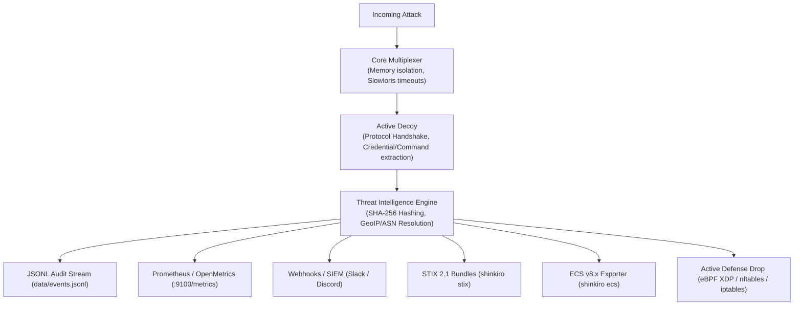

# Shinkiro System & Deception Engine Architecture

## 1. High-Interaction Protocol Decoys (12 Vectors)

1. **SSH Trap (`:2222`)**: Virtual bash environment, credential trapping, and command telemetry.
2. **PostgreSQL (`:5432`)**: Wire protocol 3.0 DB auth interception.
3. **Redis (`:6379`)**: Wire protocol RESP parser, Lua `EVAL` injection blocker.
4. **Docker Engine (`:2375`)**: Daemon REST API, crypto-miner container interception.
5. **Kubernetes API (`:6443`)**: Control plane v1.29 enumeration trap.
6. **AWS IMDS (`:8169`)**: SSRF & IAM role credential baiting.
7. **HTTP Canary Traps (`:8080`)**: Traps for `/.env`, `/.git`, AWS keys.
8. **MongoDB (`:27017`)**: BSON OP_MSG protocol emulator.
9. **Elasticsearch (`:9200`)**: Cluster health and index enumeration baiting.
10. **SMTP (`:2525`)**: ESMTP mail transfer and phishing collector.
11. **DNS (`:5353`)**: Reconnaissance subdomain query logger.
12. **SMBv2 (`:445`)**: Windows file-sharing & EternalBlue / ransomware probe trap.

## 2. Dynamic Threat Scoring & Telemetry Pipeline

