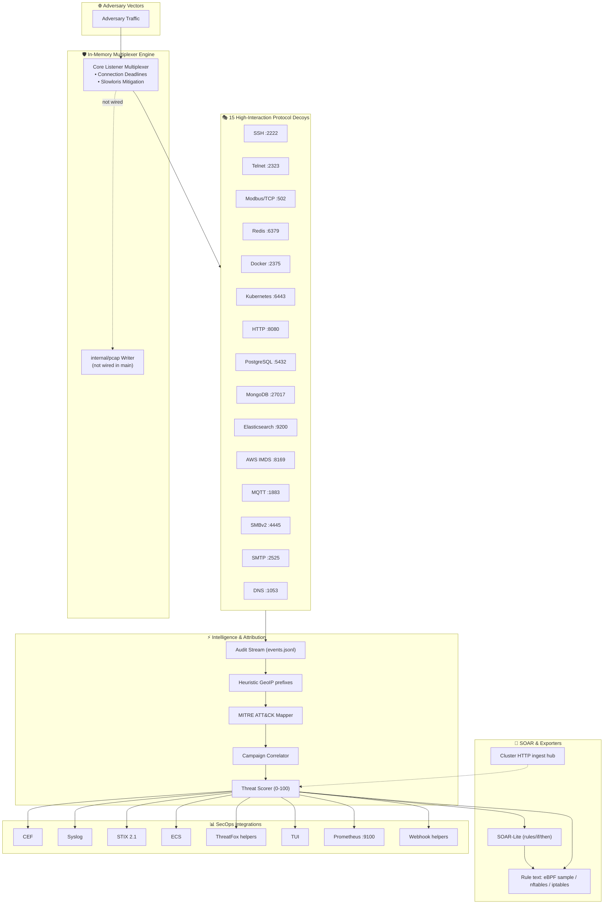
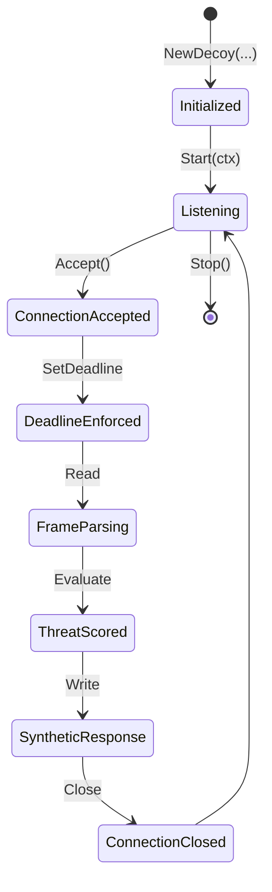

# Shinkiro System Architecture & Technical Specification

**Product:** Shinkiro (蜃気楼)  
**License:** AGPL-3.0-only  
**Language:** Go 1.24+ (single binary)

---

## 1. System Design Goals & Principles

1. **Zero Host Mutation:** Deceptive protocols must not execute host binaries or write attacker-controlled files for shell semantics. State stays in synthetic in-memory structures.
2. **Fail-Closed Security Posture:** Malformed frames / parser failures terminate the socket without stack traces to the client.
3. **Measurable Hot Path:** Prefer measured `go test -bench` results over undocumented SLA nanoseconds.
4. **Actionable SOC Interoperability:** CEF, Syslog, STIX 2.1, ECS exporters; MITRE tagging.
5. **Exportable Active Defense:** nftables/iptables/sample eBPF **text** + SOAR `block_ip` / `alert` — not a silent live XDP attach.

---

## 2. Component Topology & Data Flow



---

## 3. Package & Module Architecture

```text
internal/
├── adversary/          # Automated red-team simulate suite
├── canary/             # Canary token helpers
├── cluster/            # HTTP ingest hub (NOT UDP gossip)
├── config/             # YAML parser — runtime key services:
├── core/               # Multiplexer & connection lifecycle; Benchmark* tests
├── decoys/             # Unified Decoy interface & 15 protocol emulators
│   ├── aws/ dns/ docker/ elastic/ http/ k8s/
│   ├── modbus/ mongo/ mqtt/ postgres/ redis/
│   ├── smb/ smtp/ ssh/ telnet/
├── defense/            # iptables & nftables ruleset text generator
├── ebpf/               # Sample C + RenderScript exporter (NOT live loader)
├── intel/              # Telemetry, scoring, MITRE, correlator
│   ├── ecs/            # ECS serializer
│   ├── geoip/          # Heuristic / demo prefix resolver (NOT MaxMind)
│   ├── siem/           # CEF & Syslog exporters
│   └── stix/           # STIX 2.1 bundle generator
├── metrics/            # Prometheus helpers
├── pcap/               # Libpcap 2.4 writer (NOT wired in cmd/main)
├── soar/               # Playbook engine (block_ip, alert, tag)
├── tui/                # Bubbletea dashboard
└── webhook/            # Slack / Discord helpers
```

---

## 4. Operational CLI Interface

```bash
shinkiro up [--config config.yaml]
shinkiro tui
shinkiro cef
shinkiro syslog
shinkiro ecs
shinkiro stix
shinkiro export --format nftables     # text export
shinkiro export --format iptables     # text export
shinkiro kernel                       # sample eBPF / rule script text
shinkiro canary generate --label prod-cluster-secret
shinkiro simulate --host 127.0.0.1
shinkiro cluster hub                  # HTTP ingest on configured port
```

---

## 5. Security & Runtime Hardening

- **Seccomp file:** `deploy/security/seccomp.json` for operators to apply.
- **Supply chain:** Releases build with `-trimpath` / stripped ldflags; Cosign **`sign-blob`** on `checksums.txt`; Syft SPDX + CycloneDX SBOMs. **No SLSA Level 3 provenance workflow.**
- **Fuzzing:** Selected `testing.F` targets via `make fuzz`.
- **Deploy caveats:** Dockerfile and Helm chart exist; GHCR one-liner and full `services:` config mounts are incomplete until a deploy PR.

---

## 6. Go Package Integration

Prefer copying patterns from `cmd/shinkiro/main.go` — it is the authoritative wiring for decoys, SOAR, metrics, cluster hub, and exporters. Public/internal APIs evolve with the binary; do not invent alternate constructor signatures in docs without checking the source.

### Decoy lifecycle (conceptual)



---

## 7. Metrics & Observability (`:9100/metrics`)

Prometheus helpers live under `internal/metrics`. Treat metric names in dashboards as best-effort documentation — verify exporters in code before depending on a specific time series (including any historical `shinkiro_ebpf_drops_total` style counters that implied a live XDP path).
