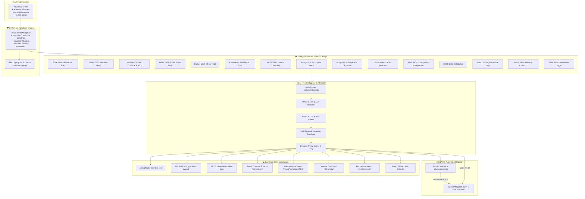
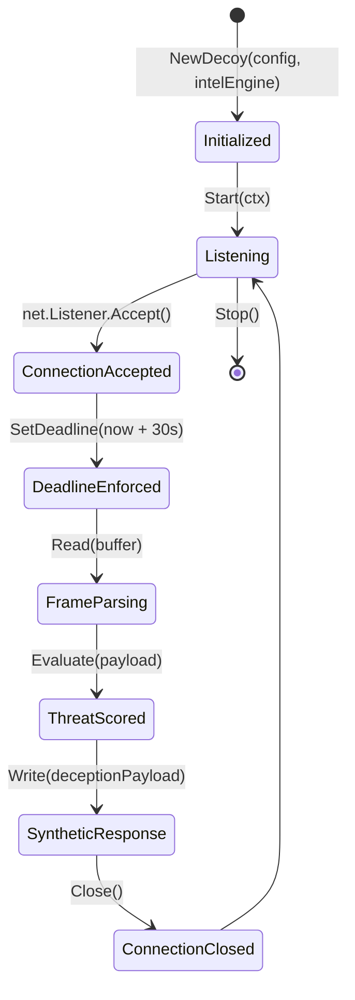

# Shinkiro System Architecture & Technical Specification

**Product:** Shinkiro (蜃気楼)  
**License:** AGPL-3.0-only  
**Language:** Go 1.24+ (Single Binary, Non-Blocking Concurrent Goroutines)

---

## 1. System Design Goals & Principles

Shinkiro is engineered as an enterprise-grade, memory-isolated cyber deception platform. Its architecture is governed by five non-negotiable systems engineering principles:

1. **Zero Host Mutation:** Deceptive protocols must never execute host binaries, spawn subshells, or write untrusted attacker data to the host filesystem. All state is maintained in synthetic in-memory ASTs and ringbuffers.
2. **Fail-Closed Security Posture:** Any malformed network frame, parser failure, or unhandled protocol condition must cleanly and immediately terminate the TCP/UDP socket, revealing no internal software stack information to scanners.
3. **Sub-Microsecond Hot Path:** The telemetry processing, scoring, and correlation pipeline must process events with zero memory allocations on the hot path (< 20 ns per event).
4. **Actionable SOC Interoperability:** All captured interactions must map directly to industry standards (MITRE ATT&CK TTPs, STIX 2.1, Elastic ECS v8.x, ArcSight CEF, and RFC5424 Syslog).
5. **Dynamic Active Defense:** Telemetry must be capable of automatically triggering immediate host or kernel mitigation via eBPF/XDP and nftables.

---

## 2. Component Topology & Data Flow



---

## 3. Package & Module Architecture

```text
internal/
├── adversary/          # Automated red-team attack simulator suite
├── canary/             # Cryptographic HMAC AWS/DB canary token generation
├── cluster/            # Distributed multi-node gossip mesh hub (:9090)
├── config/             # YAML configuration parser & environment binder
├── core/               # Non-blocking network multiplexer & connection lifecycles
├── decoys/             # Unified Decoy interface & 15 protocol emulators
│   ├── aws/            # AWS EC2 IMDSv1/v2 SSRF bait
│   ├── dns/            # RFC 1035 UDP parser
│   ├── docker/         # Docker Engine REST API emulator
│   ├── elastic/        # Elasticsearch REST API emulator
│   ├── http/           # Canary web traps (/.env, wp-login, Jenkins, Grafana)
│   ├── k8s/            # Kubernetes control-plane emulator
│   ├── modbus/         # Modbus/TCP ICS/SCADA PLC emulator
│   ├── mongo/          # MongoDB BSON OP_MSG emulator
│   ├── mqtt/           # MQTT v3.1.1 IoT broker
│   ├── postgres/       # PostgreSQL 3.0 wire protocol emulator
│   ├── redis/          # Redis RESP wire protocol & Lua EVAL blocker
│   ├── smb/            # SMBv2 NetBIOS session emulator
│   ├── smtp/           # Postfix ESMTP banner & spam collector
│   ├── ssh/            # OpenSSH server, VirtualFS, and human jitter
│   └── telnet/         # BusyBox embedded router Mirai trap
├── defense/            # Dynamic iptables & nftables ruleset generator
├── ebpf/               # Linux kernel-level XDP drop driver generator
├── intel/              # Telemetry ingestion, threat scoring, MITRE, & campaign correlator
│   ├── ecs/            # Elastic Common Schema (ECS v8.x) serializer
│   ├── geoip/          # Offline MaxMind GeoIP & ASN resolver
│   ├── siem/           # ArcSight CEF & RFC5424 Syslog exporters
│   └── stix/           # OASIS STIX 2.1 JSON bundle generator
├── metrics/            # Prometheus / OpenMetrics collector (:9100/metrics)
├── pcap/               # Raw libpcap 2.4 frame recorder
├── soar/               # SOAR-Lite YAML playbook execution engine
├── tui/                # Bubbletea + Lipgloss live terminal dashboard
└── webhook/            # Slack Block Kit and Discord notification dispatcher
```

---

## 4. Operational CLI Interface

```bash
# Start background decoy listeners and metrics daemon
shinkiro up [--config config.yaml]

# Launch interactive Bubbletea terminal dashboard
shinkiro tui

# Export SIEM telemetry streams
shinkiro cef                          # ArcSight CEF
shinkiro syslog                       # RFC5424 Syslog stream
shinkiro ecs                          # Elastic Common Schema JSON array
shinkiro stix                         # STIX 2.1 Threat Feed bundle

# Generate firewall & kernel drop rules
shinkiro export --format nftables     # nftables blackhole set
shinkiro export --format iptables     # iptables DROP script
shinkiro kernel                       # eBPF / XDP drop script

# Generate canary tokens
shinkiro canary generate --label prod-cluster-secret

# Run synthetic adversarial attack simulation
shinkiro simulate --host 127.0.0.1
```

---

## 5. Security & Runtime Hardening

- **Syscall Restrictions:** Evaluated under strict Linux `seccomp.json` profiles returning `SCMP_ACT_ERRNO` on unauthorized kernel operations.
- **Supply Chain Integrity:** Automated releases built with `-trimpath` and `-ldflags="-s -w -buildid="`, signed via **Sigstore Cosign keyless OIDC**, and verified by SPDX and CycloneDX SBOMs.
- **Continuous Fuzzing:** All protocol decoders pass automated `testing.F` fuzz suites (`make fuzz`) with zero panics or memory leaks.

---

## 6. Go Package APIs & Programmatic Integration

Shinkiro is organized into modular Go packages that can be imported directly into external Go applications or custom security agents:

### 6.1. Embedding the Decoy Multiplexer

```go
package main

import (
	"context"
	"log"
	"time"

	"github.com/Haiagari/shinkiro/internal/config"
	"github.com/Haiagari/shinkiro/internal/core"
	"github.com/Haiagari/shinkiro/internal/intel"
)

func main() {
	cfg, err := config.Load("config.yaml")
	if err != nil {
		log.Fatalf("Failed to load config: %v", err)
	}

	// Initialize Threat Intelligence & Scoring Engine
	intelEngine := intel.NewEngine(cfg.Intel)
	defer intelEngine.Close()

	// Initialize Core Multiplexer with Connection Deadlines
	mux := core.NewMultiplexer(cfg, intelEngine)

	ctx, cancel := context.WithCancel(context.Background())
	defer cancel()

	log.Println("Starting Shinkiro Deception Mesh...")
	if err := mux.Start(ctx); err != nil {
		log.Fatalf("Multiplexer runtime failure: %v", err)
	}
}
```

### 6.2. In-Memory Protocol Decoy Lifecycle State Machine

Each decoy implements the unified `Decoy` interface (`internal/decoys/decoy.go`):



---

## 7. Metrics & Observability (`:9100/metrics`)

Shinkiro exposes standard OpenMetrics / Prometheus endpoints for real-time dashboarding in Grafana:

| Metric Name | Type | Description |
| :--- | :--- | :--- |
| `shinkiro_events_total` | Counter | Total adversary interactions partitioned by `decoy`, `protocol`, and `severity`. |
| `shinkiro_threat_score_gauge` | Gauge | Instantaneous threat score distribution across active attacker IP addresses. |
| `shinkiro_active_connections` | Gauge | Currently open TCP/UDP decoy sockets. |
| `shinkiro_mitre_hits_total` | Counter | Aggregated count of triggered MITRE ATT&CK techniques. |
| `shinkiro_ebpf_drops_total` | Counter | Number of malicious packets discarded at the kernel XDP driver layer. |
| `shinkiro_soar_executions_total` | Counter | Count of automated playbook actions executed by type (`firewall`, `webhook`, `siem`). |

