# Shinkiro Cyber Deception & Threat Intelligence Architecture

```mermaid
graph TD
    %% Adversary Vector
    subgraph Adversaries ["🌐 Adversary Traffic Vectors"]
        A1["SSH / Telnet Brute Force<br/>(Ports 2222, 2323)"]
        A2["Cloud & Container Probes<br/>(AWS IMDS :8169, Docker :2375, K8s :6443)"]
        A3["Database Recon<br/>(PostgreSQL :5432, Redis :6379, Mongo :27017)"]
        A4["IoT & Lateral Movement<br/>(MQTT :1883, SMB :4445, SMTP :2525, DNS :1053)"]
        A5["Industrial Control Systems (OT)<br/>(Modbus/TCP :502)"]
    end

    %% Core Multiplexer
    subgraph Core ["🛡️ Shinkiro Core In-Memory Multiplexer"]
        Mux["Listener Multiplexer Engine<br/>- Strict Read/Write Timeouts<br/>- Slowloris Mitigation<br/>- Memory-Jailed Goroutines"]
        PCAP["Raw Libpcap 2.4 Forensics<br/>(data/dump.pcap)"]
    end

    A1 -->|TCP/UDP| Mux
    A2 -->|TCP/UDP| Mux
    A3 -->|TCP/UDP| Mux
    A4 -->|TCP/UDP| Mux
    A5 -->|TCP| Mux
    Mux -.->|Zero-Copy Frame Dump| PCAP

    %% Decoy Layer
    subgraph Decoys ["🎭 High-Interaction Protocol Decoys"]
        direction TB
        D_SSH["SSH (VirtualFS Bash & Jitter)"]
        D_Telnet["Telnet (BusyBox Mirai)"]
        D_Redis["Redis (RESP & Lua EVAL)"]
        D_Docker["Docker API (Cryptominer Trap)"]
        D_K8s["K8s API (RBAC Probes)"]
        D_AWS["AWS IMDS (SSRF Canary Keys)"]
        D_PG["PostgreSQL (Auth Capture)"]
        D_Mongo["MongoDB (OP_MSG BSON)"]
        D_Elastic["Elasticsearch (Indices)"]
        D_MQTT["MQTT 3.1.1 (IoT Broker)"]
        D_SMB["SMBv2 (EternalBlue Recon)"]
        D_SMTP["SMTP (Spam / Phishing)"]
        D_DNS["DNS (Subdomain Enum)"]
        D_HTTP["HTTP (Canary & Admin Traps)"]
        D_Modbus["Modbus/TCP (ICS/SCADA PLC)"]
    end

    Mux --> D_SSH
    Mux --> D_Telnet
    Mux --> D_Redis
    Mux --> D_Docker
    Mux --> D_K8s
    Mux --> D_AWS
    Mux --> D_PG
    Mux --> D_Mongo
    Mux --> D_Elastic
    Mux --> D_MQTT
    Mux --> D_SMB
    Mux --> D_SMTP
    Mux --> D_DNS
    Mux --> D_HTTP
    Mux --> D_Modbus

    %% Telemetry & Intel Engine
    subgraph Telemetry ["⚡ Real-Time Intelligence & Attribution Pipeline"]
        GeoIP["Offline GeoIP & ASN Engine"]
        Hasher["SHA-256 Payload Hasher"]
        Mitre["MITRE ATT&CK Mapper (TTPs)"]
        Corr["Campaign Correlator (Multi-Decoy)"]
        Score["Dynamic Threat Scoring (0-100)"]
    end

    D_SSH -->|Event| Hasher
    D_Telnet -->|Event| Hasher
    D_Redis -->|Event| Hasher
    D_Docker -->|Event| Hasher
    D_K8s -->|Event| Hasher
    D_AWS -->|Event| Hasher
    D_PG -->|Event| Hasher
    D_Mongo -->|Event| Hasher
    D_Elastic -->|Event| Hasher
    D_MQTT -->|Event| Hasher
    D_SMB -->|Event| Hasher
    D_SMTP -->|Event| Hasher
    D_DNS -->|Event| Hasher
    D_HTTP -->|Event| Hasher
    D_Modbus -->|Event| Hasher

    Hasher --> Mitre
    Mitre --> GeoIP
    GeoIP --> Corr
    Corr --> Score

    %% Outputs & Automated Defense
    subgraph Outputs ["📊 Integration & Active Mitigation"]
        SOAR["SOAR-Lite Engine<br/>(playbooks.yaml)"]
        SIEM["SIEM & Feeds<br/>(ArcSight CEF / Syslog / STIX 2.1 / ECS / ThreatFox)"]
        Prom["Prometheus Metrics<br/>(:9100/metrics)"]
        TUI["Bubbletea Terminal UI<br/>(shinkiro tui)"]
        Webhook["SecOps Webhooks<br/>(Slack Block Kit / Discord)"]
        Drop["Kernel-Level Defense<br/>- Native eBPF / XDP Filter<br/>- nftables / iptables Sets"]
    end

    Score --> SOAR
    Score --> SIEM
    Score --> Prom
    Score --> TUI
    Score --> Webhook
    SOAR -->|Automated Playbook Action| Drop
    Score -->|Score >= 80| Drop
```



---

## Data Flow Sequence

```mermaid
sequenceDiagram
    autonumber
    actor Attacker as 🦹 Adversary
    participant Mux as 🛡️ Multiplexer
    participant Decoy as 🎭 Protocol Decoy
    participant Intel as ⚡ Threat Engine
    participant XDP as 🛑 Kernel eBPF/XDP

    Attacker->>Mux: Connect (e.g. TCP :2222 or :6379)
    Mux->>Mux: Set 30s deadline, enforce memory jail
    Mux->>Decoy: Dispatch socket connection
    Decoy->>Attacker: Send authentic banner/challenge
    Attacker->>Decoy: Send exploit payload / credentials
    Decoy->>Intel: Dispatch structured telemetry event
    par Parallel Ingestion
        Intel->>Intel: Compute SHA-256 payload hash
        Intel->>Intel: Offline GeoIP & ASN lookup
        Intel->>Intel: Update IP threat score (e.g. 95)
    end
    Decoy->>Attacker: Return realistic simulated error/shell
    alt Threat Score >= 80
        Intel->>XDP: Stage IP in eBPF blacklist_map
        Note over XDP,Attacker: Subsequent packets dropped at NIC before OS socket allocation
    end

---

## 3. Deep In-Memory Multiplexer Architecture

The listener multiplexer (`internal/core/multiplexer.go`) acts as the primary network shock absorber for Shinkiro:

### 3.1. Connection Deadlines & Slowloris Neutralization
Attackers and port scanners frequently attempt denial-of-service attacks against honeypots by holding sockets open indefinitely without transmitting data (Slowloris attacks). Shinkiro enforces hard deadlines on all incoming network descriptors:

```go
// Every accepted connection is wrapped with a strict 30-second read deadline
conn.SetDeadline(time.Now().Add(30 * time.Second))
```

If an attacker remains idle or attempts trickling data byte-by-byte, the underlying runtime forcibly calls `conn.Close()`, reclaiming OS file descriptors and recycling memory immediately.

### 3.2. Fail-Closed Network Contract
Unlike production servers that return verbose stack traces, HTTP 500 error bodies, or debug diagnostics when an invalid payload arrives:
1. Shinkiro parses inputs via defensive recursive-descent parsers.
2. In the event of an unexpected byte sequence or EOF, Shinkiro silently terminates the socket (`TCP RST` or `FIN`) without transmitting any internal error string.
3. This eliminates reconnaissance tools from fingerprinting the underlying Go language runtime or Shinkiro internal structures.

---

## 4. Kernel-Level eBPF / XDP Drop Architecture

For high-threat adversaries (threat score $\ge 95$), operating system socket processing consumes unnecessary CPU cycles. Shinkiro offloads mitigation directly to the network interface card (NIC) driver using eBPF/XDP (eXpress Data Path):

```mermaid
graph TD
    NIC["Physical NIC (eth0)"] --> Driver["XDP Driver Hook (xdp_drop.o)"]
    Driver --> BPFMap{"eBPF Map: blacklist_map<br/>(Lookup Source IPv4)"}
    BPFMap -->|Match Found (Score >= 95)| Drop["XDP_DROP<br/>(Zero CPU Alloc, Line Rate Discard)"]
    BPFMap -->|No Match| Kernel["Kernel Network Stack (sk_buff)"]
    Kernel --> Shinkiro["Shinkiro In-Memory Decoys"]
```

### 4.1. eBPF Map Synchronization
The Go telemetry engine interacts directly with the kernel BPF map via the `bpf(BPF_MAP_UPDATE_ELEM)` system call:
- Malicious IPs identified in userland are staged in an LRU hash map (`BPF_MAP_TYPE_LRU_HASH`).
- Subsequent TCP SYN packets from that IP are dropped before the Linux kernel creates an `sk_buff` struct, completely neutralizing volumetric exploit floods.

---

## 5. Distributed Mesh & Cluster Architecture

In enterprise multi-cloud environments, Shinkiro can be deployed as an autonomous distributed mesh:

1. **Local Autonomous Execution:** Each sensor node runs independently with its own in-memory state machine and local decoy listeners. Sensors never depend on a centralized control plane to remain operational.
2. **Cluster Gossip & Threat Sharing:** Nodes can optionally exchange observed high-severity IoCs (threat score $\ge 80$) via encrypted UDP gossip, allowing all nodes in a cluster to preemptively blackhole an adversary probing a single edge node.
3. **Forensic Libpcap Capture:** Raw network packet streams are dumped directly to standard pcap format (`data/dump.pcap`) via zero-copy ringbuffers for post-incident reverse engineering and Wireshark inspection.

---

## 6. Production Deployment Topologies

Shinkiro supports three standardized deployment topologies depending on enterprise threat models:

### 6.1. Edge Perimeter Bastion (Public DMZ)
- Deployed on public cloud VPC boundary subnets with direct Internet ingress.
- Binds standard decoy ports (`2222`, `2323`, `502`, `6379`, `8080`, `2375`).
- Feeds real-time ArcSight CEF and RFC5424 Syslog events into central SOC SIEMs (Splunk, Wazuh).
- Drops aggressive brute-force botnets via local `nftables` blackhole tables.

### 6.2. Internal Lateral Movement Tripwire (Zero-Trust Intranet)
- Deployed inside corporate LANs or Kubernetes cluster worker nodes.
- Serves high-fidelity deception traps (synthetic PostgreSQL, MongoDB, Active Directory SMB, Kubernetes Control Plane).
- Any internal connection triggers an immediate `HIGH` or `CRITICAL` alert to SecOps, as internal production workloads should never access honeynet IP addresses.
- Integrates with SOAR playbooks to isolate compromised internal workstations automatically.

### 6.3. OT / ICS SCADA Enclave (Industrial Automation)
- Deployed on industrial control networks alongside programmable logic controllers (PLCs) and RTUs.
- Binds Modbus/TCP port `502`, emulating power grid telemetry (voltage/frequency holding registers).
- Unauthorized coil or register write requests trigger instantaneous kernel-level eBPF/XDP hardware packet drops, protecting adjacent physical equipment from industrial sabotage.

