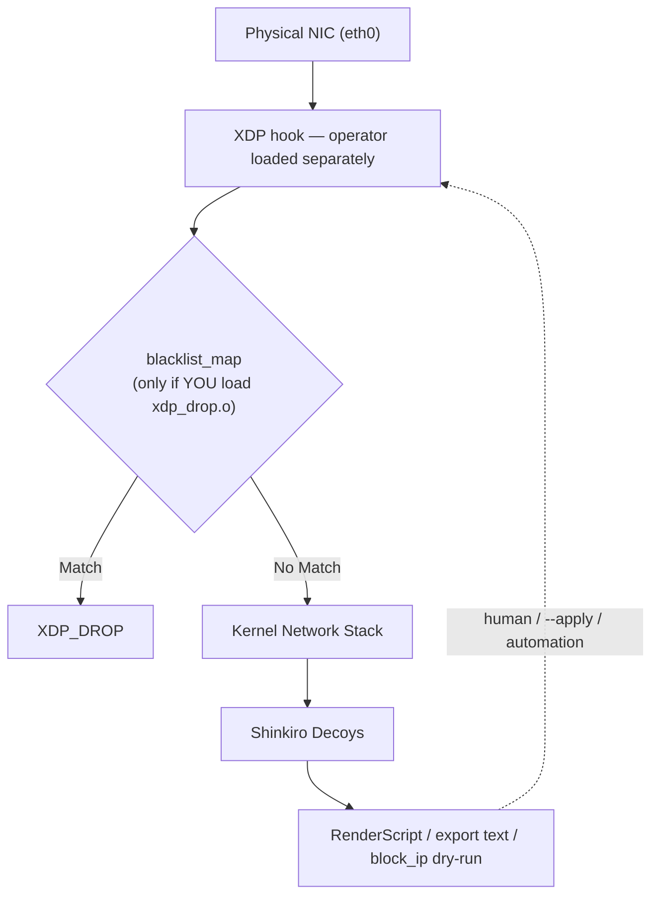

# Shinkiro Cyber Deception & Threat Intelligence Architecture

This document describes **what the code does today**. Where earlier drafts claimed live kernel XDP attachment, MaxMind GeoIP, UDP gossip, or continuous packet mirroring, those claims are corrected below. See also [`event-pipeline.md`](event-pipeline.md) for the Event → Score → Correlate → Playbook → Sink bus, SOAR dry-run/apply, and on-demand PCAP.

```mermaid
graph TD
    subgraph Adversaries ["🌐 Adversary Traffic Vectors"]
        A1["SSH / Telnet Brute Force<br/>(Ports 2222, 2323)"]
        A2["Cloud & Container Probes<br/>(AWS IMDS :8169, Docker :2375, K8s :6443)"]
        A3["Database Recon<br/>(PostgreSQL :5432, Redis :6379, Mongo :27017)"]
        A4["IoT & Lateral Movement<br/>(MQTT :1883, SMB :4445, SMTP :2525, DNS :1053)"]
        A5["Industrial Control Systems (OT)<br/>(Modbus/TCP :502)"]
    end

    subgraph Core ["🛡️ Shinkiro Core In-Memory Multiplexer"]
        Mux["Listener Multiplexer Engine<br/>- Strict Read/Write Timeouts<br/>- Slowloris Mitigation<br/>- Memory-Jailed Goroutines"]
        Bus["internal/pipeline Bus<br/>Score → Correlate → Playbook → Sink"]
        PCAP["On-demand PCAP<br/>(score ≥ threshold)"]
    end

    A1 -->|TCP/UDP| Mux
    A2 -->|TCP/UDP| Mux
    A3 -->|TCP/UDP| Mux
    A4 -->|TCP/UDP| Mux
    A5 -->|TCP| Mux
    Mux -->|events chan| Bus
    Bus -->|high score| PCAP

    subgraph Decoys ["🎭 High-Interaction Protocol Decoys (15)"]
        direction TB
        D_SSH["SSH (VirtualFS Bash & Jitter)"]
        D_Telnet["Telnet (BusyBox Mirai)"]
        D_Redis["Redis (RESP & Lua EVAL)"]
        D_Docker["Docker API (Cryptominer Trap)"]
        D_K8s["K8s API (RBAC Probes)"]
        D_AWS["AWS IMDS (SSRF Canary Keys)"]
        D_PG["PostgreSQL (Auth Capture)"]
        D_Mongo["MongoDB (OP_MSG BSON)"]
        D_Elastic["Elasticsearch (Indices)"]
        D_MQTT["MQTT 3.1.1 (IoT Broker)"]
        D_SMB["SMBv2 (EternalBlue Recon)"]
        D_SMTP["SMTP (Spam / Phishing)"]
        D_DNS["DNS (Subdomain Enum)"]
        D_HTTP["HTTP (Canary & Admin Traps)"]
        D_Modbus["Modbus/TCP (ICS/SCADA PLC)"]
    end

    Mux --> D_SSH
    Mux --> D_Telnet
    Mux --> D_Redis
    Mux --> D_Docker
    Mux --> D_K8s
    Mux --> D_AWS
    Mux --> D_PG
    Mux --> D_Mongo
    Mux --> D_Elastic
    Mux --> D_MQTT
    Mux --> D_SMB
    Mux --> D_SMTP
    Mux --> D_DNS
    Mux --> D_HTTP
    Mux --> D_Modbus

    subgraph Telemetry ["⚡ Real-Time Intelligence & Attribution Pipeline"]
        GeoIP["Heuristic GeoIP prefixes<br/>(NOT MaxMind)"]
        Hasher["SHA-256 Payload Hasher"]
        Mitre["MITRE ATT&CK Mapper (TTPs)"]
        Corr["Campaign Correlator (Multi-Decoy)"]
        Score["Dynamic Threat Scoring (0-100)"]
    end

    D_SSH -->|Event| Hasher
    D_Telnet -->|Event| Hasher
    D_Redis -->|Event| Hasher
    D_Docker -->|Event| Hasher
    D_K8s -->|Event| Hasher
    D_AWS -->|Event| Hasher
    D_PG -->|Event| Hasher
    D_Mongo -->|Event| Hasher
    D_Elastic -->|Event| Hasher
    D_MQTT -->|Event| Hasher
    D_SMB -->|Event| Hasher
    D_SMTP -->|Event| Hasher
    D_DNS -->|Event| Hasher
    D_HTTP -->|Event| Hasher
    D_Modbus -->|Event| Hasher

    Hasher --> Mitre
    Mitre --> GeoIP
    GeoIP --> Corr
    Corr --> Score

    subgraph Outputs ["📊 Integration & Active Mitigation"]
        SOAR["SOAR-Lite Engine<br/>(block_ip dry-run / --apply)"]
        SIEM["SIEM & Feeds<br/>(CEF / Syslog / STIX 2.1 / ECS / ThreatFox helpers)"]
        Prom["Prometheus Metrics<br/>(:9100/metrics)"]
        TUI["Bubbletea Terminal UI<br/>(shinkiro tui)"]
        Webhook["SecOps Webhooks<br/>(Slack / Discord helpers)"]
        Drop["Rule Text Exporters<br/>- sample eBPF script comments<br/>- nftables / iptables sets"]
        Hub["Cluster HTTP Ingest Hub<br/>(POST /api/v1/cluster/ingest)"]
    end

    Score --> SOAR
    Score --> SIEM
    Score --> Prom
    Score --> TUI
    Score --> Webhook
    SOAR -->|block_ip dry-run or apply| Drop
    Score -->|thresholded export| Drop
    Hub -.->|optional multi-node| Score
```



---

## Data Flow Sequence

```mermaid
sequenceDiagram
    autonumber
    actor Attacker as 🦹 Adversary
    participant Mux as 🛡️ Multiplexer
    participant Decoy as 🎭 Protocol Decoy
    participant Pipe as ⚡ Pipeline Bus
    participant Export as 📝 Rule Exporter / block_ip

    Attacker->>Mux: Connect (e.g. TCP :2222 or :6379)
    Mux->>Mux: Set deadline, enforce memory jail
    Mux->>Decoy: Dispatch socket connection
    Decoy->>Attacker: Send authentic banner/challenge
    Attacker->>Decoy: Send exploit payload / credentials
    Decoy->>Pipe: Emit structured telemetry event
    Pipe->>Pipe: Score (MITRE + GeoIP) → Correlate → Playbook → Sink
    Decoy->>Attacker: Return realistic simulated error/shell
    alt Score crosses SOAR / PCAP threshold
        Pipe->>Export: block_ip dry-run commands (or --apply exec)
        Note over Export,Attacker: Live firewall needs --apply / SHINKIRO_SOAR_APPLY=1; no silent BPF_MAP_UPDATE
        Pipe->>Pipe: On-demand PCAP file under data/pcap/
    end
```

---

## 3. Deep In-Memory Multiplexer Architecture

The listener multiplexer (`internal/core/multiplexer.go`) is the primary network shock absorber:

### 3.1. Connection Deadlines & Slowloris Neutralization

```go
// Every accepted connection is wrapped with a strict read deadline (config idle_timeout, default 30s)
conn.SetDeadline(time.Now().Add(30 * time.Second))
```

Idle or trickling sockets are closed, reclaiming file descriptors.

### 3.2. Fail-Closed Network Contract

1. Inputs are parsed defensively.
2. Unexpected byte sequences or EOF terminate the socket without internal error strings.
3. This reduces fingerprinting of the Go runtime / Shinkiro internals.

### 3.3. PCAP status (honest)

`internal/pcap` implements a standard libpcap 2.4 **file writer** (`NewWriter`, `OpenCapture`, `WritePacket`). The pipeline sink calls `OnDemandCapture.MaybeCapture` when `ThreatScore >=` threshold (default 80), writing forensic frames under `data/pcap/` (see [`event-pipeline.md`](event-pipeline.md)). This is **threshold-gated on-demand capture**, not continuous mirroring of every decoy socket byte stream.

---

## 4. eBPF / XDP — Sample C + Rule Exporters (Not a Live Loader)

For high-threat IPs, Shinkiro can **emit** mitigation artifacts:

| Artifact | Location / Command | What it is |
| :--- | :--- | :--- |
| Sample XDP C program | `internal/ebpf/c/xdp_drop.c` | Reference filter using a `blacklist_map` — must be built/loaded with external tooling |
| Go script renderer | `internal/ebpf.FilterManager.RenderScript()` / `shinkiro kernel` | Emits commented eBPF-oriented text or nftables/iptables scripts for staged IPs |
| Defense exporters | `shinkiro export --format nftables\|iptables` | Firewall rule text |
| SOAR block_ip apply | `shinkiro up --apply` / `SHINKIRO_SOAR_APPLY=1` | Optional live exec of generated iptables/nft commands (dry-run default) |

### What is **not** implemented

- No userspace loader attaching XDP to a NIC.
- No `bpf(BPF_MAP_UPDATE_ELEM)` (or cilium/ebpf map client) updating a live map from the Go process.
- No guaranteed line-rate hardware drop from `shinkiro up` alone.



---

## 5. Distributed Cluster — HTTP Ingest Hub

Multi-node support is an **HTTP hub**, not encrypted UDP gossip:

1. **Local autonomous execution:** Each sensor runs its own decoys and state.
2. **HTTP ingest:** `shinkiro cluster hub` serves:
   - `POST /api/v1/cluster/ingest` — JSON `intel.Event` bodies
   - `GET /api/v1/cluster/nodes` — registered node map
3. **Not implemented:** Encrypted UDP gossip, automatic peer discovery, or cross-node preemptive blackhole propagation.

---

## 6. Production Deployment Topologies

### 6.1. Edge Perimeter Bastion (Public DMZ)

- Deploy on a boundary host with decoy ports bound as configured in `services:`.
- Export CEF / Syslog / STIX to your SIEM.
- Apply exported `nftables` / `iptables` text (or enable `--apply` deliberately).

### 6.2. Internal Lateral Movement Tripwire

- Deploy inside LANs or k8s worker nodes as a tripwire.
- Any connection is suspicious by policy; SOAR `alert` / `block_ip` hooks notify SecOps.
- Helm chart scaffolding exists; treat GHCR image + config mounts as **limited until a deploy PR**.

### 6.3. OT / ICS SCADA Enclave

- Bind Modbus/TCP `:502` (or remapped non-privileged ports).
- Unauthorized coil/register writes score high and can trigger SOAR `block_ip`.
- Kernel XDP still requires **operator-managed** loading of sample C / exported rules — not automatic hardware drop from the Go binary.

---

## 7. GeoIP Enrichment (Heuristic)

`internal/intel/geoip.Resolver` uses:

- RFC1918 / loopback → `LOCAL`
- A small hard-coded **demo prefix** table (`198.51.100.`, `203.0.113.`, `192.0.2.`, …)
- Deterministic octet heuristics for other IPv4 addresses

This is **not** an offline MaxMind GeoLite/GeoIP2 engine and must not be documented as such.
