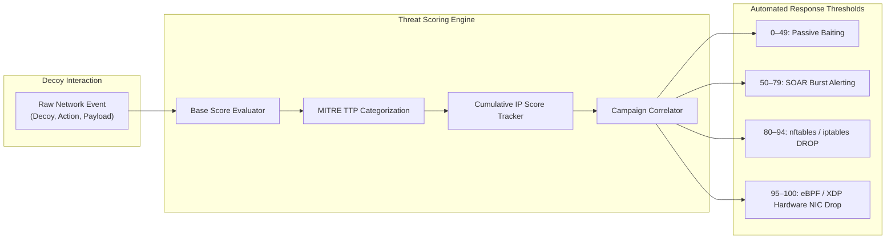
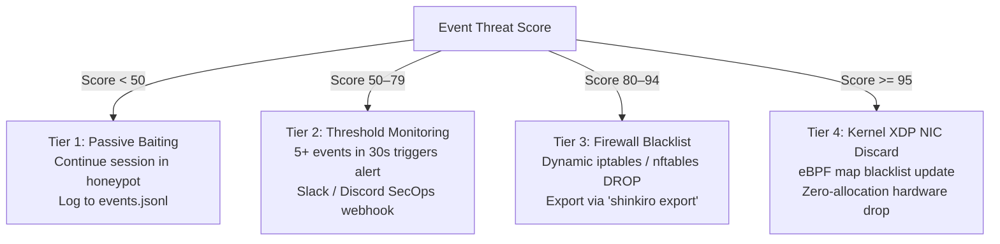
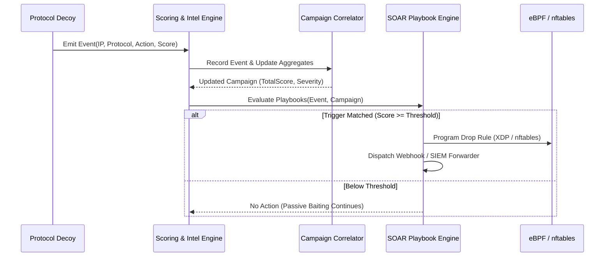

# Threat Scoring, Campaign Correlation & IoC Attribution Engine

**Product:** Shinkiro (蜃気楼)  
**Package:** `internal/intel` & `internal/soar`  
**Latency Budget:** < 20 ns / op (Zero Allocation per Scored Event)

---

## 1. Threat Scoring Architecture & Philosophy

A honeynet that emits a flood of binary alerts without prioritizing risk creates operational fatigue in the SOC. Shinkiro implements a quantitative, multi-dimensional Threat Scoring Engine that evaluates adversary intent, interaction depth, payload signature, and cross-protocol movement in real time.

Every incoming event is assigned:
1. **Discrete Event Severity:** `INFO`, `LOW`, `MEDIUM`, `HIGH`, or `CRITICAL`.
2. **Threat Score (0 to 100):** A normalized integer indicating risk and confidence.
3. **Cumulative Reputation Score:** An aggregated risk score per IP address stored in an in-memory hash map.
4. **MITRE ATT&CK TTP Binding:** Association with standard enterprise and ICS tactics and techniques.
5. **Campaign Session Clustering:** Association with a broader multi-protocol attacker campaign.



---

## 2. Threat Scoring Matrix by Protocol & Action

| Protocol / Vector | Action Identifier | Base Score | Severity | MITRE Tactic & Technique | Operational Classification & Deception Response |
| :--- | :--- | :--- | :--- | :--- | :--- |
| **TCP / Ping** | `TCP_CONNECT`, `PING` | 10 | `INFO` | `TA0043` / `T1595` (Reconnaissance) | Logged passively in JSONL audit stream. No mitigation. |
| **HTTP Web Recon** | `GET /`, `HEAD /` | 20 | `LOW` | `TA0043` / `T1595` (Active Scanning) | Tracked in sliding session window; benign or search crawler. |
| **DNS Query** | `DNS_A_LOOKUP` | 30 | `LOW` | `TA0011` / `T1071.004` (DNS) | Intercepted domain query; checked against C2 domain lists. |
| **SSH Handshake** | `SSH_PROBE_CONNECT` | 40 | `MEDIUM` | `TA0043` / `T1595` (Reconnaissance) | Client initiated SSH banner exchange. IP staged in tracking LRU. |
| **Redis Command** | `INFO`, `PING` | 40 | `MEDIUM` | `TA0007` / `T1082` (Discovery) | Client querying Redis cluster topology and host specifications. |
| **Docker API Ping** | `GET /_ping`, `GET /version` | 50 | `MEDIUM` | `TA0007` / `T1613` (Container Discovery) | Reconnaissance targeting exposed Docker daemon sockets. |
| **Elasticsearch** | `GET /_cat/indices` | 60 | `MEDIUM` | `TA0007` / `T1083` (File Discovery) | Adversary enumerating indices to identify sensitive stored data. |
| **PostgreSQL Auth** | `PG_AUTH_PROBE` | 70 | `HIGH` | `TA0006` / `T1110` (Brute Force) | Database authentication attempt. Usernames & passwords logged. |
| **Kubernetes Recon**| `GET /api/v1/namespaces` | 75 | `HIGH` | `TA0007` / `T1613` (Container Discovery) | Anonymous RBAC enumeration targeting Kubernetes cluster secrets. |
| **Modbus PLC Read** | `MODBUS_FC03_READ_HOLDING_REGISTERS` | 75 | `HIGH` | `TA0108` / `T0858` (OT Discovery) | ICS/SCADA reconnaissance probing operational power telemetry. |
| **SSH Login Success**| `SSH_LOGIN_SUCCESS_DECOY` | 75 | `HIGH` | `TA0001` / `T1078` (Valid Accounts) | Attacker successfully logs into deceptive VirtualFS shell. |
| **HTTP Config Trap**| `GET /.env`, `GET /.git/config` | 80 | `HIGH` | `TA0001` / `T1190` (Exploit Public-Facing) | Scanning for leaked environment secrets. **Auto-Firewall DROP**. |
| **Redis Config Dump**| `CONFIG GET *` | 85 | `CRITICAL` | `TA0006` / `T1552` (Unsecured Creds) | Attempt to dump configuration or prepare write persistence. |
| **Jenkins / WP Admin**| `POST /wp-login.php`, `Jenkins` | 85 | `CRITICAL` | `TA0006` / `T1110` (Brute Force) | Credential stuffing against web administration portals. |
| **SSH Shell Command**| `cat /etc/passwd`, `whoami` | 85 | `HIGH` | `TA0002` / `T1059.004` (Unix Shell) | Interactive exploration inside virtual sandbox. |
| **AWS IMDS Token** | `PUT /latest/api/token` | 90 | `CRITICAL` | `TA0006` / `T1552.005` (Cloud Metadata) | SSRF exploitation attempting IMDSv2 token acquisition. |
| **Modbus Coil Write**| `MODBUS_FC05_WRITE_SINGLE_COIL` | 95 | `CRITICAL` | `TA0108` / `T0855` (Unauthorized Command) | **Active OT Sabotage Attempt**. Immediate kernel drop. |
| **Redis Lua RCE** | `EVAL "redis.call(...)"` | 95 | `CRITICAL` | `TA0002` / `T1059` (Command Interpreter) | Sandbox escape attempt. Payload hashed in SHA-256. |
| **Docker Miner** | `POST /containers/create` | 95 | `CRITICAL` | `TA0002` / `T1609` (Container Exec) | Attempting to deploy crypto-miner or rootkit container. |
| **AWS IAM Exfil** | `GET /latest/meta-data/iam/...` | 100 | `CRITICAL` | `TA0006` / `T1552.005` (Cloud Metadata) | Harvesting cloud IAM credentials. **Kernel XDP DROP**. |
| **SSH Dropper** | `curl`, `wget`, `bash -i`, `python` | 100 | `CRITICAL` | `TA0002` / `T1059` (Interpreter) | Remote payload download / reverse shell attempt. **XDP DROP**. |

---

## 3. Multi-Protocol Campaign Correlation

Isolated honeypot events fail to convey the complete attacker lifecycle. Shinkiro's `Correlator` (`internal/intel/correlator.go`) tracks multi-stage adversary campaigns using an in-memory sliding session window (default: 2 hours).

### Correlation Algorithm:
1. When an event arrives from `RemoteIP`, the correlator checks for an existing active `Campaign`.
2. If absent or expired, a new `Campaign` record is initialized (`camp-<IP>-<timestamp>`).
3. If active, the incoming interaction updates the campaign:
   - Extends `LastSeen` timestamp.
   - Appends newly targeted decoys (`DecoysTargeted`).
   - Updates `MaxThreatScore` to the highest observed severity.
   - Deduplicates and appends MITRE tactic identifiers (`MitreTacticIDs`).
   - Indexes captured usernames (`UsernamesUsed`) and executed commands (`CommandsRun`).

### Example Correlated Campaign Object:
```json
{
  "id": "camp-198.51.100.25-1788642000",
  "attacker_ip": "198.51.100.25",
  "first_seen": "2026-09-05T14:30:00Z",
  "last_seen": "2026-09-05T14:48:15Z",
  "decoys_targeted": ["ssh", "redis", "modbus"],
  "total_events": 12,
  "max_threat_score": 95,
  "mitre_tactic_ids": ["TA0043", "TA0006", "TA0002", "TA0108"],
  "usernames_used": ["root", "admin", "postgres"],
  "commands_run": ["whoami", "cat /etc/passwd", "cat /root/.env"],
  "metadata": {
    "geo_country": "Netherlands",
    "geo_asn": "AS16276",
    "geo_org": "OVH SAS"
  }
}
```

---

## 4. Kernel & Firewall Mitigation Actions

Shinkiro enforces tiered active defense based on the quantitative threat score:



### 4.1. Tier 3: iptables & nftables Rule Synthesis
```bash
# Generate dynamic nftables ruleset for all IPs with score >= 80
./bin/shinkiro export --format nftables --threshold 80
```
Output:
```text
add table inet shinkiro_filter
add set inet shinkiro_filter blackhole { type ipv4_addr; }
add element inet shinkiro_filter blackhole { 198.51.100.25 }
add rule inet shinkiro_filter input ip saddr @blackhole drop
```

### 4.2. Tier 4: Kernel-Level eBPF / XDP Filtering
For high-confidence threats (score >= 95), Shinkiro programs an in-kernel eBPF XDP hook (`xdp_drop.c`) attached to the host physical interface (`eth0`). Incoming packets matching malicious IPs are discarded directly in the network driver before kernel sk_buff allocation, nullifying DDoS and exploit attempts at line rate.

---

## 5. SOAR-Lite Playbook Automation Engine

The threat scoring engine directly feeds the in-process SOAR (Security Orchestration, Automation, and Response) engine (`internal/soar`). When an incoming event or correlated campaign crosses configured score and frequency thresholds, declarative YAML playbooks execute actions synchronously:

### 5.1. Playbook Rule Specification (`playbooks.yaml`)

```yaml
version: "1.0"
playbooks:
  - id: "critical-ics-block"
    name: "Immediate Kernel Drop on ICS Modbus Exploitation"
    enabled: true
    trigger:
      min_threat_score: 90
      protocols: ["modbus"]
      actions: ["MODBUS_WRITE_COIL", "MODBUS_WRITE_HOLDING_REGISTER"]
    actions:
      - type: "xdp_drop"
        target_interface: "eth0"
      - type: "webhook"
        url: "https://soc.company.internal/webhooks/critical-incidents"
        format: "json"
        headers:
          Authorization: "Bearer ${SOC_WEBHOOK_SECRET}"
      - type: "siem_forward"
        format: "cef"
        target: "siem.company.internal:514"

  - id: "brute-force-rate-limit"
    name: "Automated Rate Limiting on SSH / Telnet Spray"
    enabled: true
    trigger:
      min_threat_score: 75
      protocols: ["ssh", "telnet"]
      window_seconds: 60
      event_count_threshold: 5
    actions:
      - type: "firewall_drop"
        backend: "nftables"
        table: "shinkiro_filter"
        timeout_seconds: 3600
      - type: "threat_intel_share"
        feed: "threatfox"
```

### 5.2. Action Execution Lifecycle



---

## 6. Algorithmic Calculation: Decay, Velocity & Trust Factors

Threat scoring in Shinkiro is not a static lookup table; it is an evolving metric that incorporates temporal velocity, asset sensitivity, and score decay:

### 6.1. Temporal Decay Formula
Adversary reputation decays gradually over periods of inactivity to prevent permanent false-positive lockouts of dynamic residential IP addresses:

$$S(t) = S_0 \cdot e^{-\lambda \Delta t}$$

Where:
- $S(t)$ is the current threat score at time $t$.
- $S_0$ is the peak recorded threat score.
- $\lambda$ is the decay constant (default: $\lambda = 0.05 \text{ hr}^{-1}$, half-life $\approx 13.8$ hours).
- $\Delta t$ is the elapsed time in hours since the adversary's last recorded packet.

### 6.2. Velocity Multiplier
Repeated probing across short time intervals inflates the threat score multiplicatively:

$$V = \min\left(2.5, 1.0 + 0.15 \times \frac{N_{\text{events}}}{\Delta t_{\text{minutes}}}\right)$$

Where $N_{\text{events}}$ is the number of events captured within the sliding evaluation window $\Delta t_{\text{minutes}}$.

### 6.3. Whitelist & False Positive Immunity
Shinkiro maintains an in-memory CIDR prefix tree (radix tree) containing RFC1918 private subnets, designated internal monitoring systems, and health probes (e.g., Kubernetes liveness probes). Packets originating from whitelisted CIDRs are stamped with `threat_score: 0` and bypass active firewall mitigation rules entirely.

