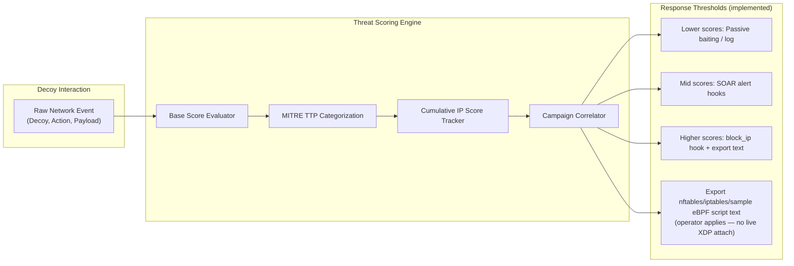
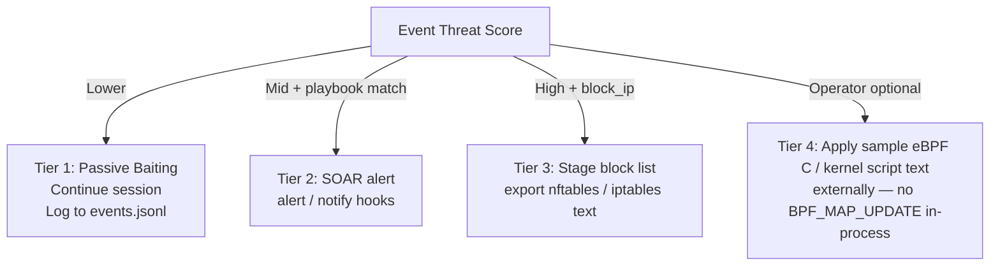

# Threat Scoring, Campaign Correlation & IoC Attribution Engine

**Product:** Shinkiro (蜃気楼)  
**Package:** `internal/intel` & `internal/soar`  
**Note:** Hot-path latency claims below are design targets — run `make bench` for measured numbers; do not treat historical invented ns/op tables as CI truth.

---

## 1. Threat Scoring Architecture & Philosophy

A honeynet that emits unprioritized alerts creates SOC fatigue. Shinkiro assigns:

1. **Discrete Event Severity:** `INFO`, `LOW`, `MEDIUM`, `HIGH`, or `CRITICAL` (as emitted by decoys / intel helpers).
2. **Threat Score (0 to 100):** Normalized integer indicating risk and confidence.
3. **Cumulative Reputation Score:** Aggregated risk per IP in an in-memory map.
4. **MITRE ATT&CK TTP Binding:** Association with enterprise and ICS tactics/techniques.
5. **Campaign Session Clustering:** Multi-protocol attacker campaign association (`internal/intel/correlator.go`).



---

## 2. Threat Scoring Matrix by Protocol & Action

| Protocol / Vector | Action Identifier | Base Score | Severity | MITRE Tactic & Technique | Operational Classification & Deception Response |
| :--- | :--- | :--- | :--- | :--- | :--- |
| **TCP / Ping** | `TCP_CONNECT`, `PING` | 10 | `INFO` | `TA0043` / `T1595` (Reconnaissance) | Logged passively in JSONL audit stream. No mitigation. |
| **HTTP Web Recon** | `GET /`, `HEAD /` | 20 | `LOW` | `TA0043` / `T1595` (Active Scanning) | Tracked in sliding session window; often benign crawler noise. |
| **DNS Query** | `DNS_A_LOOKUP` | 30 | `LOW` | `TA0011` / `T1071.004` (DNS) | Intercepted domain query; enrichment is heuristic GeoIP only. |
| **SSH Handshake** | `SSH_PROBE_CONNECT` | 40 | `MEDIUM` | `TA0043` / `T1595` (Reconnaissance) | Client initiated SSH banner exchange. |
| **Redis Command** | `INFO`, `PING` | 40 | `MEDIUM` | `TA0007` / `T1082` (Discovery) | Client querying Redis-like topology metadata. |
| **Docker API Ping** | `GET /_ping`, `GET /version` | 50 | `MEDIUM` | `TA0007` / `T1613` (Container Discovery) | Recon targeting exposed Docker daemon sockets. |
| **Elasticsearch** | `GET /_cat/indices` | 60 | `MEDIUM` | `TA0007` / `T1083` (File Discovery) | Index enumeration. |
| **PostgreSQL Auth** | `PG_AUTH_PROBE` | 70 | `HIGH` | `TA0006` / `T1110` (Brute Force) | Database authentication attempt; credentials logged. |
| **Kubernetes Recon**| `GET /api/v1/namespaces` | 75 | `HIGH` | `TA0007` / `T1613` (Container Discovery) | Anonymous RBAC / secrets recon paths. |
| **Modbus PLC Read** | `MODBUS_FC03_READ_HOLDING_REGISTERS` | 75 | `HIGH` | `TA0108` / `T0858` (OT Discovery) | ICS reconnaissance. |
| **SSH Login Success**| `SSH_LOGIN_SUCCESS_DECOY` | 75 | `HIGH` | `TA0001` / `T1078` (Valid Accounts) | Login into deceptive VirtualFS shell. |
| **HTTP Config Trap**| `GET /.env`, `GET /.git/config` | 80 | `HIGH` | `TA0001` / `T1190` (Exploit Public-Facing) | Secret-path scanning; SOAR may `block_ip`. |
| **Redis Config Dump**| `CONFIG GET *` | 85 | `CRITICAL` | `TA0006` / `T1552` (Unsecured Creds) | Config dump / persistence prep. |
| **Jenkins / WP Admin**| `POST /wp-login.php`, `Jenkins` | 85 | `CRITICAL` | `TA0006` / `T1110` (Brute Force) | Credential stuffing against web admin traps. |
| **SSH Shell Command**| `cat /etc/passwd`, `whoami` | 85 | `HIGH` | `TA0002` / `T1059.004` (Unix Shell) | Interactive exploration inside virtual sandbox. |
| **AWS IMDS Token** | `PUT /latest/api/token` | 90 | `CRITICAL` | `TA0006` / `T1552.005` (Cloud Metadata) | SSRF-style IMDSv2 token acquisition. |
| **Modbus Coil Write**| `MODBUS_FC05_WRITE_SINGLE_COIL` | 95 | `CRITICAL` | `TA0108` / `T0855` (Unauthorized Command) | OT write attempt; high score + SOAR hooks. |
| **Redis Lua RCE** | `EVAL "redis.call(...)"` | 95 | `CRITICAL` | `TA0002` / `T1059` (Command Interpreter) | Sandbox escape attempt; payload hashed. |
| **Docker Miner** | `POST /containers/create` | 95 | `CRITICAL` | `TA0002` / `T1609` (Container Exec) | Crypto-miner / rootkit container create attempt. |
| **AWS IAM Exfil** | `GET /latest/meta-data/iam/...` | 100 | `CRITICAL` | `TA0006` / `T1552.005` (Cloud Metadata) | IAM credential path harvest. |
| **SSH Dropper** | `curl`, `wget`, `bash -i`, `python` | 100 | `CRITICAL` | `TA0002` / `T1059` (Interpreter) | Remote payload / reverse-shell style commands. |

---

## 3. Multi-Protocol Campaign Correlation

`Correlator` (`internal/intel/correlator.go`) tracks multi-stage campaigns with an in-memory sliding session window.

### Correlation Algorithm

1. On event from `RemoteIP`, look up an active `Campaign`.
2. If absent or expired, initialize `camp-<IP>-<timestamp>`.
3. If active, update `LastSeen`, `DecoysTargeted`, `MaxThreatScore`, MITRE IDs, usernames, and commands.

### Example Correlated Campaign Object

```json
{
  "id": "camp-198.51.100.25-1788642000",
  "attacker_ip": "198.51.100.25",
  "first_seen": "2026-09-05T14:30:00Z",
  "last_seen": "2026-09-05T14:48:15Z",
  "decoys_targeted": ["ssh", "redis", "modbus"],
  "total_events": 12,
  "max_threat_score": 95,
  "mitre_tactic_ids": ["TA0043", "TA0006", "TA0002", "TA0108"],
  "usernames_used": ["root", "admin", "postgres"],
  "commands_run": ["whoami", "cat /etc/passwd", "cat /root/.env"],
  "metadata": {
    "geo_country": "US",
    "geo_asn": "AS14618",
    "geo_org": "Amazon.com, Inc.",
    "geo_note": "Heuristic/demo GeoIP prefix — not MaxMind"
  }
}
```

---

## 4. Firewall & Sample Kernel Rule Export

Shinkiro stages mitigation via SOAR hooks and **text exporters**. It does **not** program a live XDP map from userland.



### 4.1. iptables & nftables Rule Synthesis

```bash
./bin/shinkiro export --format nftables --threshold 80
```

Example shape:

```text
add table inet shinkiro_filter
add set inet shinkiro_filter blackhole { type ipv4_addr; }
add element inet shinkiro_filter blackhole { 198.51.100.25 }
add rule inet shinkiro_filter input ip saddr @blackhole drop
```

### 4.2. Sample eBPF / XDP Artifacts

- Sample C: `internal/ebpf/c/xdp_drop.c`
- Script text: `./bin/shinkiro kernel` / `FilterManager.RenderScript()`
- Loading/attaching those artifacts is an **operator** responsibility (clang/bpftool/ip link, etc.). Shinkiro does not claim automatic NIC drops.

---

## 5. SOAR-Lite Playbook Automation Engine

Package `internal/soar` loads YAML into `PlaybookConfig{ Rules []Rule }` where each rule uses **`if` / `then`** (not a fantasy `playbooks[].trigger.actions.firewall_drop` schema).

### 5.1. Real Playbook Schema (`playbooks.yaml`)

```yaml
rules:
  - name: ssh-credential-stuffing-autoblock
    enabled: true
    if:
      decoy: ssh
      min_score: 75
      action_match: LOGIN
    then:
      - type: block_ip
      - type: alert

  - name: redis-exploitation-immediate-ban
    enabled: true
    if:
      decoy: redis
      min_score: 80
      action_match: CONFIG
    then:
      - type: block_ip
      - type: alert

  - name: rapid-recon-scanning-ratelimit
    enabled: true
    if:
      decoy: "*"
      threshold: 5
      window_sec: 30
    then:
      - type: block_ip
      - type: alert
```

Supported action types in code today: **`block_ip`**, **`alert`** / **`notify`**, **`tag`**.

### 5.2. Action Execution Lifecycle

```mermaid
sequenceDiagram
    participant Decoy as Protocol Decoy
    participant Engine as Scoring & Intel Engine
    participant Correlator as Campaign Correlator
    participant SOAR as SOAR Playbook Engine
    participant Hook as block_ip / alert hooks

    Decoy->>Engine: Emit Event(IP, Protocol, Action, Score)
    Engine->>Correlator: Record Event & Update Aggregates
    Correlator-->>Engine: Updated Campaign
    Engine->>SOAR: Process(Event)
    alt Rule matched
        SOAR->>Hook: Execute then[] actions
        Note over Hook: Hooks may stage IPs; export commands emit firewall text
    else Below thresholds
        SOAR-->>Engine: No Action
    end
```

---

## 6. Algorithmic Calculation: Decay, Velocity & Trust Factors

Threat scoring incorporates temporal velocity and decay as implemented in the intel packages (see source for exact constants):

### 6.1. Temporal Decay (design)

Reputation may decay over inactivity to reduce permanent lockouts of dynamic residential IPs. Treat formulas in older drafts as illustrative; verify constants in code before citing them in SLAs.

### 6.2. Velocity Multiplier

Repeated probing within a short window can inflate scores. The SOAR engine also supports explicit `threshold` + `window_sec` rate gates per rule.

### 6.3. Private / Local Handling

Heuristic GeoIP marks RFC1918 / loopback as `LOCAL`. Operators should still maintain their own allowlists at the firewall layer — Shinkiro does not ship a full CIDR policy engine equivalent to enterprise NAC.
