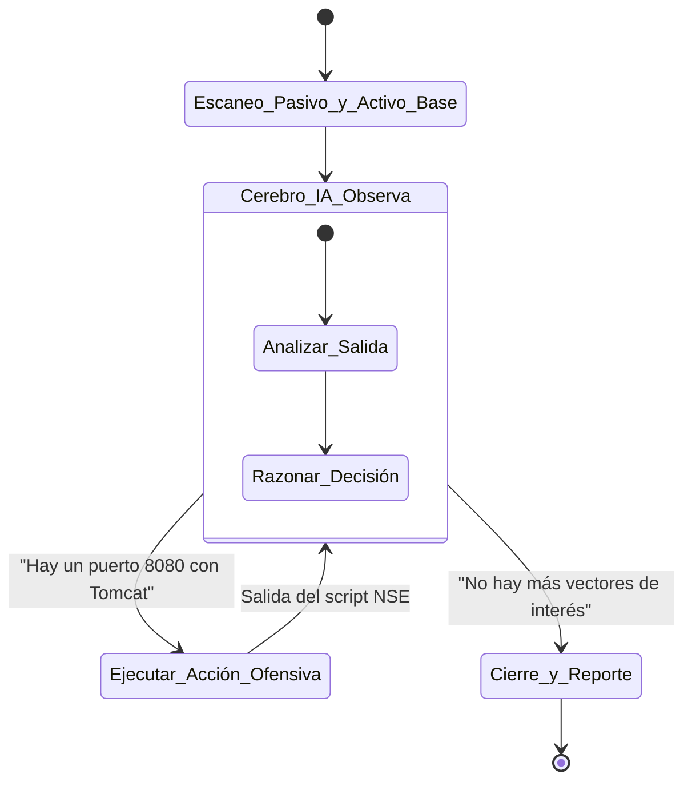

# Plan Maestro de Evolución de Producto - OzyRecon

Este documento detalla la hoja de ruta para transformar OzyRecon de una herramienta de línea de comandos de nicho a un **Producto Empresarial y Plataforma de Seguridad Ofensiva Autonóma.**

---

## 1. SaaS de Attack Surface Management (ASM) Continuo

### 1.1. Visión del Producto
Convertir OzyRecon en un competidor de plataformas Enterprise como Randori, Detectify o Prisma Cloud. El cliente (CTO, CISO) no interactúa con la consola; entra a un Dashboard web, ingresa el dominio de su empresa, y la plataforma lo mantiene vigilado 24/7.

### 1.2. Arquitectura de la Plataforma Web
*   **Backend API (Control Plane):** Expandir el modo actual `ozy serve` (FastAPI) para manejar Multi-Tenancy. Cada cliente tiene su propia partición de base de datos o taggíng a nivel de Tenant.
*   **Frontend (Dashboard):** 
    *   Framework: **Next.js** o **React+Vite**.
    *   Styling: **TailwindCSS** + Shadcn/UI (para componentes visuales limpios, oscuros y orientados a ciberseguridad).
    *   Visualizaciones: Recharts o vis.js para mostrar el grafo de red y estadísticas de vulnerabilidades históricas.
*   **Autenticación y Facturación:** 
    *   Auth0 o Clerk para manejo de usuarios corporativos (SSO/SAML).
    *   Stripe Integración: Cobro por cantidad de "Assets/Dominios vigilados" o por frecuencia (Escaneo Diario vs Escaneo Continuo en Tiempo Real).

### 1.3. Endpoints Clave para el MVP del SaaS
En la capa `src/application/api/`, se deberán construir las siguientes rutas RESTful:
*   `POST /api/v1/workspaces`: Crea el entorno del cliente.
*   `POST /api/v1/targets`: El cliente agrega `miempresa.com`.
*   `GET /api/v1/dashboard/metrics`: Devuelve la agregación de puertos abiertos, severidad de CVEs e histórico de cambios.
*   `GET /api/v1/diffs/latest`: Consume la lógica del `diff_engine` para poblar el "Feed de Novedades" (Ej: "Ayer un dev expuso un MongoDB").

### 1.4. Valor de Negocio
Pasar de una herramienta de "uso único" (Pentesting) a una herramienta de **suscripción mensual recurrente (MRR)**. El valor se basa en la "Tranquilidad" (Peace of Mind) de los directivos de seguridad corporativa.

---

## 2. Agente IA Ofensivo Autónomo (Workflow Agentic)

### 2.1. Visión del Producto
El escaneo automatizado tradicional es ciego: ejecuta comandos fijos sin importar el contexto. Un *Agente Autónomo* imita a un atacante humano: ve algo interesante, razona sobre ello, y decide ejecutar comandos no planificados para profundizar.

### 2.2. Diseño del Bucle Agentic (Patrón ReAct - Reason, Act, Observe)



### 2.3. Especificación a Nivel de Código (LLM Orchestration)

**A. El Sistema de Herramientas Dinámicas para la IA:**
Se debe crear un adaptador (`LLMAgentAdapter`) conectado a la API de OpenAI/Claude/Gemini. A la IA se le entrega un *System Prompt* ofensivo y un set de funciones (Tool Calling / Function Calling).

```json
{
  "name": "run_nuclei_template",
  "description": "Ejecuta un template específico de Nuclei contra un host",
  "parameters": {
    "host": "string",
    "template_id": "cves/2021/CVE-2021-44228.yaml"
  }
}
```

**B. Guardrails de Seguridad (Crucial para no causar daños):**
*   **Solo Lectura/No Destructivo:** La IA NO DEBE tener permisos para ejecutar comandos que alteren el target (Ej. `sqlmap --dump` o exploits que borren tablas).
*   **Scope Sandbox:** Todas las herramientas (Nmap, Nuclei) ejecutadas por la IA deben pasar por el mismo `Scope Gate` (Phase 2) de OzyRecon para garantizar que la IA no se escape y empiece a escanear propiedades de terceros ilegalmente.

### 2.4. Valor de Negocio
Posiciona a OzyRecon como una de las primeras herramientas de Ciberseguridad IA-Nativas, atrayendo a red teams avanzados y reduciendo la necesidad de ingenieros humanos analizando puertos aburridos.

---

## 3. Integraciones Corporativas Nativas

### 3.1. Visión del Producto
Los reportes en `.md` o `.json` son geniales para ingenieros, pero inútiles para los corporativos de gestión de procesos. Si OzyRecon encuentra un fallo, debe insertarlo en los flujos de trabajo que los desarrolladores *ya usan*.

### 3.2. Adaptadores de Salida (Ticketing Adapters)

El diseño Hexagonal facilita esto. Se debe crear un nuevo puerto en la aplicación:
`src/application/ports/ticketing_service.py` -> `ITicketingService(Protocol)`

Las integraciones clave a desarrollar como Adaptadores:
1.  **Jira Software Adapter:**
    *   Se conecta vía Atlassian REST API.
    *   Convierte el objeto `Finding(severity="CRITICAL")` en un Jira Issue tipo "Bug" o "Security Incident".
    *   Adjunta las trazas (evidence hash) en los comentarios para reproducibilidad.
2.  **PagerDuty / OpsGenie Adapter:**
    *   Diseñado para el modo "Continuo".
    *   Si a las 4 AM OzyRecon detecta un bucket S3 de la empresa que se volvió público, el adaptador gatilla una llamada automatizada al ingeniero de guardia (On-call) usando la API de PagerDuty.
3.  **Slack / Microsoft Teams SecOps Bot:**
    *   Un adaptador que usa Webhooks entrantes.
    *   Envía mensajes enriquecidos (Block Kit) con botones de acción interactivos ("Confirmar Riesgo", "Marcar como Falso Positivo").

### 3.3. Estructura del Payload Corporativo
Para que un ticket sea accionable, el adaptador de JIRA debe parsear el contexto generado por OzyRecon de esta forma:
*   **Title:** [OzyRecon-Critical] Exposed Git Repository en api.empresa.com
*   **Description:** "El motor continuo detectó un cambio en el directorio `.git/`. Se adjuntan logs de HTTPX."
*   **Labels:** `security`, `auto-generated`, `ASM`
*   **Attachments:** `audit_bundle.tar.gz`

### 3.4. Valor de Negocio
Es el puente definitivo entre el Red Team (OzyRecon) y el Blue Team / DevOps. Disminuye el "Time to Remediation" (TTR) al meter las vulnerabilidades directo en los tableros Kanban del equipo de desarrollo, justificando el costo de licencias empresariales de la herramienta.
