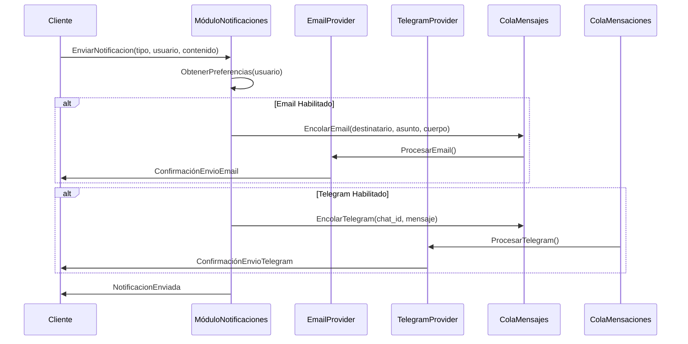

# Propuesta: Implementación de Módulo de Notificaciones

## 1. Introducción

Este documento propone la creación de un nuevo módulo `src/notifications` para gestionar el envío de notificaciones a usuarios a través de diferentes canales (email, Telegram).

## 2. Requisitos Funcionales

- El sistema DEBE permitir el envío de notificaciones por email.
- El sistema DEBE permitir el envío de notificaciones por Telegram.
- Los usuarios DEBEN poder suscribirse o desuscribirse de tipos específicos de notificaciones.
- El sistema DEBE manejar colas de notificaciones para evitar bloqueos.

## 3. Requisitos No Funcionales

- **Escalabilidad**: El módulo DEBERÍA ser capaz de manejar un volumen creciente de notificaciones.
- **Fiabilidad**: Las notificaciones DEBEN ser entregadas con alta fiabilidad (mecanismos de reintento).
- **Seguridad**: La información de los usuarios en las notificaciones DEBE ser protegida.

## 4. Diseño Propuesto

### 4.1. Estructura del Módulo

```
src/notifications/
├── __init__.py
├── interfaces.py  # Definiciones de interfaces (e.g., INotificationService, IChannelProvider)
├── services.py    # Implementaciones de servicios (e.g., NotificationService)
├── providers/
│   ├── __init__.py
│   ├── email.py   # Implementación del proveedor de email
│   └── telegram.py # Implementación del proveedor de Telegram
├── models.py      # Modelos de datos para notificaciones y suscripciones
└── use_cases.py   # Casos de uso específicos para el envío de notificaciones
```

### 4.2. Diagrama de Secuencia (Envío de Notificación)



## 5. Decisiones Arquitectónicas

- **Composición sobre Herencia**: Se usarán interfaces y providers inyectables para los diferentes canales de notificación, en lugar de herencia directa.
- **Cola de Mensajes**: Se utilizará un sistema de colas (ej., Redis Queue, Celery) para el procesamiento asíncrono de notificaciones, desacoplando el envío de la lógica principal.

## 6. Plan de Rollback

En caso de problemas, se puede revertir la implementación del módulo y las configuraciones asociadas en la base de datos sin afectar la funcionalidad existente.
