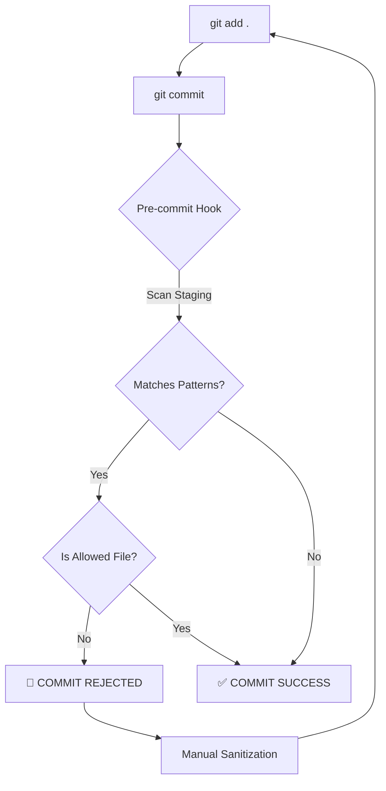

# OPSEC en OzyRecon

## Principios

1. **Nunca dejar rastros identificables**
2. **Rotar identidades frecuentemente**
3. **Respetar rate limits**
4. **Tener kill switch siempre disponible**
5. **Prevenir fugas de información del target en repositorios (Leak Prevention)**

## Componentes OPSEC

### 🛡️ OPSEC Guard (Leak Prevention)
Un sistema de prevención de fugas de datos que actúa como un guardián antes de subir código al repositorio.

#### Workflow de Protección


- **Pre-commit Hook**: Escanea el área de preparación de Git en busca de dominios, IPs o secretos.
- **Filtros Dinámicos**: Configurable vía `config/opsec_filters.yaml`.
- **Uso**: El sistema bloquea automáticamente el commit si detecta patrones prohibidos.

```bash
# Ejemplo de alerta si intentas subir un target real:
❌ OPSEC ALERT: Pattern '.edu.pe' found in 'assets/targets.txt'
🛑 COMMIT RECHAZADO: Se detectó información sensible.
```

### 👤 Data Anonymization
Módulo de utilidades para enmascarar información sensible en reportes o logs compartidos.

```python
from src.utils import anonymize_target

# Para dominios
print(anonymize_target("target.edu.pe")) 
# Output: target-xxx.edu.pe

# Para IPs
print(anonymize_target("192.168.0.38"))
# Output: 192.168.x.x
```

### Rate Limiter
Control automático de tasa de requests.

```python
from src.opsec import rate_limiter

# Usa el rate limiter global
rate_limiter.wait()
```

### Identity Rotation
Rotación de User-Agents.

```python
from src.opsec import identity_rotation

ua = identity_rotation.get_random_ua()  # Aleatorio
ua = identity_rotation.get_rotating_ua()  # Secuencial
```

### Jitter
Demora aleatoria para evitar patrones.

```python
from src.opsec import default_jitter, stealth_jitter

default_jitter.sleep()  # 1s +- 50%
stealth_jitter.sleep()  # 2s +- 70%
```

### Kill Switch
Parada de emergencia.

```python
from src.opsec import kill_switch, check_kill

# En tu loop principal:
if check_kill():
    break

# Para activar:
kill_switch.trigger("Razón")
```

## Configuración

```yaml
auto_rate_limit:
  enabled: true
  max_requests_per_min: 200
  check_interval: 10
  error_threshold: 10
  ban_threshold: 50
```

## Mejores Prácticas

- Siempre usar jitter en loops de scanning
- Rotar User-Agent cada n requests
- Monitorar códigos de error HTTP
- Tener kill switch configurado antes de cada scan
- No escanear más rápido de lo necesario