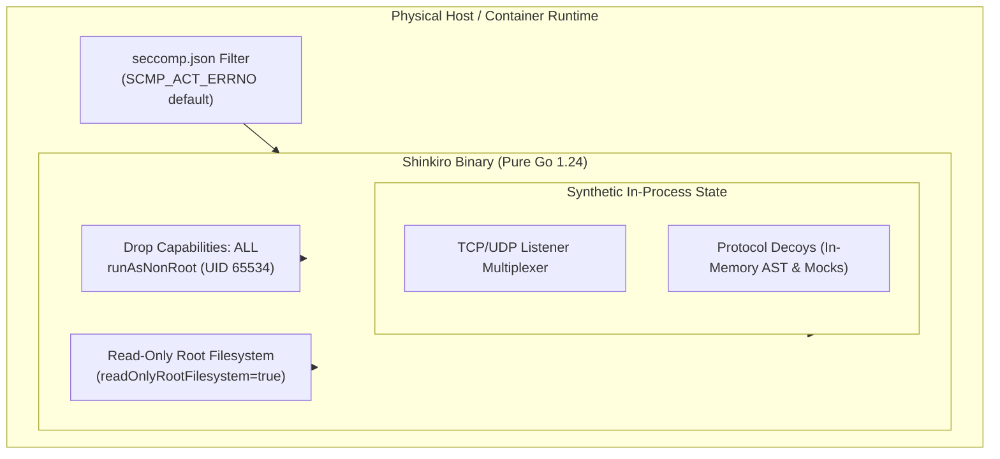

# Shinkiro High-Interaction Protocol Decoys & Emulation Matrix

**Product:** Shinkiro (蜃気楼)
**Architecture:** Go sensor with in-process protocol handlers and an optional separate cluster hub
**Runtime:** Go 1.24+ executable; telemetry is written to disk, and selected breadcrumb commands deliberately write files to a local path.

---

## 1. Architecture and Operational Boundaries

Protocol handlers run in the sensor process. The SSH virtual filesystem is synthetic process-local state, not an OS-level jail; goroutines do not isolate decoys from the host or from each other. Connection deadlines and non-blocking event delivery are not memory quotas.

### Security notes
1. The SSH virtual shell implements a limited command set against in-memory data. It does not invoke a general host shell, but that does not guarantee isolation from bugs in other handlers.
2. Handlers generally return on malformed or incomplete input, but failure behavior differs by protocol; do not treat it as a universal fail-closed guarantee.
3. This matrix describes selected emulated interactions, not complete or standards-certified protocol implementations. Validate behavior and containment in an authorized test environment.

---

## 2. Decoy Protocol Emulation Matrix

| Decoy Service | Layer 4 Protocol | Default Port | Representative Emulated Interaction | Example ATT&CK Tags |
| :--- | :--- | :--- | :--- | :--- |
| **SSH** | TCP | `2222` / `22` | OpenSSH-style banner and a limited in-memory command emulator; records submitted passwords or public-key fingerprints, not public keys | Heuristic tags; see implementation |
| **Telnet** | TCP | `2323` / `23` | Router-style login prompt, IAC negotiation, credential and command logging; limited command responses | Heuristic tags; see implementation |
| **Modbus / TCP** | TCP | `502` | Synthetic Modbus/TCP responses for supported function codes; not a vendor-specific PLC implementation | `T0855` on handled events |
| **Redis** | TCP | `6379` | Line-oriented `PING`, `INFO`, `CONFIG`, `EVAL` and `EVALSHA` responses; not a complete RESP server | Heuristic tags; see implementation |
| **Docker Engine** | HTTP | `2375` | Docker Daemon v24.0.7 API (`/_ping`, `/version`, `/containers/create`), miner trap | `T1609`, `T1496` |
| **Kubernetes API** | HTTPS | `6443` | Kubernetes v1.29 control-plane API (`/version`, `/api/v1/namespaces`, `/api/v1/secrets`) | `T1613`, `T1078.001` |
| **PostgreSQL** | TCP | `5432` | PostgreSQL 3.0 wire protocol handshake, StartupMessage, SSLRequest & Cleartext auth | `T1078.001`, `T1110` |
| **MongoDB** | TCP | `27017` | BSON wire protocol `OP_MSG` emulator, unauthenticated `isMaster` probe collector | `T1078`, `T1190` |
| **Elasticsearch** | HTTP | `9200` | Elasticsearch v8.11 REST API (`/`, `/_cat/indices`, `/_cluster/health`), cluster recon | `T1190`, `T1083` |
| **HTTP Deep Traps**| HTTP | `8080` / `80` | WordPress (`/wp-login.php`), Jenkins auth form, Grafana API metrics, canary files (`/.env`, `/.git`) | `T1190`, `T1552.001` |
| **AWS IMDS** | HTTP | `8169` / `169.254.169.254` | EC2 Instance Metadata Service v1 & v2, SSRF-style paths returning synthetic AWS-like metadata and credentials | `T1552.005`, `T1078.004` |
| **MQTT** | TCP | `1883` | Eclipse Mosquitto v2.0.18 broker, CONNECT client authentication, unauthorized PUBLISH/SUBSCRIBE | `T1078`, `T1190` |
| **SMB / CIFS** | TCP | `4445` / `445` | NetBIOS Session & SMBv2 negotiation parser, EternalBlue (MS17-010) recon trap | `T1021.002`, `T1210` |
| **SMTP / ESMTP** | TCP | `2525` / `25` | Postfix ESMTP banner (`HELO`, `EHLO`, `MAIL FROM`, `RCPT TO`, `DATA`), spam collector | `T1566`, `T1071.003` |
| **DNS Server** | UDP | `1053` / `53` | RFC 1035 UDP parser, subdomain enumeration, DNS query logging for subdomain and C2-style lookup activity | `T1071.004`, `T1568` |

---

Rows below describe representative paths, not full protocol compatibility. ATT&CK tags are heuristic references, and event scores vary by action; neither should be read as validated attribution or a calibrated measure of maliciousness.

## 3. Detailed Protocol Emulation Specifications

### 3.1. SSH Honeypot (`internal/decoys/ssh`)
- **Transport & Banner:** Responds with authentic OpenSSH banner: `SSH-2.0-OpenSSH_9.2p1 Debian-2+deb12u2`. Supports standard RSA host keys generated dynamically in memory.
- **Authentication Capture:** Records the username and submitted password for password authentication, or the public-key SHA-256 fingerprint for public-key authentication. It does not store the public key itself.
- **Interactive VirtualFS:** An in-memory hierarchical Unix filesystem containing:
  - System files: `/etc/passwd`, `/etc/shadow`, `/etc/os-release`, `/etc/hostname`, `/etc/resolv.conf`, `/etc/hosts`, `/var/log/auth.log`, `/proc/version`, `/proc/cpuinfo`.
  - Application configs: `/etc/nginx/nginx.conf`.
  - Canary Honeytokens: `/root/.env` (fake AWS IAM keys, Postgres connection string, Vault root token), `/root/.bash_history` (pre-populated plausible administrative command history).
- **Emulated Commands:** `id`, `whoami`, `hostname`, `uname -a`, `pwd`, `cd` (stateful directory tracking), `uptime`, `ps`, `cat`, `head`, `tail`, `grep`, `touch`, `mkdir`, `df`, `free`, `sudo`, `echo`, `env`, `ls -la`, `history`, `curl`/`wget` (simulated timeouts to bait exfiltration scripts).
- **Response Delay:** Adds a uniform pseudo-random delay of 15–44 ms before interactive shell output. This may affect timing, but does not guarantee resistance to fingerprinting.

### 3.2. Industrial Control Systems: Modbus/TCP (`internal/decoys/modbus`)
- **Protocol Framing:** Decodes standard 7-byte Modbus Application Protocol (MBAP) header:
  - `Transaction ID` (2 bytes)
  - `Protocol ID` (2 bytes, validated `0x0000`)
  - `Length` (2 bytes)
  - `Unit ID` (1 byte)
- **Supported Function Codes:**
  - `0x01` (Read Coils) & `0x02` (Read Discrete Inputs)
  - `0x03` (Read Holding Registers) & `0x04` (Read Input Registers)
  - `0x05` (Write Single Coil) & `0x06` (Write Single Register)
  - `0x08` (Diagnostics)
  - `0x0F` (Write Multiple Coils) & `0x10` (Write Multiple Registers)
- **OT Decoy Responses:** Read-register requests return fixed synthetic values (`0x00DC` and `0x0032`). Write function codes `0x05`, `0x06`, `0x0F`, and `0x10` generate `CRITICAL` events with score `95` and ATT&CK technique `T0855`; the values do not represent or control a real PLC.

### 3.3. Redis Deception Engine (`internal/decoys/redis`)
- **Command Handling:** Reads newline-terminated, line-oriented commands and dispatches on the first token; this is not a complete RESP parser for array-encoded commands.
- **Emulated Responses:** `INFO` returns a small synthetic Redis 7.2.4 response. Any `CONFIG` command gets a generic unknown-command / insufficient-permissions error; it does not detect particular persistence paths. `EVAL` and `EVALSHA` are rejected and the submitted command line is hashed and recorded in telemetry; the handler does not execute or classify Lua payloads.

### 3.4. Docker & Kubernetes Cloud APIs (`internal/decoys/docker`, `internal/decoys/k8s`)
- **Docker REST API:**
  - Handles `/_ping`, `/version` (including version-prefixed paths), and paths containing `/containers/create`; other paths receive a generic empty response.
  - The create handler records up to 4096 bytes read from the request body and a hash of those bytes. It does not parse image names, command arguments, or environment variables into separate fields.
- **Kubernetes-style API:**
  - Returns a synthetic `/version` response, API version lists for `/api` and `/apis`, and a `403` for paths containing `secrets` or `pods`; other paths return `404`.
  - If an Authorization header is present, the event records its hash and labels the auth type; it does not store the raw bearer token.

### 3.5. Web & Deep Admin Canaries (`internal/decoys/http`)
- **Scanner Bait:** Returns canned responses for paths containing `.env`, `.git`, WordPress login/admin, Grafana, or Jenkins markers.
- **Admin-Style Pages:** WordPress and Jenkins paths return synthetic login-form HTML. The handler records the request method and path, not submitted form fields, so it does not capture username/password pairs from those forms.
  - **Grafana Metrics (`/grafana`, `/api/v1/query`):** Emulates Grafana v10.2.3 API responses.

### 3.6. AWS EC2 Instance Metadata Service (`internal/decoys/aws`)
- **Listener:** The default service port is `8169`. Serving the standard link-local address `169.254.169.254` requires host or network configuration to direct traffic there.
- **IMDS-Style Responses:** Returns a synthetic token for `PUT /latest/api/token` and fixed metadata/credential responses for selected paths. Credential paths do not require the token, so this is not a full IMDSv2 implementation.
- **External Monitoring:** The handler records each request, but does not monitor subsequent use of returned values or generate external AWS canary alerts; that requires a separate monitoring service.

### 3.7. Relational & NoSQL Databases (`internal/decoys/postgres`, `internal/decoys/mongo`)
- **PostgreSQL 3.0 Wire Protocol:** Handles SSLRequest handshake (`80877103`), negotiates unencrypted fallback, captures startup parameters (`user`, `database`), issues cleartext authentication challenge (`R`), extracts attacker password, and returns authentic `SFATAL C28P01` authentication failure errors.
- **MongoDB BSON OP_MSG:** Intercepts unauthenticated wire queries including `isMaster` and `buildInfo` reconnaissance.

### 3.8. Network & IoT Services (`internal/decoys/smb`, `internal/decoys/mqtt`, `internal/decoys/telnet`)
- **SMBv2:** Captures NetBIOS Session Requests and SMB Negotiate Protocol requests, trapping EternalBlue (MS17-010) network scanners.
- **MQTT:** Decodes MQTT v3.1.1 protocol headers, harvesting unauthorized client identifiers, usernames, passwords, and malicious telemetry topics.
- **Telnet:** Responds with authentic BusyBox embedded Linux prompts, trapping Mirai and Gafgyt automated credential sprayers.

---

## 4. Fuzzing & Protocol Parser Verification

`make fuzz` runs five bounded Go fuzz targets (Redis, PostgreSQL, Docker, the SSH virtual filesystem, and Modbus) for five seconds each. These runs are useful checks, not continuous fuzzing or a guarantee of panic-free behavior:

```bash
# Execute full security fuzzing test suite
make fuzz
```

The suite validates:
1. `FuzzRedisDecoy`: Mutates RESP arrays, raw binary chunks, and malformed Lua payload strings.
2. `FuzzPostgresDecoy`: Mutates startup lengths, SSL request headers, and authentication blocks.
3. `FuzzDockerDecoy`: Mutates malformed HTTP headers, oversized verbs, and malformed JSON bodies.
4. `FuzzVirtualFSExecute`: Mutates arbitrary command line strings, shell metacharacters, and path traversals.
5. `FuzzModbusDecoy`: Mutates MBAP length fields, unit identifiers, and unauthorized function codes.

---

## 5. Process and Deployment Security



- **Syscall Filtering:** A seccomp profile file is shipped at `deploy/security/seccomp.json` for operators to apply (not auto-enforced by the binary).
- **Container Hardening:** Helm chart templates set `readOnlyRootFilesystem`, `runAsNonRoot`, and `capabilities.drop: [ALL]` when you deploy the chart; image/registry wiring still has limitations (see README Helm section).
- **Resource Limits:** The Helm values provide container resource requests and limits; they are deployment settings, not per-connection memory quotas. Set and validate them for your environment.

---

## 6. Adversary Interaction Scenarios & Deception Depth

The following summaries describe handler behavior, not validated transcripts or complete protocol sessions.

### 6.1. Telnet Login and Command Logging

1. On connection, the handler sends IAC `DO ECHO` / `DO SUPPRESS_GO_AHEAD` bytes and an `Embedded Linux Router (Busybox v1.31.1)` login prompt.
2. It reads a username and password, records them in an event with score `90`, then displays a BusyBox banner and `#` prompt. It does not validate the credentials.
3. Commands are logged as events with score `100`. The handler only emulates a few responses: `sh` and `shell` return a prompt, `/bin/busybox MIRAI` returns `MIRAI: applet not found`, and other commands return a `not found` message. It does not execute shell pipelines, run host binaries, or fetch URLs.

### 6.2. Redis Command Responses

1. `INFO` returns synthetic Redis 7.2.4 information and records an event with score `65`.
2. `CONFIG` returns a generic unknown-command / insufficient-permissions error and records an event with score `85`; it does not emulate Redis persistence or write an `authorized_keys` file.
3. `EVAL` and `EVALSHA` return a sandbox-blocked error, record an event with score `95`, and hash the submitted command line. These scores are implementation heuristics, not calibrated risk measurements.

### 6.3. Scenario C: Modbus/TCP Unauthorized Coil Overwrite (OT/ICS)

1. **Industrial Scanner:** Adversary targets port `502` transmitting an MBAP function `0x05` (`Write Single Coil` at address `0x0001` with value `0xFF00` to trip an electrical safety breaker).
2. **Parser Analysis:** Shinkiro decodes `TransactionID: 0x0001`, `ProtocolID: 0x0000`, `Length: 6`, `UnitID: 1`, `Function: 0x05`.
3. **Telemetry Event:** Write-function events are marked `CRITICAL` with score `95` and ATT&CK technique `T0855`; delivery to an SOC depends on separately configured alerting.
4. **SOAR / Export Mitigation:** Matching playbook rules may run `block_ip` / `alert` hooks. Operators can export nftables/iptables/sample eBPF rule **text** (`shinkiro export`, `shinkiro kernel`) and apply it themselves. Shinkiro does **not** attach a live XDP program or update BPF maps in-process.

---

## 7. Decoy Configuration & Operational Tuning

Runtime configuration uses the top-level key **`services:`** (see root `config.yaml` and `internal/config`). The earlier `decoys:` example schema was incorrect.

```yaml
# Matches config.yaml — runtime key is services:
node_name: "shinkiro-sensor-primary"
idle_timeout: 30s
max_connections: 1000
audit_log_path: "data/events.jsonl"
metrics_port: 9100

services:
  ssh:
    enabled: true
    port: 2222
  redis:
    enabled: true
    port: 6379
  docker:
    enabled: true
    port: 2375
  http:
    enabled: true
    port: 8080
  postgres:
    enabled: true
    port: 5432
  k8s:
    enabled: true
    port: 6443
  aws-imds:
    enabled: true
    port: 8169
  mongo:
    enabled: true
    port: 27017
  elastic:
    enabled: true
    port: 9200
  smtp:
    enabled: true
    port: 2525
  dns:
    enabled: true
    port: 1053
  smb:
    enabled: true
    port: 4445
  telnet:
    enabled: true
    port: 2323
  mqtt:
    enabled: true
    port: 1883
  modbus:
    enabled: true
    port: 502
```

Per-decoy banner/jitter fields shown in older drafts are not part of the minimal `ServiceConfig` shape loaded today — extend `internal/config` before documenting them as supported knobs.
