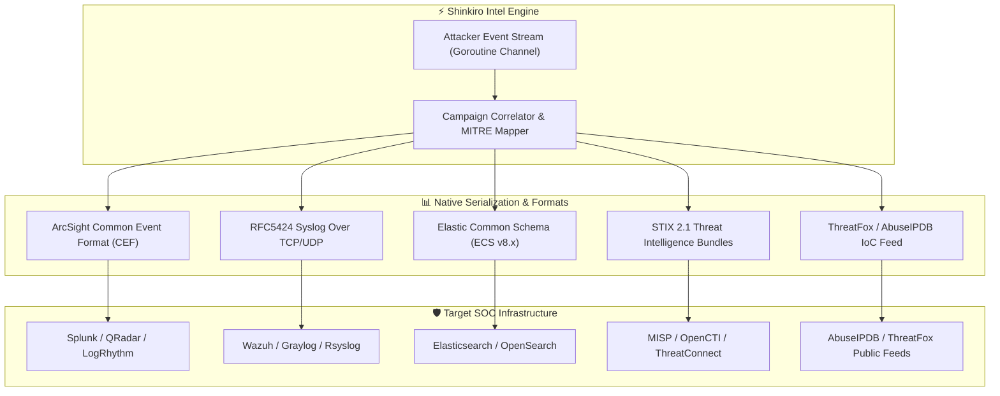

# Cyber Threat Intelligence (CTI) & SIEM Integration Architecture

**Product:** Shinkiro (蜃気楼)  
**Specification:** STIX 2.1, ArcSight CEF, RFC5424 Syslog, Elastic Common Schema (ECS v8.x), ThreatFox, MISP & AbuseIPDB

---

## 1. Overview & SOC Ingestion Objectives

A cyber deception platform that only records isolated interactions to proprietary log files provides minimal utility to modern Security Operations Centers (SOC). Shinkiro transforms raw honeynet interactions into structured, enriched, and actionable Cyber Threat Intelligence (CTI) feeds consumable by existing SIEM, SOAR, and Threat Intelligence Platforms (TIP) without requiring proprietary agents or dashboard redirection.

Every interaction intercepted across Shinkiro's 15 decoy services undergoes immediate enrichment:
- **Cryptographic Hashing:** SHA-256 fingerprinting of all attacker scripts, commands, and binary streams.
- **Geographic & Network Attribution:** Heuristic / demo GeoIP prefix resolution (`internal/intel/geoip`) for country, city, ASN, and org fields — **not** an offline MaxMind GeoIP database.
- **MITRE ATT&CK Mapping:** Automatic correlation of decoy actions with enterprise and ICS tactics/techniques (`T1110`, `T1059`, `T0855`, `T1021`, `T1190`, `T1595`).
- **Multi-Protocol Campaign Correlation:** Stateful session clustering aggregating probes from the same adversary IP across different decoy protocols into unified threat campaigns.
- **Dynamic Threat Scoring:** Quantitative Bayesian-inspired scoring (0 to 100) based on adversary intent, payload severity, and interaction velocity.

---

## 2. Supported Integration Formats & Protocols



---

## 3. STIX 2.1 Specification & Object Generation

Shinkiro produces fully compliant OASIS STIX 2.1 Threat Intelligence bundles (`bundle--<uuid>`). Events with an assigned threat score >= 60 automatically generate standard STIX `indicator` objects:

### Example STIX 2.1 Indicator:
```json
{
  "type": "bundle",
  "id": "bundle--1788642180000000",
  "spec_version": "2.1",
  "objects": [
    {
      "type": "indicator",
      "id": "indicator--ssh-login-1757038920192837",
      "spec_version": "2.1",
      "created": "2026-09-05T14:48:30.000Z",
      "modified": "2026-09-05T14:48:30.000Z",
      "name": "Malicious Honeypot Probe from 198.51.100.88",
      "description": "Observed ssh probe on decoy port 2222 (SSH_LOGIN_SUCCESS_DECOY). Threat score: 85",
      "pattern": "[ipv4-addr:value = '198.51.100.88']",
      "pattern_type": "stix",
      "valid_from": "2026-09-05T14:48:30.000Z",
      "confidence": 85,
      "labels": [
        "malicious-activity",
        "honeypot",
        "attacker-ip",
        "T1110"
      ]
    }
  ]
}
```

### Export Command:
```bash
# Output STIX 2.1 JSON bundle to file or pipeline
./bin/shinkiro stix > /tmp/shinkiro-threats.json
```

---

## 4. ArcSight Common Event Format (CEF)

For legacy and enterprise SIEM platforms (Splunk Enterprise Security, HP ArcSight, IBM QRadar), Shinkiro serializes interaction telemetry according to the CEF standard:

```text
CEF:Version|Device Vendor|Device Product|Device Version|Device Event Class ID|Name|Severity|[Extension]
```

### Example CEF Record:
```text
CEF:0|Haiagari|Shinkiro|0.4.0|redis|CONFIG GET|8|src=192.168.1.50 spt=45678 dpt=6379 app=redis act=CONFIG\ GET rt=1788642210000 cs1=T1059 cs1Label=MitreTechniqueID cs2=Command\ and\ Scripting\ Interpreter cs2Label=MitreTechniqueName cn1=75 cn1Label=ThreatScore msg=CONFIG\ GET\ dir
```

### Export Command:
```bash
# Stream CEF formatted logs to stdout or pipeline
./bin/shinkiro cef
```

---

## 5. RFC5424 Syslog Integration

Shinkiro wraps CEF formatted records into compliant IETF RFC5424 Syslog frames with facility `local0` (16) and severity `informational` (6), calculating priority value `<134>`:

```text
<134>1 2026-09-05T14:48:30Z sensor-primary shinkiro - - - CEF:0|Haiagari|Shinkiro|0.4.0|ssh|SSH_LOGIN_SUCCESS_DECOY|10|src=10.0.0.99 spt=52341 dpt=2222 app=ssh act=SSH_LOGIN_SUCCESS_DECOY rt=1788642210000 cs1=T1110 cs1Label=MitreTechniqueID cs2=Brute\ Force cs2Label=MitreTechniqueName cn1=90 cn1Label=ThreatScore suser=root
```

### Forwarding to Central Syslog Daemons (Rsyslog / syslog-ng):
```bash
# Forward live syslog stream directly over UDP to SIEM aggregator
./bin/shinkiro syslog | nc -u -w1 10.0.0.50 514
```

---

## 6. Elastic Common Schema (ECS v8.x) Integration

For Elastic Stack (Elasticsearch, Logstash, Kibana) and OpenSearch deployments, Shinkiro maps all interaction dimensions to the official ECS v8.11 taxonomy:

```json
{
  "@timestamp": "2026-09-05T14:48:30.123456789Z",
  "ecs": {
    "version": "8.11.0"
  },
  "event": {
    "id": "ssh-cmd-1788642210000",
    "kind": "alert",
    "category": ["intrusion_detection", "threat"],
    "type": ["indicator", "denied"],
    "outcome": "success",
    "action": "SSH_EXEC_COMMAND",
    "severity": 8,
    "risk_score": 85.0
  },
  "source": {
    "ip": "198.51.100.25",
    "port": 45120,
    "geo": {
      "country_name": "Germany",
      "city_name": "Frankfurt"
    },
    "as": {
      "organization_name": "Example Cloud AS"
    }
  },
  "host": {
    "hostname": "shinkiro-sensor-primary"
  },
  "service": {
    "name": "ssh",
    "type": "honeypot"
  },
  "network": {
    "transport": "tcp",
    "protocol": "ssh"
  },
  "threat": {
    "framework": "MITRE ATT&CK",
    "tactic": {
      "id": "TA0002",
      "name": "Execution",
      "reference": "https://attack.mitre.org/tactics/TA0002/"
    },
    "technique": {
      "id": "T1059",
      "name": "Command and Scripting Interpreter",
      "reference": "https://attack.mitre.org/techniques/T1059/"
    }
  },
  "user": {
    "name": "root"
  }
}
```

### Export Command:
```bash
# Export ECS formatted JSON array
./bin/shinkiro ecs > /tmp/shinkiro-ecs.json
```

---

## 7. ThreatFox & AbuseIPDB Community Intelligence Feeds

Shinkiro empowers organizations to contribute actionable IoCs back to community blocklists (ThreatFox, AbuseIPDB, AlienVault OTX) with automated noise suppression:

- **Confidence Thresholding:** Only indicators with a confidence threat score >= 75 are included.
- **De-duplication:** Multiple probes within a sliding time window from the same IP address are condensed into a single high-confidence IoC entry.

### Example ThreatFox IoC Entry:
```json
[
  {
    "threat_type": "honeypot_probe",
    "ioc_type": "ip:port",
    "ioc_value": "198.51.100.1:2222",
    "confidence_level": 85,
    "first_seen": "2026-09-05T14:48:00Z",
    "reporter": "shinkiro-mesh",
    "tags": ["honeypot", "shinkiro", "ssh", "T1110"],
    "reference": "https://github.com/Haiagari/shinkiro"
  }
]
```

---

## 8. SIEM & SOAR Integration Workflows

### 8.1. Automated Ingestion to OpenCTI / MISP
```bash
# Push STIX 2.1 bundles to MISP REST API
./bin/shinkiro stix | curl -s -X POST https://misp.security.corp/events/add \
  -H "Authorization: $MISP_AUTH_KEY" \
  -H "Accept: application/json" \
  -H "Content-Type: application/json" \
  -d @-
```

### 8.2. Logstash Pipeline Configuration for ECS
```ruby
input {
  exec {
    command => "/usr/local/bin/shinkiro ecs"
    interval => 60
    codec => "json"
  }
}

output {
  elasticsearch {
    hosts => ["https://elasticsearch.internal:9200"]
    index => "shinkiro-telemetry-%{+YYYY.MM.dd}"
    ssl => true
    cacert => "/etc/logstash/ca.crt"
  }
}
```

### 8.3. Splunk Inputs.conf Configuration
```ini
[monitor:///var/log/shinkiro/events.jsonl]
disabled = false
sourcetype = _json
index = honeypot_intel
```
