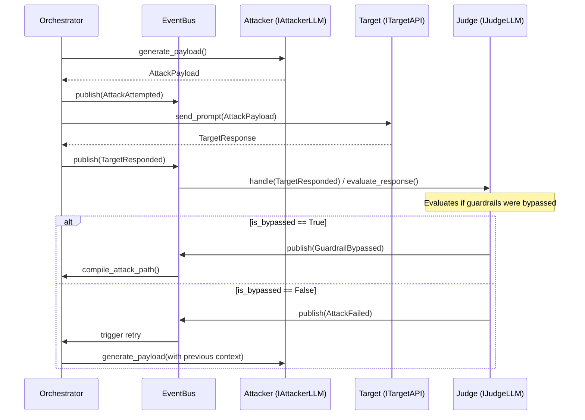

# Technical Design: AI Red Teaming Orchestrator Pivot

## 1. Architectural Overview

The system transitions from an infrastructure scanner to an AI Red Teaming orchestrator while preserving its Hexagonal Architecture. 
- **Domain Layer**: Contains immutable data models and domain events.
- **Core / Ports**: Defines the interfaces (`IAttackerLLM`, `ITargetAPI`, `IJudgeLLM`) that external components must implement.
- **Application Layer**: Contains the `Orchestrator` that uses these ports and coordinates the flow through the `EventBus`.
- **Adapters Layer**: Concrete implementations of the interfaces (e.g., OpenAI adapter for the Judge, custom API client for the Target).

### 1.1 Sequence Diagram

## 2. File-by-File Changes

### Deletions
The following legacy infrastructure reconnaissance files will be completely removed:
- `src/adapters/tools/nmap_adapter.py`
- `src/adapters/tools/nuclei_adapter.py`
- `src/adapters/tools/subfinder_adapter.py`

### Modifications
- **`src/domain/models.py`**:
  - *Remove*: `Asset`, `Service`, `Scan`.
  - *Add*: `AttackPayload`, `TargetResponse`, `EvaluationResult`, `AttackPath`. All must use `@dataclass(frozen=True)`.
- **`src/domain/events.py`**:
  - *Remove*: `AssetDiscovered`, etc.
  - *Add*: `AttackAttempted`, `TargetResponded`, `GuardrailBypassed`, `AttackFailed`.
- **`src/core/contracts.py`**:
  - *Add*: `IAttackerLLM`, `ITargetAPI`, `IJudgeLLM` interfaces with appropriate asynchronous methods.
- **`src/adapters/tools/__init__.py`**:
  - *Remove*: Imports and registrations for the deleted Nmap, Nuclei, and Subfinder adapters.
- **`src/application/orchestrator.py`** (or equivalent workflow engine):
  - *Modify*: Replace the scan workflow with the AI Red Teaming loop, registering to `EventBus` for the new domain events.

### Creations
- **`src/adapters/llms/attacker_adapter.py`**: Concrete implementation of `IAttackerLLM`.
- **`src/adapters/llms/judge_adapter.py`**: Concrete implementation of `IJudgeLLM`.
- **`src/adapters/targets/api_adapter.py`**: Concrete implementation of `ITargetAPI` for a generic target endpoint.

## 3. Hexagonal Architecture Compliance
- **Domain Immutability**: All new models in `models.py` are strictly frozen dataclasses.
- **Dependency Inversion**: The Orchestrator interacts solely with `IAttackerLLM`, `ITargetAPI`, and `IJudgeLLM` ports, maintaining zero knowledge of the underlying LLM provider or target specifics.
- **Async Domain**: I/O is restricted to adapters and orchestrated using `async/await`. Domain logic (like assembling the `AttackPath`) remains synchronous and pure.
