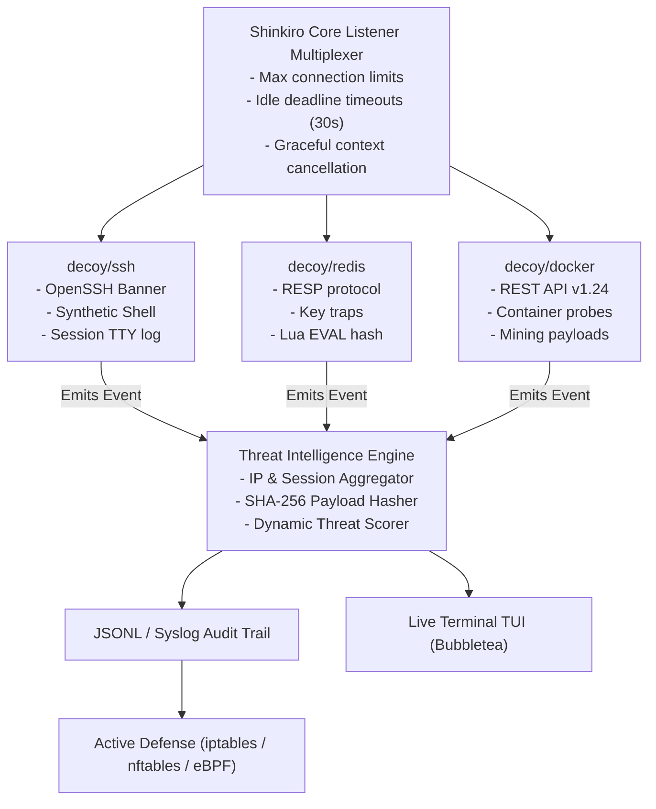

# Architecture & Technical Design: Shinkiro (蜃気楼)

## 1. High-Level Architecture Overview

Shinkiro is structured following clean hexagonal architecture in **Go 1.24+**, prioritizing zero external daemon dependencies, in-memory isolation, and high-concurrency event multiplexing.



## 2. Component Design & Interfaces

### 2.1 The Decoy Interface (`internal/decoys`)
Each protocol emulator implements a unified, thread-safe interface:
```go
package decoys

import (
    "context"
    "net"
    "shinkiro/internal/intel"
)

type Decoy interface {
    Name() string
    DefaultPort() int
    HandleConnection(ctx context.Context, conn net.Conn, events chan<- intel.Event) error
}
```

### 2.2 In-Memory Virtual Terminal (`internal/decoys/ssh/shell.go`)
- Uses a deterministic state machine mimicking Linux bash without spawning real OS processes.
- Maintains a simulated virtual filesystem (`/etc/passwd`, `/root/.bash_history`, `/proc/cpuinfo`) in memory.
- Intercepts pipe/redirection syntax (`curl http://... | bash`, `wget`) and extracts the targeted URL directly into an IoC event.

### 2.3 RESP Parser (`internal/decoys/redis/resp.go`)
- Lightweight zero-allocation byte parser for Redis wire format.
- Intercepts commands:
  - `INFO`: returns randomized synthetic uptime and cluster specs.
  - `CONFIG GET *`: records credential dump intent.
  - `EVAL`: stores SHA-256 of the payload and safely denies execution.

### 2.4 Threat Intelligence Engine (`internal/intel`)
- Aggregates events via a buffered Go channel (`chan intel.Event`).
- Dispatches to:
  - Rolling JSONL file logger (`data/events.jsonl`).
  - Memory LRU cache for live TUI statistics.
  - Threat scoring matrix:
    - Port scan / Single connection: LOW (Score: 10)
    - Authentication attempt: MEDIUM (Score: 40)
    - Shell command / RCE payload / Docker container creation: CRITICAL (Score: 90)
  - When Score >= 80, the IP is automatically staged in the Active Defense Blocklist.

## 3. Directory Layout

```text
shinkiro/
├── cmd/
│   └── shinkiro/
│       └── main.go           # CLI commands (up, export, tui)
├── internal/
│   ├── config/               # YAML & CLI flags parser
│   ├── core/                 # Listener multiplexer, signal handling
│   ├── decoys/
│   │   ├── decoy.go          # Decoy interface definition
│   │   ├── ssh/              # SSH emulator + virtual shell
│   │   ├── redis/            # RESP protocol emulator
│   │   ├── docker/           # Docker REST API emulator
│   │   └── http/             # Canary HTTP traps
│   ├── intel/                # Telemetry, IoC extraction, threat scoring
│   ├── defense/              # iptables/nftables generator
│   └── tui/                  # Bubbletea live visualizer
├── go.mod
├── go.sum
├── Makefile
└── README.md
```
